# 一、CSS选择器

## ① 基础选择器

### 1. 标签选择器


### 2. 类选择器


### 3. id选择器


### 4. 通配符选择器


## ② 复合选择器

### 1.后代选择器


### 2. 子选择器


### 3. 并集选择器


### 4. 伪类选择器

#### 4.1 链接伪类选择器


#### 4.2 focus伪类选择器


# 二、字体属性


## ① 字体系列 font-family


## ② 字体大小 font-size


## ③ 字体粗细 font-weight


## ④ 文字样式 font-style


## ⑤ 字体复合属性（快捷）


# 三、文本属性

## ① 文本颜色 color


## ② 文本水平对齐 text-align


## ③ 文本装饰 text-decoration


## ④ 文本缩进 text-indent


## ⑤ 行间距 line-height


## 技巧：文字垂直居中


# 四、引入方式

## ① 行内式


## ② 内嵌式


## ③ 外部式


# #Emmet语法


# 五、元素的显示模式

## ① 块元素


## ② 行内元素


## ③ 行内块元素


## ④ 元素显示模式转换

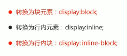

# 六、背景

## ① 背景颜色 bgc-color


## ② 背景图片 bgc-image


### 1. 背景平铺 bgc-repeat


### 2. 背景位置 bgc-position


### 3. 背景图像固定 bgc-attachment（视差效果）


### 4. 背景复合写法


### 5. 背景色半透明


### 6. 背景线性渐变


# 七、CSS三大特性

## ① 层叠性


## ② 继承性


### 1. 行高的继承


## ③ 优先级


### 1. 权重的叠加


# 八、盒子模型

## ① 组成


### 1. 边框  border


#### 1.1. 表格细线边框


#### 1.2 边框会影响盒子的实际大小


### 2. 内边距 padding（影响大小）


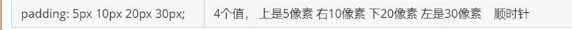


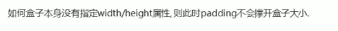

### 3. 外边距 margin


#### 3.1 块级盒子水平居中


#### 3.2 行内元素和行内块元素水平居中


#### 3.3 外边距合并-嵌套块元素塌陷


### 4. 清除内外边距

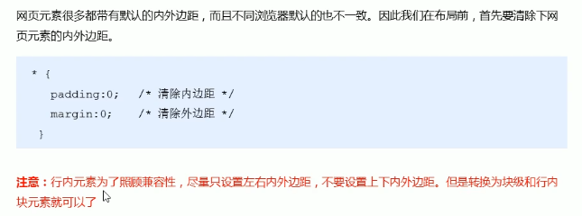

## ② CSS3新增

### 1. 圆角边框

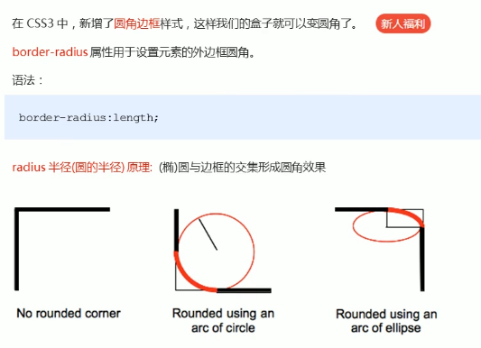


### 2. 盒子阴影


# 九、PS操作

## ① 基本操作

## 


## ② PS切图

### 1. 常见的图片格式


### 2. PS切图

#### 2.1 图层切图


#### 2.2 切片切图


#### 2.3 插件切图

## ③ 其他

## 1. 矩形选框+ CTRL+T查看坐标


# 案例总结


# 十、CSS浮动


## ① 传统网页布局的方式

### 1. 标准流


### 2. 浮动

### 3. 定位

## ② 网页布局的准则


## ③ 概述


## ④ 浮动特性

### 1. 脱标


### 2. 行排列 顶端对齐


### 3. 行内块特性


## ⑤ 常见的网页布局


## ⑥ 浮动注意事项


## ⑦ 清除浮动

### 1. 本质


### 2. 方法

#### 2.1 额外标签法


#### 2.2 父元素overflow


#### 2.3 :after 伪元素法


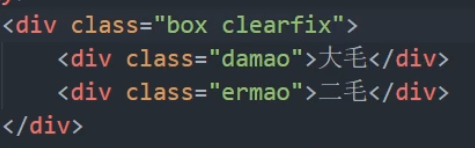

#### 2.4 双伪元素清除浮动


```css
.clearfix:before,.clearfix:after {
	content: "";
	display: table;
}
.clearfix:after {
	clear: both;
}
.clearfix {
	*zoom:1;
}
```


# 案例（学成在线）

## ① CSS属性书写顺序


## ② 页面布局整体思路


## ③ 头部制作

### 1. 分析


### 2. 导航栏要点


### 3. 精品推荐模块


## ④ 浮动的盒子不会有外边距合并的问题

# 十一、CSS定位

## ① 定位的组成


### 1. 定位模式


### 2. 边偏移


### 3. 静态定位 static


### 4. 相对定位 relative


### 5. 绝对定位 absolute


### 6. 固定定位 fixed


#### 6.1 固定定位贴在版心右侧


### 7. 粘性定位 sticky


## ② 子绝父相


## ③ 定位的总结


## ④ 定位的叠放顺序 z-index


## ⑤ 拓展

### 1. 绝对定位的盒子居中


### 2. 定位的特殊特性


### 3. 浮动不会压住标准流文字/图片


## ⑥ 元素的显示与隐藏 

### 1. display


### 2. visibility


### 3. overflow


# 十二、CSS高级

## ① 精灵图


## ② 字体图标


### 1. 字体图标使用


```css
@font-face {
  font-family: 'icomoon';
  src:  url('fonts/icomoon.eot?p4ssmb');
  src:  url('fonts/icomoon.eot?p4ssmb#iefix') format('embedded-opentype'),
    url('fonts/icomoon.ttf?p4ssmb') format('truetype'),
    url('fonts/icomoon.woff?p4ssmb') format('woff'),
    url('fonts/icomoon.svg?p4ssmb#icomoon') format('svg');
  font-weight: normal;
  font-style: normal;
  font-display: block;
}
```


### 2. 字体图标增加


## ③ CSS 三角形


## ④ 用户界面样式

### 1. 鼠标样式 cursor


### 2. 轮廓线 outline


### 3. 禁止文本域拖拽 


## ⑤ vertical-align 

### 1. 垂直居中


### 2. 解决图片底部空白缝隙


## ⑥ 溢出文字用省略号

### 1. 单行文本


### 2. 多行文本


## ⑦ 常见的布局技巧

### 1. margin负值的运用


### 2. 文字围绕浮动元素


```html
<div>
    <div class='pic'>
        
    </div>
    <p>
        12354536456546
    </p>
</div>
<style>
    .pic {
        float: left;
        height: 200px;
        width: 110px;        
    }
</style>
```


### 3.  行内块的巧妙运用

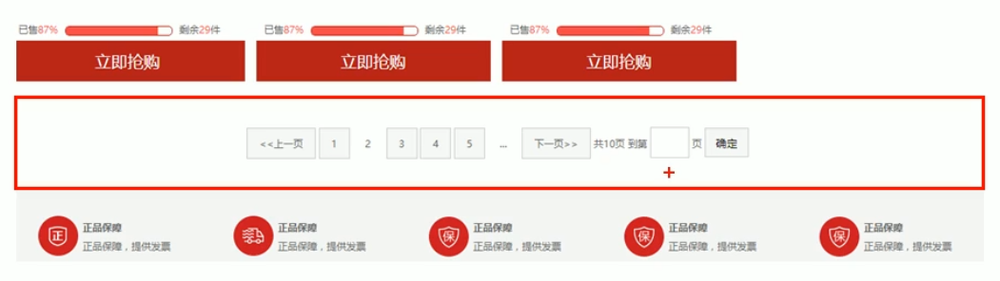

### 4. CSS三角形运用


## ⑧ CSS初始化


# 十三、HTML5新增

## ① 新增语义化标签


## ② 新增多媒体标签

### 1. 视频  video


### 2. 音频 audio


## ③ 新增input类型


## ④ 新增表单属性


# 十四、CSS3新特性

## ① 新增选择器


### 1. 属性选择器


### 2. 结构伪类选择器


### 3. 伪元素选择器


## ② 盒子模型 box-sizing


## ③ 滤镜 filter


## ④ 计算函数 calc

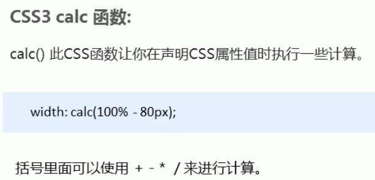

## ⑤ CSS3过渡 transition

谁过渡给谁加！！


```css
div {
	transition: width 1s, height 1s //注意加单位s
    transition: all 0.5s //多个属性直接用all
}
```

## ⑥ 2D转换  transform

### 1. 移动 translate


#### 1.1 盒子水平垂直居中


### 2. 旋转 rotate

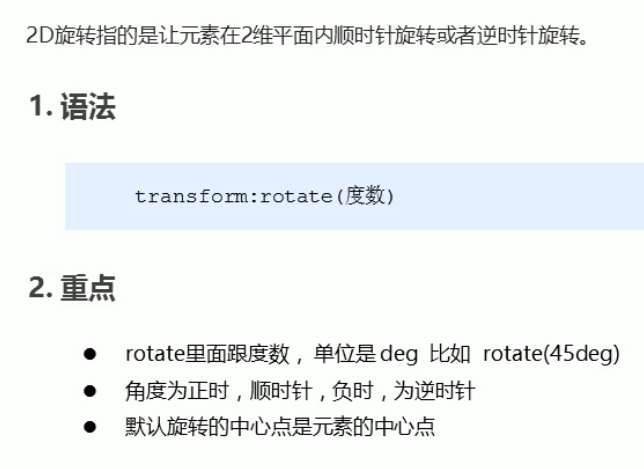

#### 2.1 三角形制作


### 3. 转换中心点 transform-origin


### 4. 缩放 scale


### 5. 综合写法


## ⑦ 动画

### 1. 动画的基本使用


### 2. 动画常用属性


### 3. 动画简写属性


## ⑧ 3D转换

### 1. 3D移动 translate


### 2. 透视 perspective


### 3. 3D旋转 rotate3d


### 4. 3D呈现 transform-style


## ⑨ 浏览器私有前缀


# 十五、品优购项目

## ① 网站制作流程


## ② 项目规划

### 1. 整体介绍


### 2. 学习目的


### 3. 开发工具和技术栈


### 4. 项目搭建工作


### 5. favicon图标


```css
<link rel="shortcut icon" href="favicon.ico /">
```

### 6. 网站TDK三大标签SEO优化


#### 6.1 title网站标题


#### 6.2 description网站说明


#### 6.3 keywords关键字

## ③ 首页制作


### 1. 常用模块类名命名


### 2. logo SEO优化


### 3. header制作


### 4. nav制作


### 5. footer制作


### 6. main主体模块制作

### 7.tab栏选项卡

## ④ 分类列表页

# 十六、Web服务器

## ① 什么是服务器

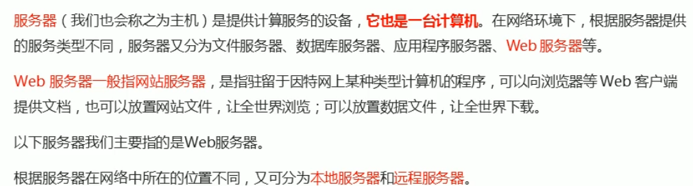

### 1. 本地服务器


### 2. 远程服务器


## ② 申请空间


# 十七、移动端布局

## ① 移动端基础

### 1. 浏览器现状


### 2. 手机屏幕现状


## ② 视口

### 1. 布局视口


### 2. 视觉视口

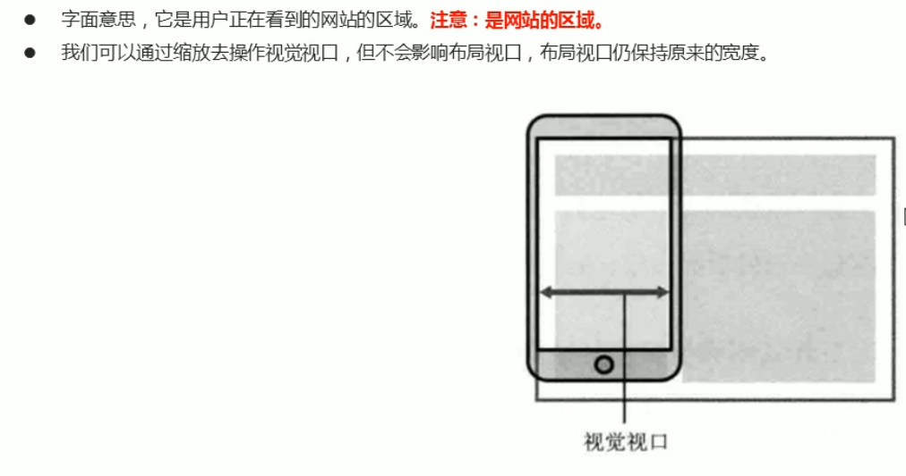

### 3. 理想视口


### 4. meta视口标签


## ③ 二倍图

### 1. 物理像素 & 像素比


### 2. 多倍图

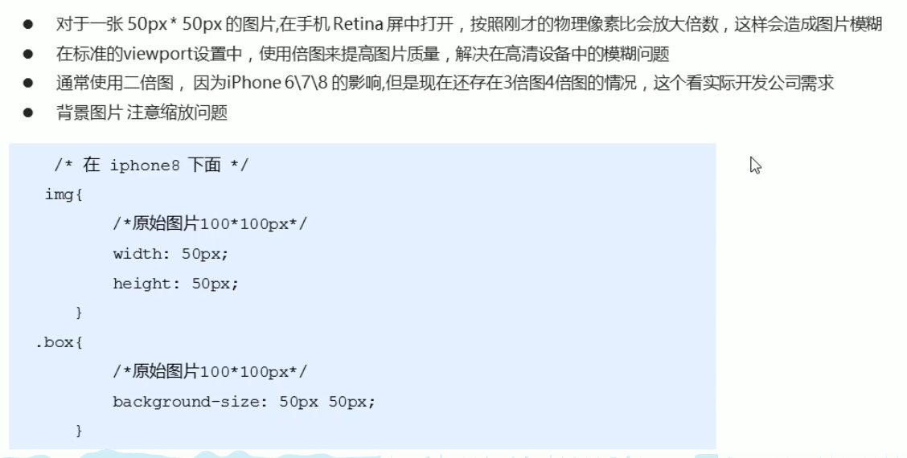

### 3. 背景缩放 background-size


### 4. cutterman多倍图


## ④ 移动端开发选择

### 1. 单独移动端页面（主流）


### 2. 响应式兼容PC移动端


## ⑤ 移动端技术解决方案

### 1. CSS初始化


### 2. 特殊样式


## ⑥ 流式布局（百分比）


## ⑦ flex布局

### 1. flex布局原理


### 2. 父项常见属性


#### 2.1 主轴方向 flex-direction


#### 2.2 主轴子元素排列方式 justify-content


#### 2.3 子元素是否换行 flex-wrap


#### 2.4 单行侧轴子元素排列 align-items


#### 2.5 多行侧轴子元素排列 align-content


#### 2.6 复合写法flex-flow


### 3. 子项常见属性

#### 3.1 子项目分配剩余空间 flex


```
flex: 20% //可用百分比表示，这样可以自动换行
```


#### 3.2 子项自己在侧轴的排列方式 align-self


#### 3.3 项目的排列顺序 order


### 4. 常见flex布局思路


## ⑧ rem适配布局

### 1.rem单位


### 2. 媒体查询 Media Query


```
mediatype:
```


```
and | not | only
```


```
media feature
```


#### 2.1 引入资源


```
按从小到大引入资源
```

### 3. less基础

#### 3.1 CSS弊端


#### 3.2 less介绍


#### 3.3 less变量


#### 3.4 less编译

#### 3.5 less嵌套

```less
// 1.后代选择器
#header {
	.logo {
		width: 30px;
	}
}
// 2.伪类选择器
a {
    color: #green;
    &:hover {
        color: #red
    }
}
// 3.伪元素选择器
.nav {
    &::before {
        content: '';
    }
}
```

#### 3.6 less运算


### 4. rem 适配方案的技术使用


####  4.1 方案1


#### 4.2 方案2 flexible


## ⑨ 响应式布局

### 1. 原理


### 2. 响应式布局容器


### 3. Bootstrap 框架

#### 3.1 简介


#### 3.2 使用


#### 3.3 布局容器


#### 3.4 栅格系统


```
.col-xs-份数
份数总和 > 12 换行
		= 12 铺满
		< 12 留空
```

##### 3.4.1 列嵌套


##### 3.4.2 列偏移


##### 3.4.3 列排序


##### 3.4.4 响应式工具


