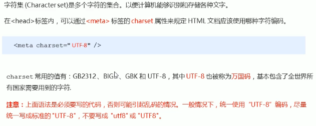
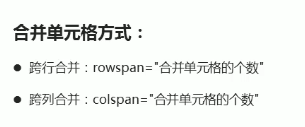

# 一、HTML标签


## ① 文档

### 1. lang 语言种类


### 2. 字符集



### 3. 文档类型声明


## ② 常用标签

### 1. 标题标签  h1-h6


### 2. 段落标签 p 和换行标签 br


### 3. 文本格式化标签


### 4. div 和 span标签


### 5. 图像标签

#### 5.1 内容


#### 5.2 路径


### 6. 超链接标签 a


<a href= "javascrip:"></a>

#### 锚点连接


### 7. 注释和特殊字符


## ③ 更多标签

### 1. 表格标签（展示数据）





```html
<table>
    <thead>
    <tr>
    	<th>表头th>
    </tr>
    </thead>
    <tbody>
    	...
    </tbody>
</table>
```

### 2. 列表标签（布局）

#### 2.1 无序列表（布局）


#### 2.2 有序列表（了解）


#### 2.3 自定义列表


### 3. 表单标签（收集信息）

#### 3.1 表单域


#### 3.2 表单元素 form

##### input输入表单元素


##### lable标签（配合↑）


##### select下拉表单元素


##### textarea文本域元素


