# 一、BOM的构成

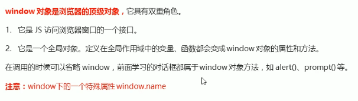

# 二、window对象的常见事件

## ① 窗口加载事件

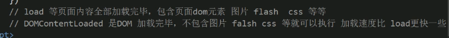

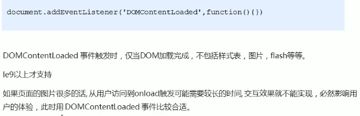

## ② 调整窗口大小事件

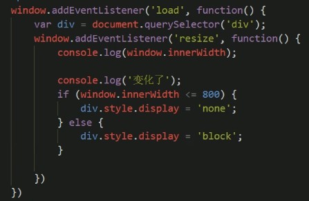

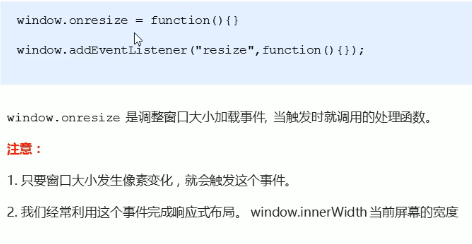

## ③ 定时器 

### 1. setTimeout(调用函数，延迟时间)

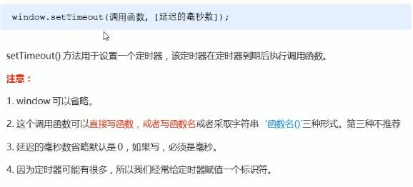

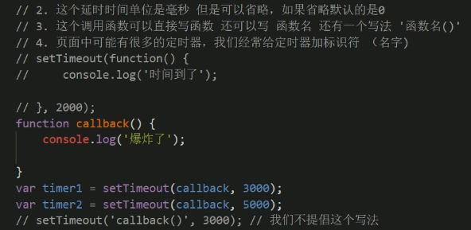

### 2. 回调函数 callback

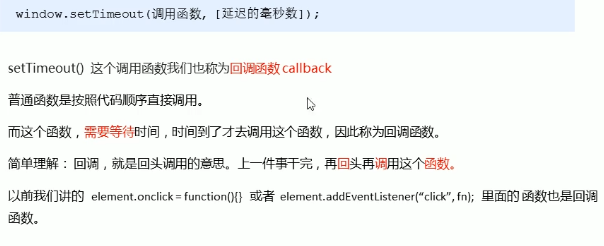

### 3. 停止定时器

1.setTimeout

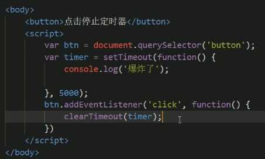

2. setInterval

   

### 4. setInterval（）循环调用

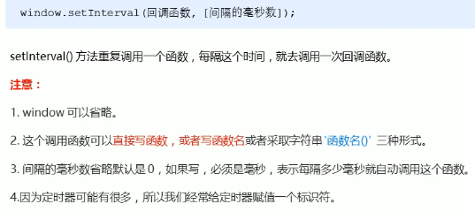

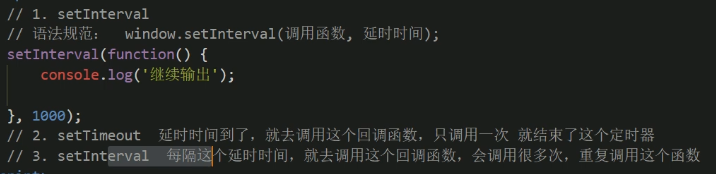

### 案例：自动关闭广告

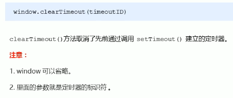

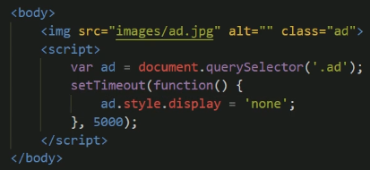

4. 

### 案例：倒计时效果

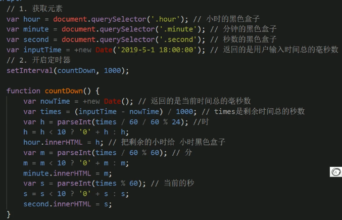

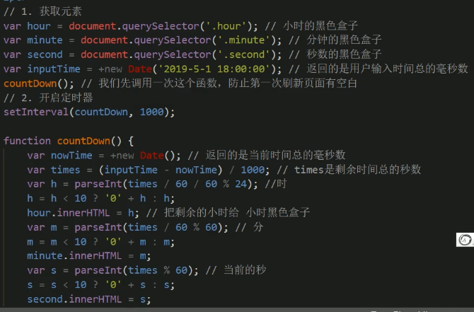

### 案例：发送短信验证码

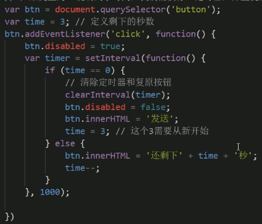

## ④ this 指向

 1.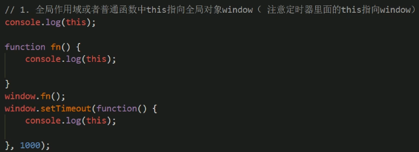

2.

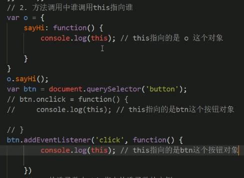

3.

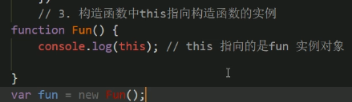

# 三、JS执行机制

## ① 单线程

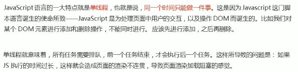

## ② 同步和异步

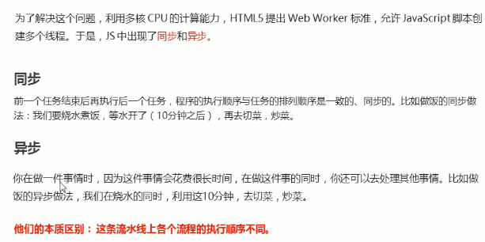

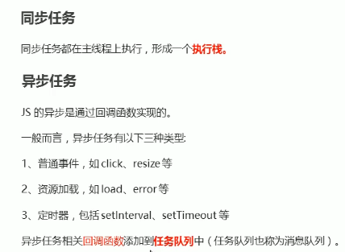

### 1. 同步任务

### 2. 异步任务

### 3. 执行机制

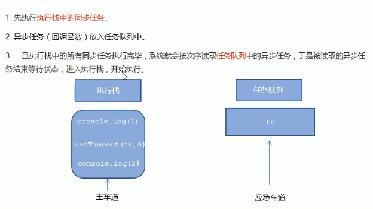

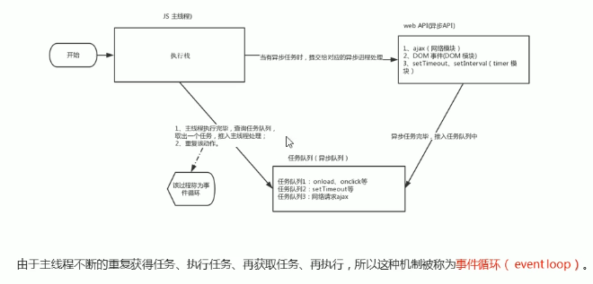

## ③ location 对象

### 1. 概念

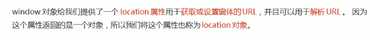

### 2. URL

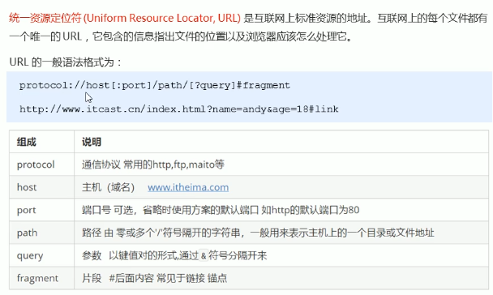

### 3. location对象的属性

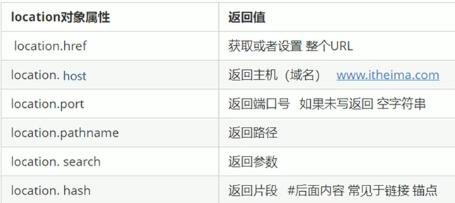

### 4. location对象的属性

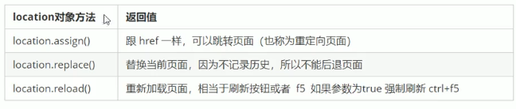

### 案例：5s后跳转页面

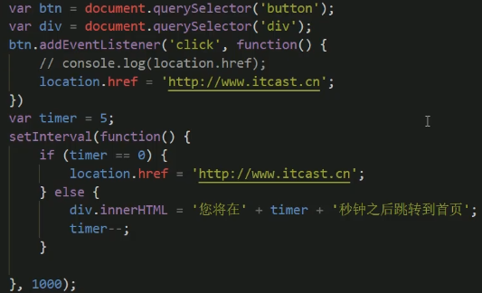

### 案例：获取URL参数数据

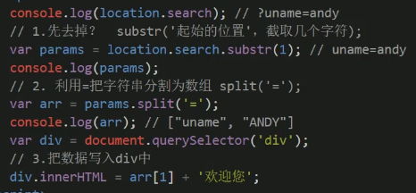

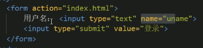

## ④ navigator对象

## ⑤ history对象

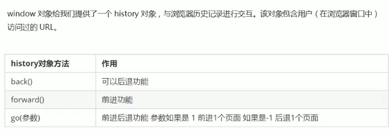

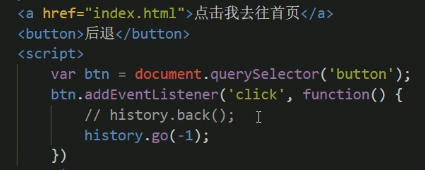

# 三、PC端网页特效

## ① offset 元素偏移量

 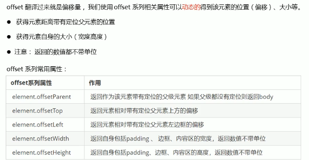

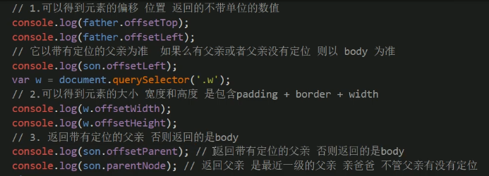

## ② offset和style区别

## ③ 获取鼠标在页面中坐标

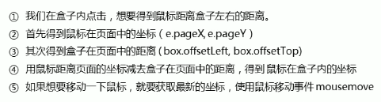

## ④ client 元素可视区

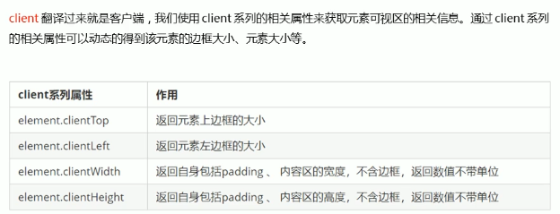

## ⑤ 立即执行函数

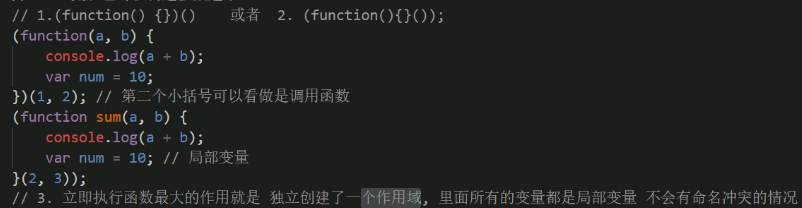

## ⑥ scroll 元素滚动

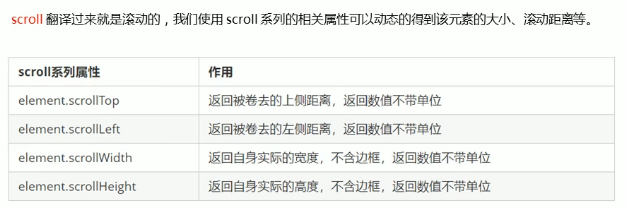

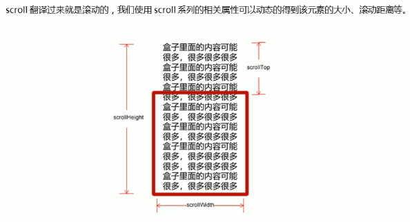

## ⑦ 总结

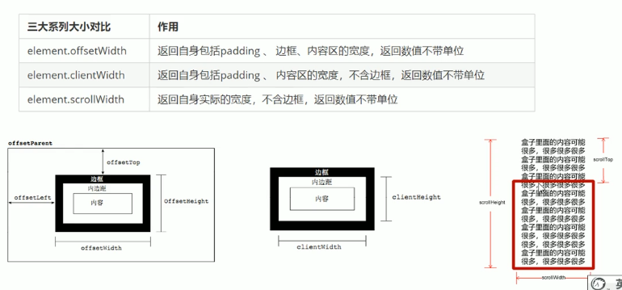

## 案例：拖动模态框

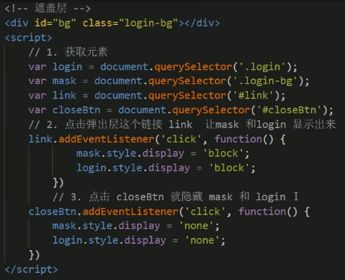

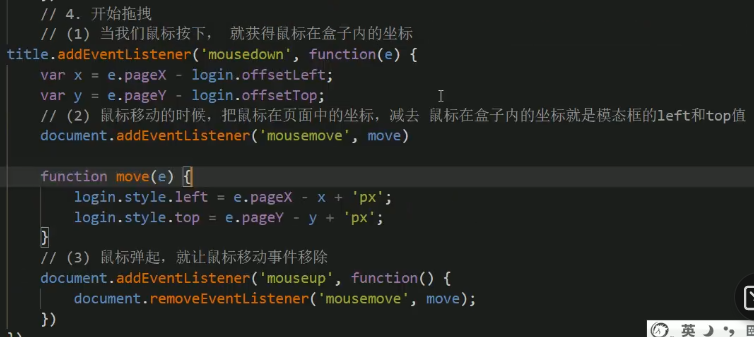

## 案例：放大镜效果

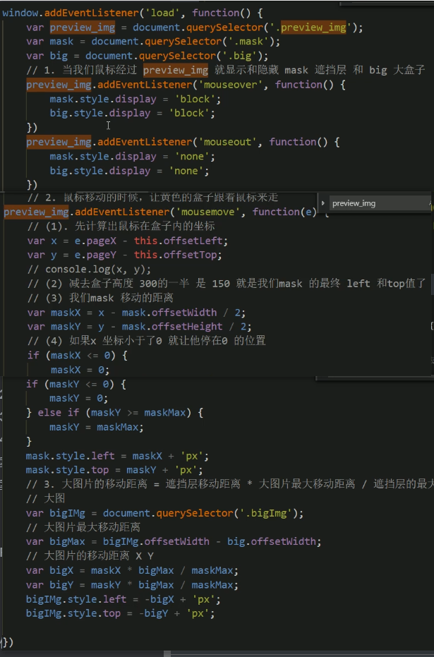

## 案例：flexible.js源码分析

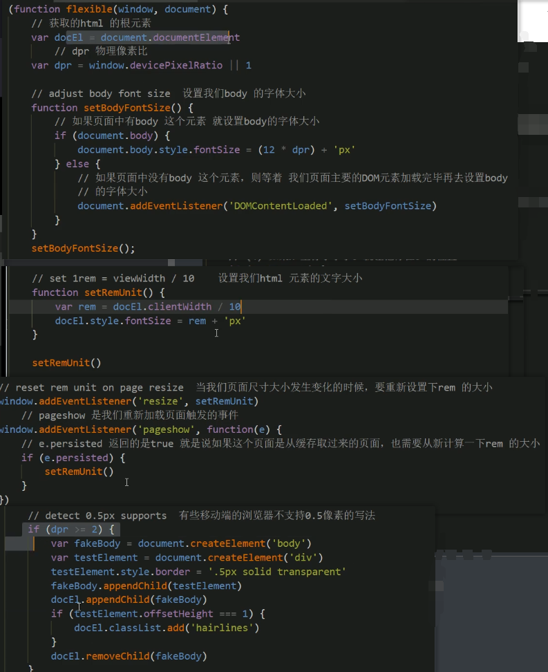

## 案例：固定侧边栏

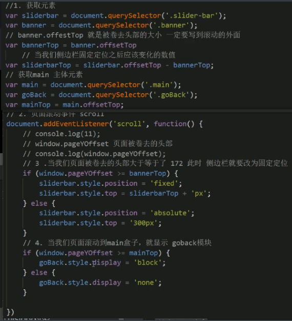

## 区别：mouseenter和mouseover

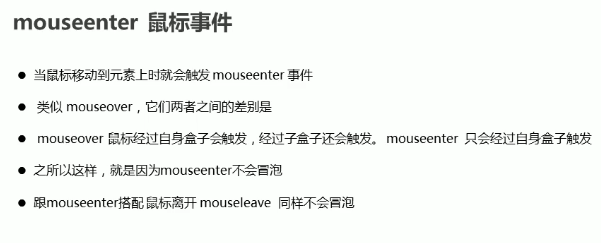

## ① 动画原理

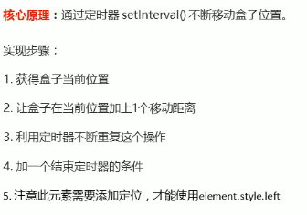

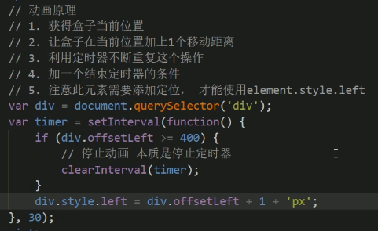

## ② 动画函数的封装

优化前：

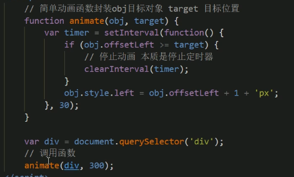

目标对象需要有绝对定位position：absolute

### 优化：给不同对象添加不同定时器

### 解决：重复点击定时器叠加问题

## ③ 缓动动画

### 1. 原理

### 2. 代码实现

### 3. 优化：去除小数和倒退

去除小数（正数向上取整）

倒退（负值向下取整）：

优化前：

优化后：

### 4. 动画添加回调函数

### 5. 动画函数的使用

单独封装到一个js文件，再引入

### 案例：网页轮播图

### 案例：动画效果的返回顶部

# 四、本地存储

## ① sessionStorage

## ② localStorage

