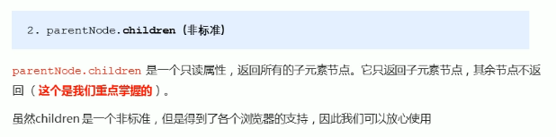
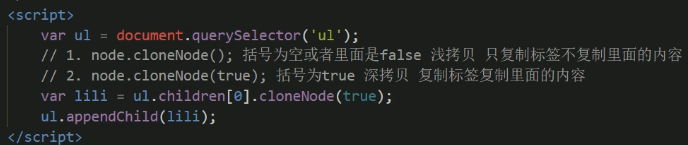
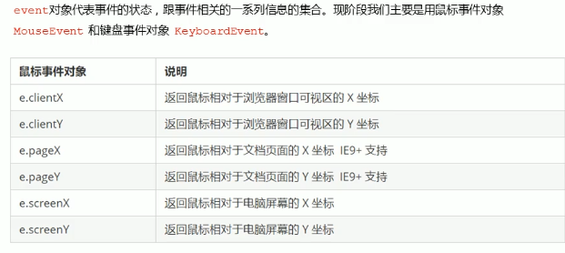
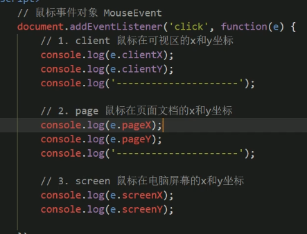

# DOM

## console.dir() 打印元素对象

## 一、获取元素

### 1. getElementById('id') 

返回一个元素对象

### 2. getElementsByTagName(‘标签名’)

返回一个对象集合，以伪数组的形式存储

遍历：

```javascript
for(var i = 0; i< lis.length; i++){
	console.log(lis[i])
}
```

如果页面中只有一个，返回的仍是伪数组形式

如果页面中没有这个元素，则返回空的伪数组

采用指定元素：

```javascript
// 指定一个id= ol
var ol = document.getrElementById('ol');
console.log(ol.getElementsByTagName('li'))
```

### 3. getElementsByClassName('类名')    //(HTML5新增)

### 4. querySelector('选择器')

返回指定选择器的第一个元素对象

```javascript
<div class = "box"><div/>
var firstBox = document.querySelector('.box');

<div id = "nav">
var nav = document.querySelector('#nav');

<li> aaa </li>
var li = document.querySelector('li');
```

### 5. querySelectorAll('选择器')

返回指定选择器的所有元素对象

```javascript
var allBox = document.querySelectorAll('.box');
```

### 6. 获取特殊元素

#### ① body: document.body

```javascript
var bodyEle = document.body;
```

#### ② html: document.documentElement

```javascript
var html = document.documentElement;
```

## 二、事件基础

### 1. 事件三要素


### 2. 执行事件步骤


### 3. 常见事件

#### ① 鼠标事件


### 4. 操作元素


#### ① innerText（不推荐）和InnerHTML

innerText不识别html标签

innerHTML可以识别HTML标签   保留空格和换行


#### ② 修改元素属性

 

#### ③ 表单属性设置


##### 案例：仿京东切换明暗文


#### ④ 修改元素样式


##### 案例：循环精灵图

```javascript
'0 -44px'
'0 -++indexpx'
'0 -' + index + 'px';
```


##### 案例：显示隐藏文本框内容


##### 技巧： 利用className修改元素样式


##### 案例：密码框验证


#### ⑤ 排他思想（算法）


##### 案例：百度换肤


##### 案例：表格隔行变色


##### 案例：表单全选取消案例


#### ⑥ 自定义属性操作

##### 1. 获取属性


##### 2. 设置属性


##### 重点案例：tab栏切换


#### ⑦ H5自定义属性


### 5. 节点操作

#### ① 节点概述


#### ② 节点操作

##### 1. 节点层级

###### 1.1 父级节点


###### 1.2 子节点

子节点





首部/尾部节点


###### 1.3  兄弟节点


##### 案例：下拉菜单


##### 2. 添加/创建节点


###### 2.1 创建节点


###### 2.2 添加节点


##### 案例：简单 发布留言


##### 3. 删除节点


##### 案例： 删除留言


##### 4. 克隆节点




##### 案例：动态生成表格


##### 5. 三种创建元素方式区别

###### 5.1 document.write()


###### 5.2 innerHTML

拼接多个字符串效率低 改用数组拼接


###### 5.3 document.createElement()

## 三、事件高级

### ① 注册事件（绑定事件）

##### 1. 传统方式


##### 2. 方法监听


### ② 删除事件

##### 1. 传统方式


##### 2. 方法监听


##### 3. 兼容性解决


### ③ DOM事件流

##### 1. 三个阶段


###### 1.1. 捕获阶段


###### 1.2. 当前目标阶段

###### 1.3. 冒泡阶段


##### 2. 事件对象


###### 2.1 常见事件对象属性和方法


1. e.target


2. e. preventDefault()

   

###### 2.2 阻止事件冒泡


###### 2.3 禁止选中文字和右键菜单


###### 2.4 获得鼠标坐标





###### 2.5 常用的键盘事件


###### 2.6 键盘事件对象


###### 案例：跟随鼠标的天使


###### 案例：按键后搜索框获得焦点


###### 案例：输入时在旁边显示放大的文本框


##### 3. 事件委托


###### 


