# 1. JS的书写方式

### ①行内式

```
<script>
    alert("aaa");
</script>
```


### ②内嵌式

```
<input onclick="alert("aaa")">
```


### ③外部

```
<script src=""></script>
//中间不能再加代码了
```

# 2. JS注释

```
1.单行注释
//   ctrl+/
2 多行注释
/*  */  shift+alt+a  ----> shift+alt+/
```

# 3. JS输入输出语句

### ① alert("警示框")

### ② prompt("输入框")

### ③ console.log("控制台打印")


# 4. 变量

### ① 声明变量+赋值

```
var age = 10;
```

### ② 处理输入

```
var myname = prompt("请输入你的姓名")
alert(myname);
```

### ③ 声明多个变量

```
var a = 1,
	b = 2,
	c = 3;
```

### ④ 特殊情况

```
1.只声明不赋值  为undefined
var sex；
console.log(sex)
2.不声明不赋值  报错

3.不声明、直接赋值 可以运行
```

### ⑤ 变量命名规范

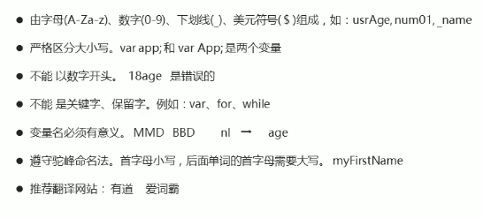

# 5. 简单数据类型

### 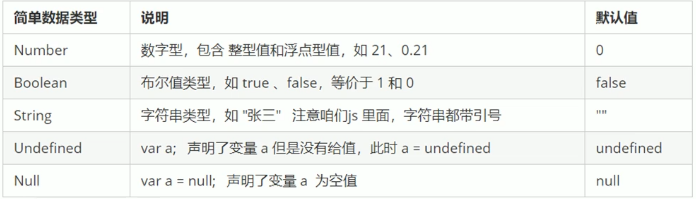

### // 获取变量数据类型：typeof name;

### ① Number 数字型

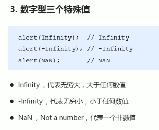

```
isNaN(12) = false;
isNaN("aaa") = true;
```


### ② Boolean 布尔型

### ③ String 字符串型

 

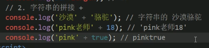

### ④ Undefined

### ⑤ Null

# 6. 数据类型转换

### ① 转换为字符串

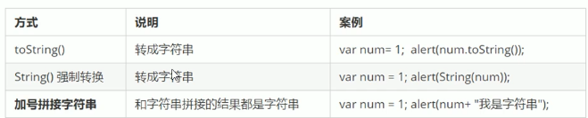

### ② 转换为数字型

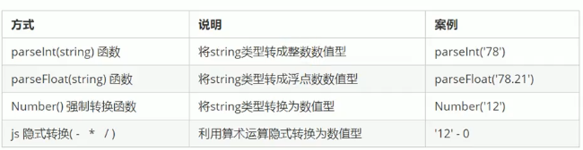

### ③ 转换为布尔型

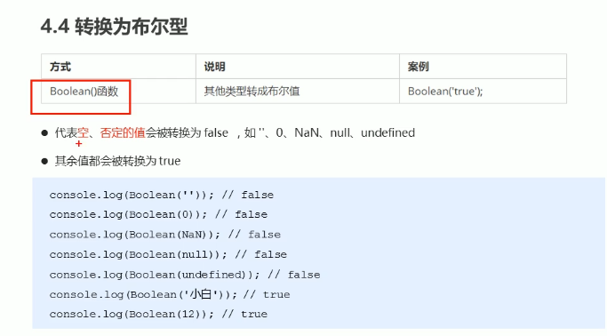

# 7.JS运算符

### ① 算数运算符 

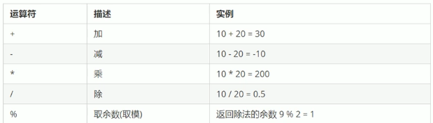

### ② 递增和递减

### ③ 比较运算符

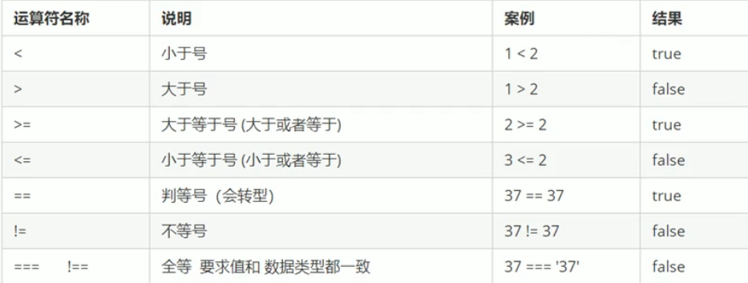

### ④ 逻辑运算符（短路现象）

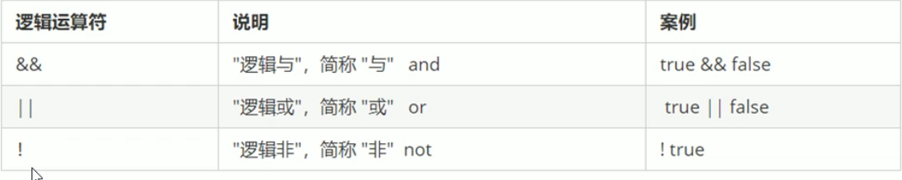

短路：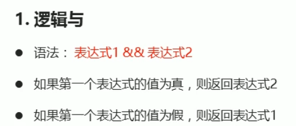

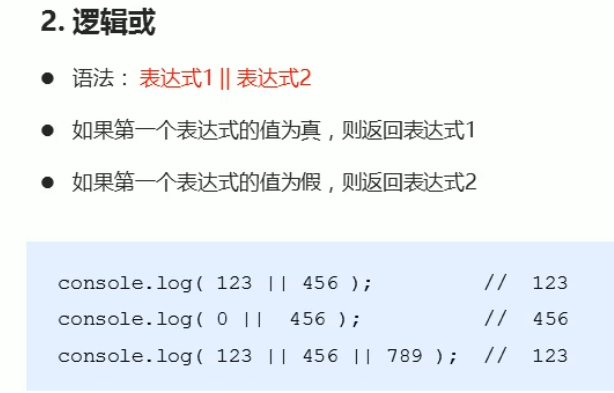

### ⑤ 赋值运算符

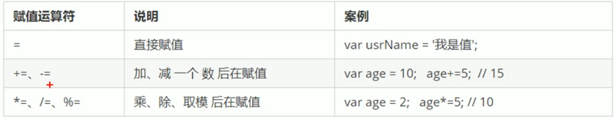

### ⑥ 运算符优先级

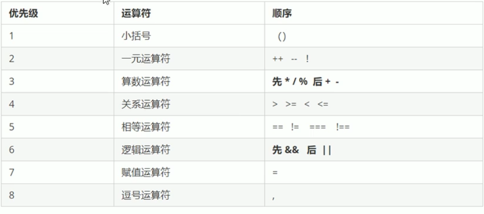

# 8.JS流程控制

### ① 分支结构

1. if语句

2. switch语句

   

3. 三元表达式

   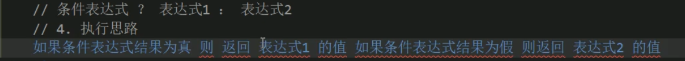

### ② 循环结构

### ③ JS规范

#### 1. 标识符命名规范

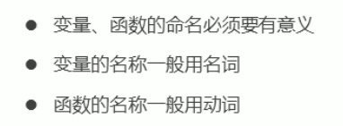

#### 2. 操作符规范

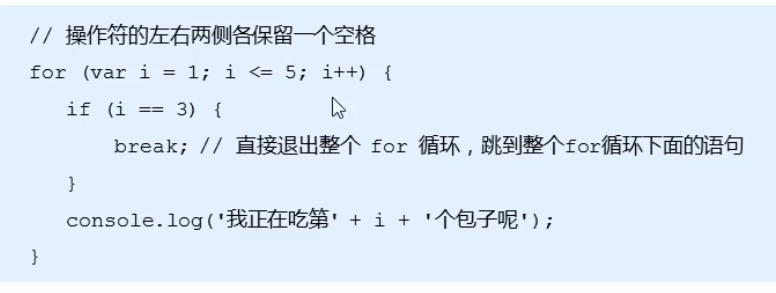

#### 3. 单行注释规范

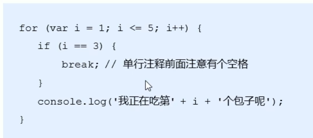

#### 4. 其他规范

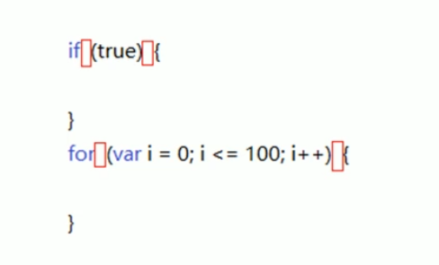

# 9. 数组

### ① 数组的创建

#### 1. new创建


#### 2. 字面量创建

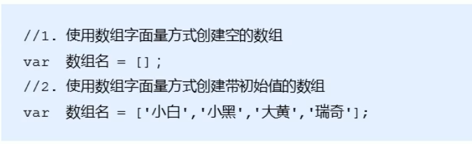

### ② 新增数组元素

#### 1. 修改length长度

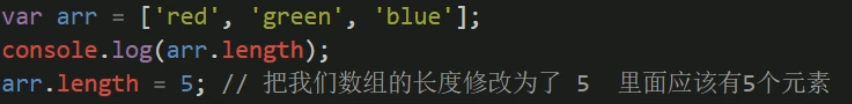

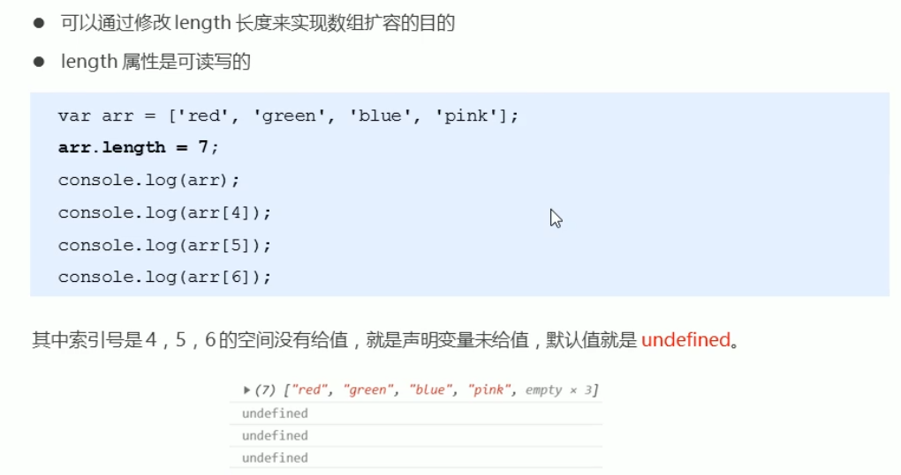

#### 2. 修改索引号

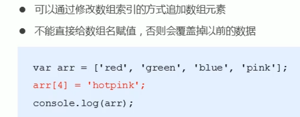

# 10. 函数

### ① 函数使用

#### 1.函数声明

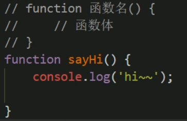

#### 2. 调用函数

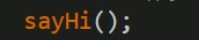

### ② 函数返回

无return返回undefined

### ③ arguments

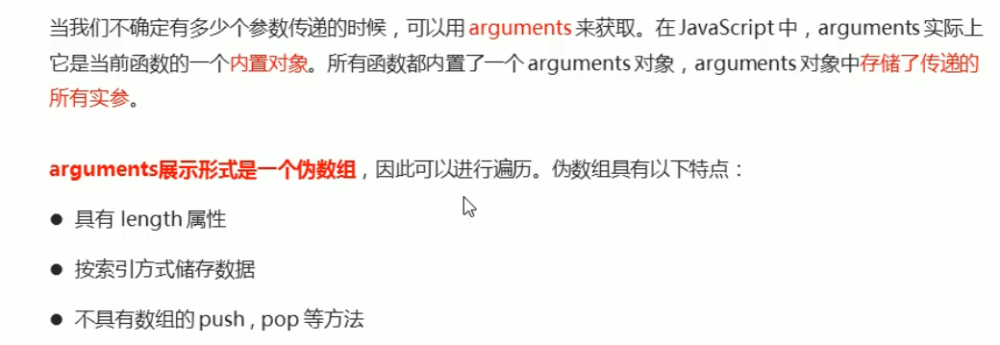

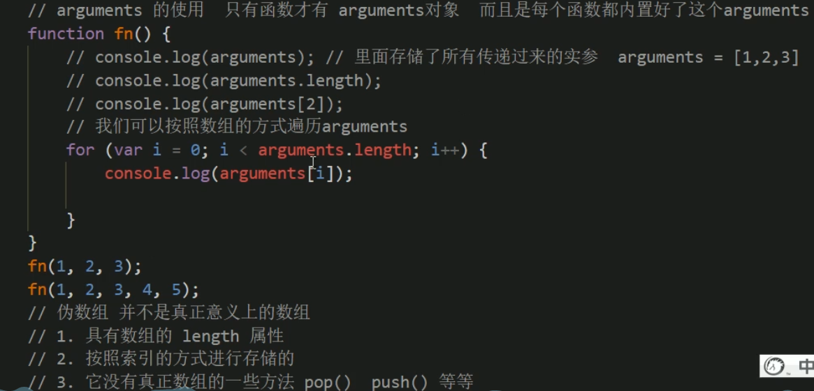

### ③ 函数声明

#### 1. 函数关键字

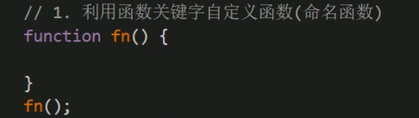

#### 2. 函数表达式（匿名函数）

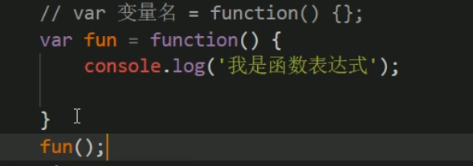

# 11. JS作用域

### ① 概述：

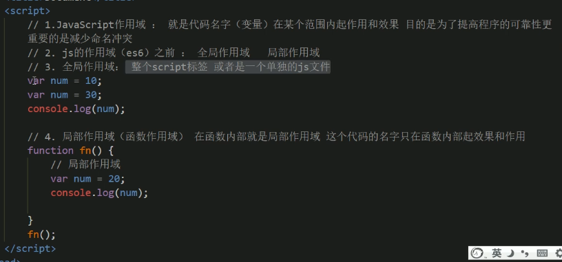

### ② 变量的作用域

#### 1. 全局变量

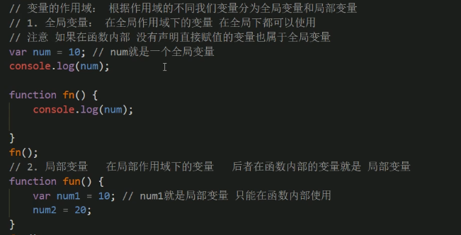

#### 2. 局部变量

### ③ JS没有块级作用域（ES6前）

### ④ 作用域链

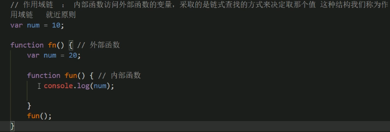

# 12. JS预解析

### ① 变量提升

### ② 函数提升

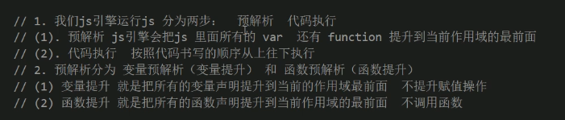

# 13. JS对象

### ① 创建对象

#### 1. 字面量

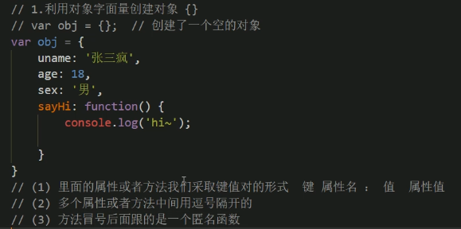

#### 2. new Object

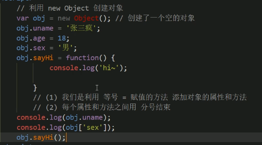

#### 3. 构造函数（重要）

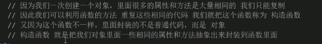

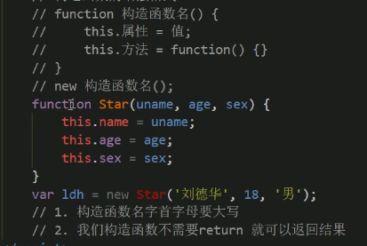

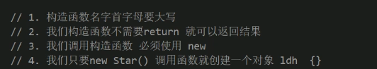

### ② 使用对象

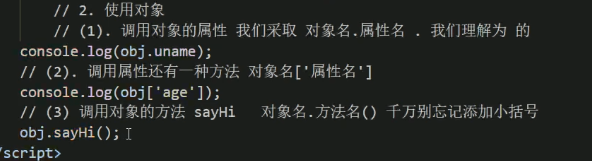

### ③ new关键字的执行原理

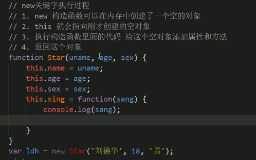

### ④ 遍历对象属性（for... in...）

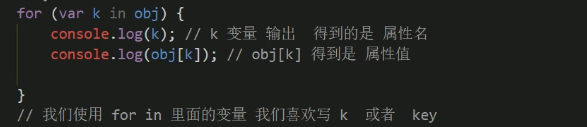

# 14. JS内置对象

### MDN查询

### ① Math对象

#### 1. 数据处理

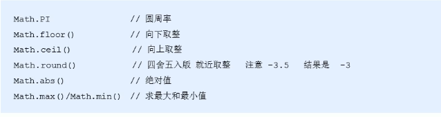

#### 2. Math.random()

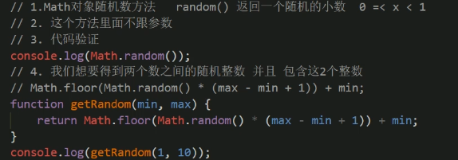

### ②  Date对象

#### 1. 获取时间的方法

#### 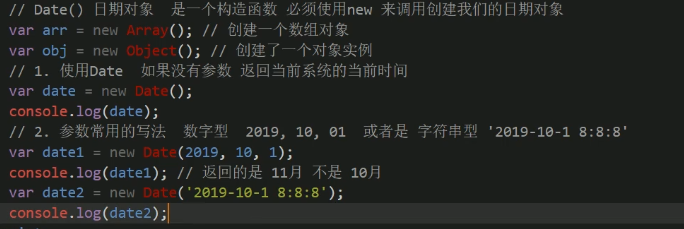

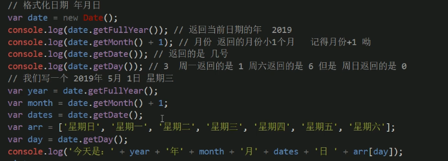

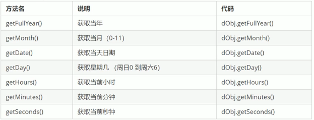

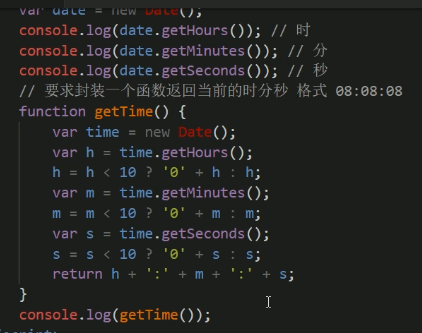

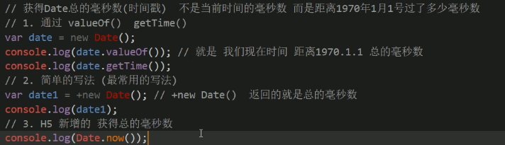

#### 2. 倒计时案例

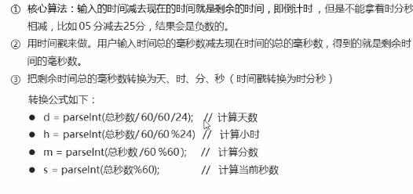

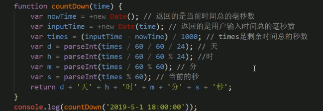


### ③ 数组对象

#### 1. 创建数组


#### 2. 检测是否为数组


#### 3. 添加/删除数组元素


```
Arr.push()
```

#### 4. 数组排序


#### 5. 获取数组索引


#### *数组去重：


#### 6. 数组转换为字符串


#### 7. 其他


### ④ 字符串对象

#### 1. 基本包装类型


#### 2. 不可变性（值不变 地址变）

尽量减少字符串的拼接！

#### 3. 根据字符返回其位置


#### 4. 根据位置返回字符


#### *统计字符出现次数


#### 5. 字符串操作


#### 6. 其他

##### 替换字符


##### 字符转换为数组


##### 大小写


# 15. 简单和复杂数据类型

### ① 数据类型内存分配


### ② 简单数据类型传参


### ③ 复杂数据类型传参


## 

