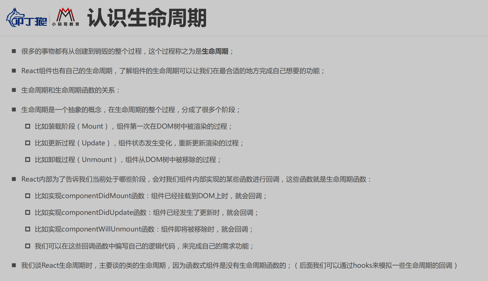
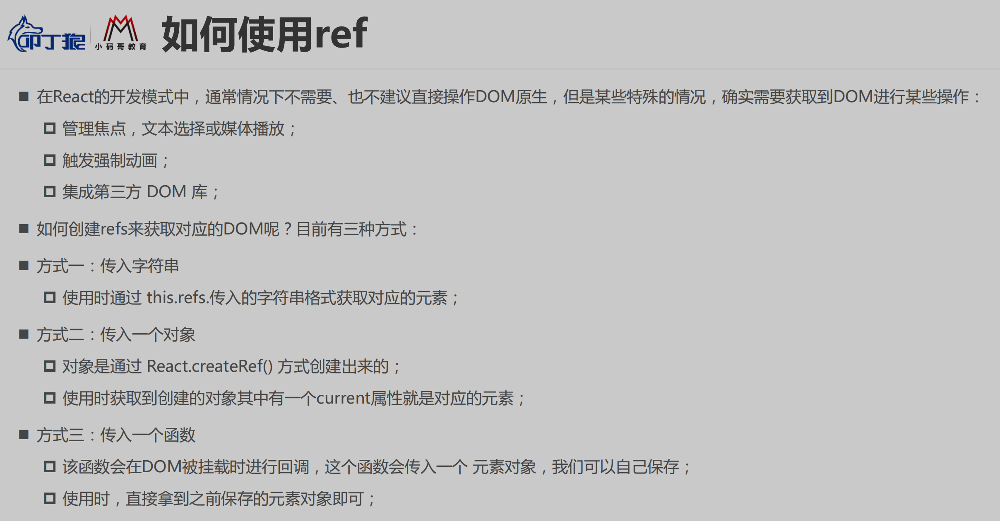
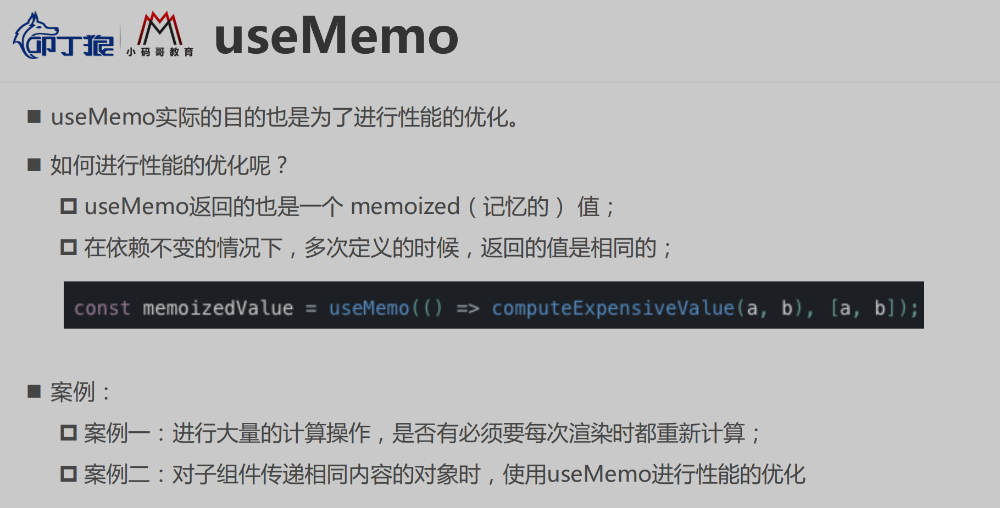
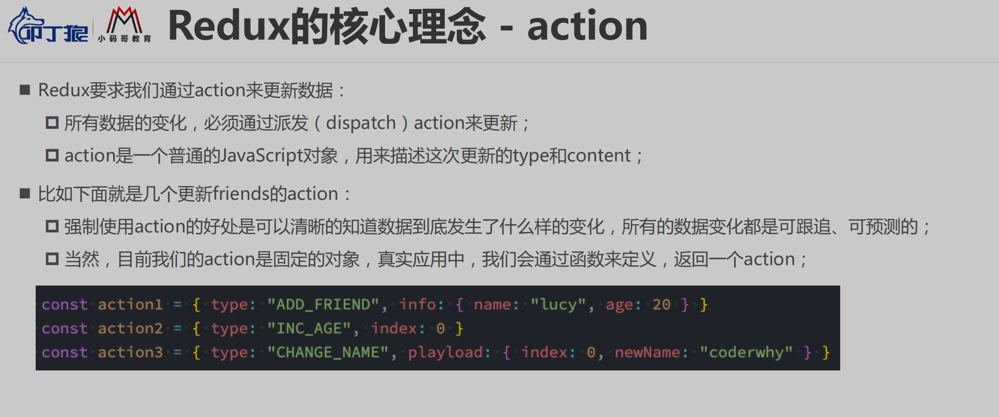

# 一、React

## 1. React 开发依赖

### 1.1 引入 React

### 1.2 网页中使用 React

### 1.3 组件化使用

#### ① 数据依赖

#### ② 事件绑定

#### ③ 示例

### 1.4 安装脚手架

### 1.5 创建 React项目

### 1.6 目录结构分析

### 1.7 起步

## 2. JSX 核心语法

### 2.1 ES6 的 class

### 2.2 认识 JSX

### 2.3 JSX 的使用

### 2.4 React 事件绑定

### 2.5 React 条件渲染

### 2.6 React 列表渲染

## 3. React 核心概念

### 3.1 类组件

### 3.2 函数组件

### 3.3 生命周期

### 3.4 组件间通信

#### ① 父传子

#### ② 子传父

#### ③ Context 应用场景 （非父子）

### 3.5 setState

### 3.6 ref

### 3.7 受控组件

### 2.8 高阶组件

### 2.9 Portals

### 2.10 fragment

### 2.11 StrictMode

## 4. React 的 CSS

#### 4.1 内联样式

### 4.2 普通的 CSS

### 4.3 CSS Modules

### 4.4 CSS in JS

## 5. hooks

### 5.1 useState

### 5.2 Effect

### 5.3 useContext

### 5.4 useReducer

### 5.5 useCallback

### 5.6 useMemo

### 5.7 useRef

# 二、Redux

## 1. 纯函数

## 2. Redux 核心理念

### 2.1 Store

### 2.2 action

### 2.3 reducer

## 3. Redux 三大原则

## 4. Redux 使用过程

### 