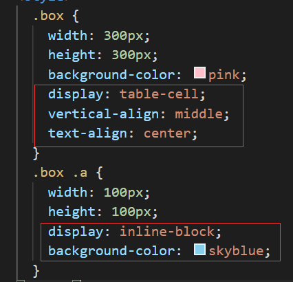
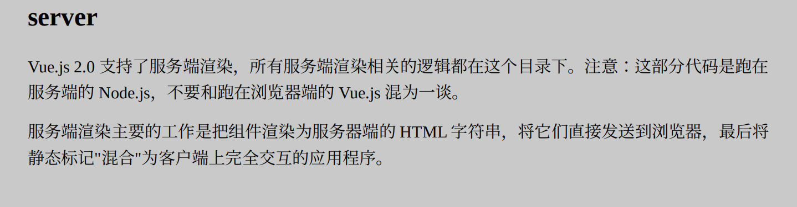

# 补充：HTML

## 1. src 和 href 的区别

- src
  - 

# 一、JavaScript

## 1. 原型链


## 2. 继承

### 2.1 原型链继承

```js
function Parent() {
	this.name = 'kevin';
}

Parent.prototype.getName = function () {
  console.log(this.name);
}

function Child () {
  
}

Child.prototype = new Parent();
var child1 = new Child();
console.log(child1.getName()); // kevin
```

缺点：

- 引用类型的属性被所有实例共享
- 在创建Child实例时，不能向Parent传参


### 2.2 借用构造函数

```js
function Parent() {
    this.names = ['kevin', 'daisy'];
}

function Child() {
    Parent.call(this)
}

var Child1 = new Child();

Child1.names.push('cw');

console.log(child1.names); // ['kevin', 'daisy', 'yayu']

var Child2 = new Child();

console.log(Child2.names); // ['kevin', 'daisy']
```

优点：

- 避免了引用类型的属性被所有实例共享

- 可以在 Child 中向 Parent 传参

  - ```js
    function Parent (name) {
        this.name = name;
    }
    
    function Child (name) {
        Parent.call(this, name);
    }
    
    var child1 = new Child('kevin');
    
    console.log(child1.name); // kevin
    
    var child2 = new Child('daisy');
    
    console.log(child2.name); // daisy
    ```

  

缺点：

- 方法都在构造函数中定义，每次创建实例都会创建一遍方法。


### 2.3 组合继承

原型链+借用构造函数

```js
function Parent(name) {
    this.name = name;
    this.colors = ['red', 'pink', 'green'];
}

function Child(name, age) {
    Parent.call(this, name);
    this.age = age;
}

Child.prototype = new Parent();
var child1 = new Child('kevin', '18');

child1.colors.push('black');

console.log(child1.name); // kevin
console.log(child1.age); // 18
console.log(child1.colors); // ["red", "blue", "green", "black"]

var child2 = new Child('daisy', '20');

console.log(child2.name); // daisy
console.log(child2.age); // 20
console.log(child2.colors); // ["red", "blue", "green"]
```

优点：

- 组合继承弥补了原型链和盗用构造函数的不足，是 JavaScript 中使用最多的继承模式。
- 组合继承也保留了 instanceof 操作符和 isPrototypeOf()方法识别合成对象的能力。

缺点：

- 会调用两次父构造函数
  - 设置子类型实例：Child.prototype = new Parent();
  - 创建子类型实例：var child1 = new Child('kevin', 18);


### 2.4 原型式继承

```js
function createObj(o) {
  function F(){}
  F.prototype = o;
  return new F();
}
```

```JS
var person = {
    name: 'kevin',
    friends: ['daisy', 'kelly']
}

var person1 = createObj(person);
var person2 = createObj(person);

person1.name = 'person1';
console.log(person2.name); // kevin

person1.friends.push('taylor');
console.log(person2.friends); // ["daisy", "kelly", "taylor"]
```

缺点：

- 同原型链，引用类型的属性仍旧被实例共享

适用：

- 原型式继承非常适合不需要单独创建构造函数，但仍然需要在对象间共享信息的场合。


### 2.5 寄生式继承

```JS
function createObj (o) {
  var clone = Object.create(o);
  clone.sayName = function () {
    console.log('hi');
  }
  return clone;
}
```

- 寄生式继承背后的思路类似于寄生构造函数和工厂模式：创建一个实现继承的函数，以某种方式增强对象，然后返回这个对象。

缺点：

- 同借用构造函数，每次创建对象都会创建一遍方法。


### 2.6 寄生组合式继承

```JS
function Parent(name) {
    this.name = name;
    this.colors = ['red', 'pink', 'green'];
}

Parent.prototype.getName = function () {
    console.log(this.name);
}

function Child(name, age) {
    Parent.call(this, name);
    this.age = age;
}

function object(o) {
    function F() {}
    F.prototype = o;
    return new F();
}

function prototype(child, parent) {
    var prototype = object(parent.prototype);
    prototype.constructor = child;
    child.prototype = prototype;
}

prototype(Child, Parent);
```

- 这种方式的高效率体现它只调用了一次 Parent 构造函数，并且因此避免了在 Parent.prototype 上面创建不必要的、多余的属性。与此同时，原型链还能保持不变；因此，还能够正常使用 instanceof 和 isPrototypeOf。


## 3. 作用域链

### 3.1 概念

- 当查找变量的时候，会先从当前上下文的变量对象中查找，如果没有找到，就会从父级(词法层面上的父级)执行上下文的变量对象中查找，一直找到全局上下文的变量对象，也就是全局对象。这样由多个执行上下文的变量对象构成的链表就叫做作用域链。


### 3.2 函数创建

- 函数的作用域在函数定义的时候就决定了。

- 这是因为函数有一个内部属性 [[scope]]，当函数创建的时候，就会保存所有父变量对象到其中，你可以理解 [[scope]] 就是所有父变量对象的层级链，但是注意：[[scope]] 并不代表完整的作用域链！

  - ```JS
    function foo() {
      function bar() {
        ...
      }
    }
    
    // 函数创建时，各自的[[scope]]为：
      foo.[[scope]] = [
        globalContext.VO // VO = 变量对象
      ];
      
      bar.[[scope]] = [
        fooContext.AO,  // AO = 活动变量
        globalContext.VO
      ]
    ```

    

### 3.3 函数激活

- 当函数激活时，进入函数上下文，创建 VO/AO 后，就会将活动对象添加到作用链的前端。

- 这时候执行上下文的作用域链，我们命名为 Scope：

  - ```JS
    Scope = [AO].concat([Scope]); // 添加AO到作用域
    ```


### 3.4 实例

```JS
var scope = "global scope";
function checkscope() {
  var scope2 = 'local scope';
  return scope2;
}
checkscope();
```


执行结果如下：

- checkscope函数被创建，保存作用域链到内部属性[[scope]]

  - ```JS
    checkscope.[[scope]] = [
      globalContext.VO
    ];
    ```

- 执行checkscope函数，创建checkscope函数执行上下文并压入执行上下文栈中。

  - ```JS
    ECStack = [
      checkscopeContext,
      globalContext
    ]
    ```

- checkscope函数并不立刻执行，开始做准备工作。

  - **①** 复制函数[[scope]]属性创建作用域链

    - ```JS
      checkscopeContext = {
        Scope: checkscope.[[scope]],
      }
      ```

  - **②** 用 arguments 创建活动对象，随后初始化活动对象，加入形参、函数声明、变量声明

    - ```JS
      checkscopeContext = {
        AO: {
          arguments: {
            length: 0;
          },
          scope2: undefined
        },
        Scope: checkscope.[[scope]]
      }
      ```

  - **③** 将活动对象压入checkscope作用域链顶端

    - ```JS
      checkscopeContext = {
        AO: {
          arguments: {
            length: 0;
          },
          scope2: undefined
        },
        Scope: [AO, Scope]
      }
      ```

- 准备工作完成，开始执行函数。修改AO的属性值

  - ```JS
    checkscopeContext = {
        AO: {
            arguments: {
                length: 0
            },
            scope2: 'local scope'
        },
        Scope: [AO, [[Scope]]]
    }
    ```

-  查找到scop2的值，返回后函数执行完毕，函数上下文从执行上下文栈中弹出。


## 4. 闭包

### 4.1 定义

- MDN 对闭包的定义为：闭包是指那些能够访问自由变量的函数。
  - 自由变量是指在函数中使用的，但既不是函数参数也不是函数的局部变量的变量。
  - 闭包 = 函数 + 函数能够访问的自由变量
- 实践定义：
  - **①** 即使创建它的上下文已经销毁，它仍然存在（比如，内部函数从父函数中返回）
  - **②** 在代码中引用了自由变量


### 4.2 分析

```JS
var scope = "global scope";
function checkscope() {
	var scope = "local scope";
  function f() {
    return scope;
  }
  return f;
}

var foo = checkscope();
foo();
```

> 这里直接给出简要的执行过程：
>
> 1. 进入全局代码，创建全局执行上下文，全局执行上下文压入执行上下文栈
> 2. 全局执行上下文初始化
> 3. 执行 checkscope 函数，创建 checkscope 函数执行上下文，checkscope 执行上下文被压入执行上下文栈
> 4. checkscope 执行上下文初始化，创建变量对象、作用域链、this等
> 5. checkscope 函数执行完毕，checkscope 执行上下文从执行上下文栈中弹出
> 6. 执行 f 函数，创建 f 函数执行上下文，f 执行上下文被压入执行上下文栈
> 7. f 执行上下文初始化，创建变量对象、作用域链、this等
> 8. f 函数执行完毕，f 函数上下文从执行上下文栈中弹出

- f 执行上下文维护了一个作用域链

  - ```JS
    fContext = {
      Scope: [AO, checkscopeContext.AO, globalContext.VO]
    }
    ```

- 就是因为这个作用域链，f 函数依然可以读取到 checkscopeContext.AO 的值，说明当 f 函数引用了 checkscopeContext.AO 中的值的时候，即使 checkscopeContext 被销毁了，但是 JavaScript 依然会让 checkscopeContext.AO 活在内存中，f 函数依然可以通过 f 函数的作用域链找到它，正是因为 JavaScript 做到了这一点，从而实现了闭包这个概念。


### 4.3 例题

```JS
/*----------------------- 普通写法 ----------------------------*/
var data = [];

for (var i = 0; i < 3; i++) {
  data[i] = function () {
    console.log(i);
  };
}

data[0](); // 3
data[1](); // 3
data[2](); // 3
/*----------------------- 闭包写法 ----------------------------*/
var data = [];
for (var i = 0; i < 3; i++) {
  data[i] = (function (i) {
    return funtion() {
      console.log(i);
    }
  })(i)
}
data[0](); // 0
data[1](); // 1
data[2](); // 2

/*
data[0]Context = {
    Scope: [AO, 匿名函数Context.AO globalContext.VO]
}
匿名函数Context = {
    AO: {
        arguments: {
            0: 0,
            length: 1
        },
        i: 0
    }
}
data[0]Context 的 AO 并没有 i 值，所以会沿着作用域链从匿名函数 Context.AO 中查找，这时候就会找 i 为 0 
*/
```


## 5. 变量提升

### 5.1 变量对象

定义：

- 变量对象是与执行上下文相关的数据作用域，存储了在上下文中定义的变量和函数声明。


### 5.2 全局上下文

- 全局上下文的变量对象是全局对象 window


### 5.3 执行过程

#### ① 进入执行上下文

- 变量对象会包括：

  1. 函数的所有形参 (如果是函数上下文)
     - 由名称和对应值组成的一个变量对象的属性被创建
     - 没有实参，属性值设为 undefined
  2. 函数声明
     - 由名称和对应值（函数对象(function-object)）组成一个变量对象的属性被创建
     - 如果变量对象已经存在相同名称的属性，则完全替换这个属性
  3. 变量声明
     - 由名称和对应值（undefined）组成一个变量对象的属性被创建；
     - 如果变量名称跟已经声明的形式参数或函数相同，则变量声明不会干扰已经存在的这类属性

- ```JS
  function foo(a) {
    var b = 2;
    function c() {}
    var d = function() {};
    b = 3;
  }
  foo(1);
  /*
  AO = {
      arguments: {
          0: 1,
          length: 1
      },
      a: 1,
      b: undefined,
      c: reference to function c(){},
      d: undefined
  }
  */
  
  ```

#### ② 代码执行

- 在代码执行阶段，会顺序执行代码，根据代码，修改变量对象的值

- ```JS
  AO = {
      arguments: {
          0: 1,
          length: 1
      },
      a: 1,
      b: 3,
      c: reference to function c(){},
      d: reference to FunctionExpression "d"
  }
  ```


## 6. this的指向

https://juejin.cn/post/6844903496253177863

### 6.1 reference

构成：

- **base value**：基值，属性所在的对象（undefined,  Object,  Boolean,  String,  Number,  environment record）

- **referenced name**：引用名称（属性的名称）

- strict reference：严格引用标志

```JS
/*--------------------------例1----------------------------*/
var foo = 1;

// 对应的Reference是：
var fooReference = {
    base: EnvironmentRecord,
    name: 'foo',
    strict: false
};
/*--------------------------例2----------------------------*/
var foo = {
    bar: function () {
        return this;
    }
};
 
foo.bar(); // foo

// bar对应的Reference是：
var BarReference = {
    base: foo,
    propertyName: 'bar',
    strict: false
};
```

方法：

- GetBase(V)：返回 reference 的 base value。
- IsPropertyReference：如果 base value 是一个对象，就返回true。


### 6.2 GetValue

- GetValue 返回对象属性真正的值，但是要注意：

  **调用 GetValue，返回的将是具体的值，而不再是一个 Reference**

```JS
var foo = 1;

var fooReference = {
    base: EnvironmentRecord,
    name: 'foo',
    strict: false
};

GetValue(fooReference) // 1;
```


### 6.3 确定this的值

函数调用时：

- 计算 MemberExpression 的结果赋值给 ref
- 判断 ref 是不是一个 Reference 类型
  - 如果 ref 是 Reference，并且 IsPropertyReference(ref) 是 true(基值是对象或Boolean，String，Number), 那么 **this 的值为 GetBase(ref)**
  - 如果 ref 是 Reference，并且 base value 值是 Environment Record, 那么this的值为 ImplicitThisValue(ref) **始终返回undefined**
  - 如果 ref 不是 Reference，那么 **this 的值为 undefined**


具体解释：

- MemberExpression：简单理解为（）左边的部分

  - PrimaryExpression // 原始表达式
  - FunctionExpression // 函数定义表达式
  - MemberExpression [ Expression ] // 属性访问表达式
  - MemberExpression . IdentifierName // 属性访问表达式
  - new MemberExpression Arguments // 对象创建表达式

  ```js
  function foo() {
      console.log(this)
  }
  
  foo(); // MemberExpression 是 foo
  
  function foo() {
      return function() {
          console.log(this)
      }
  }
  
  foo()(); // MemberExpression 是 foo()
  
  var foo = {
      bar: function () {
          return this;
      }
  }
  
  foo.bar(); // MemberExpression 是 foo.bar
  
  ```

- 判断ref是不是一个Reference类型

  - 关键就在于看规范是如何处理各种 MemberExpression，返回的结果是不是一个Reference类型。

```js
var value = 1;

var foo = {
  value: 2,
  bar: function () {
    return this.value;
  }
}

//示例1
console.log(foo.bar()); // 情况1 this = GetBase(ref) = foo
//示例2
console.log((foo.bar)()); // 情况2 结果同1
//示例3
console.log((foo.bar = foo.bar)()); // this为隐式转换为window
//示例4
console.log((false || foo.bar)()); // this为隐式转换为window
//示例5
console.log((foo.bar, foo.bar)()); // this为隐式转换为window
// 普通情况
function foo() {
    console.log(this)
}

foo(); 
```

> 各类情况：
>
> ① **属性访问**：foo.bar / foo[bar] **返回一个reference**，其基值为 baseValue 且其引用名为 propertyNameString, 严格模式标记为 strict.
>
> ② **分组表达式**：( Expression ) 按照下面的过程执行 :
>
> 1. 返回执行Expression的结果，它**可能是Reference**类型。
>
> ③ **赋值运算符**：
>
> 1. LeftHandSideExpression = AssignmentExpression 
>
>    ----返回值为GetValue(rref) **不是 reference**
>
> ④ **逻辑运算符**：
>
> 1. LogicalANDExpression && BitwiseORExpression
>
>    ----返回值为GetValue(rref) **不是 reference**
>
> 2. LogicalORExpression || LogicalANDExpression
>
>    ----返回值为GetValue(rref) **不是 reference**
>
> ⑤ **逗号运算符**：
>
> 1. Expression , AssignmentExpression
>
>    ----返回值为GetValue(rref) **不是 reference**
>
> ⑥ **标识符解析**：
>
> 1. 解释执行一个标识符得到的结果必定是 引用 类型的对象，且其引用名属性的值与 Identifier 字符串相等 **返回一个reference**
>
>    ```js
>    function foo() {
>        console.log(this)
>    }
>                                                                                                                                                       
>    foo(); 
>    /*
>    var fooReference = {
>        base: EnvironmentRecord,
>        name: 'foo',
>        strict: false
>    };
>    ```


## 7. 立即执行函数

- （）不能在函数声明后，必须在函数表达式后
- 函数声明被包裹在（）中，视为函数表达式

```js
//这两种模式都可以被用来立即调用一个函数表达式，利用函数的执行来创造私有变量

(function(){/* code */}());//Crockford recommends this one，括号内的表达式代表函数立即调用表达式
(function(){/* code */})();//But this one works just as well，括号内的表达式代表函数表达式

// Because the point of the parens or coercing operators is to disambiguate
// between function expressions and function declarations, they can be
// omitted when the parser already expects an expression (but please see the
// "important note" below).

var i = function(){return 10;}();
true && function(){/*code*/}();
0,function(){}();

//如果你并不关心返回值，或者让你的代码尽可能的易读，你可以通过在你的函数前面带上一个一元操作符来存储字节

!function(){/* code */}();
~function(){/* code */}();
-function(){/* code */}();
+function(){/* code */}();

// Here's another variation, from @kuvos - I'm not sure of the performance
// implications, if any, of using the `new` keyword, but it works.
// http://twitter.com/kuvos/status/18209252090847232

new function(){ /* code */ }
new function(){ /* code */ }() // Only need parens if passing arguments
```

```js
// 它的运行原理可能并不像你想的那样，因为`i`的值从来没有被锁定。
// 相反的，每个链接，当被点击时（循环已经被很好的执行完毕），因此会弹出所有元素的总数，
// 因为这是 `i` 此时的真实值。

var elems = document.getElementsByTagName('a');
for(var i = 0;i < elems.length; i++ ) {
    elems[i].addEventListener('click',function(e){
        e.preventDefault();
        alert('I am link #' + i)
        },false);
}

// 而像下面这样改写，便可以了，因为在IIFE里，`i`值被锁定在了`lockedInIndex`里。
// 在循环结束执行时，尽管`i`值的数值是所有元素的总和，但每一次函数表达式被调用时，
// IIFE 里的 `lockedInIndex` 值都是`i`传给它的值,所以当链接被点击时，正确的值被弹出。

var elems = document.getElementsByTagName('a');
for(var i = 0;i < elems.length;i++) {
    (function(lockedInIndex){
        elems[i].addEventListener('click',function(e){
            e.preventDefault();
            alert('I am link #' + lockedInIndex);
            },false)
    })(i);
}

//你同样可以像下面这样使用IIFE，仅仅只用括号包括点击处理函数，并不包含整个`addEventListener`。
//无论用哪种方式，这两个例子都可以用IIFE将值锁定，不过我发现前面一个例子更可读

var elems = document.getElementsByTagName( 'a' );

for ( var i = 0; i < elems.length; i++ ) {
    elems[ i ].addEventListener( 'click', (function( lockedInIndex ){
        return function(e){
            e.preventDefault();
            alert( 'I am link #' + lockedInIndex );
        };
        })( i ),false);
    }
```

```js
// 模块模式
var counter = (function(){
    var i = 0;
    return {
        get: function(){
            return i;
        },
        set: function(val){
            i = val;
        },
        increment: function(){
            return ++i;
        }
    }
    }());
    counter.get();//0
    counter.set(3);
    counter.increment();//4
    counter.increment();//5

    conuter.i;//undefined (`i` is not a property of the returned object)
    i;//ReferenceError: i is not defined (it only exists inside the closure)
```


## 8. instanceof 实现原理

### 8.1 作用

- 判断实例是否属于某类型或其祖先类型

  - ```js
    let person = function () {
    }
    let programmer = function () {
    }
    programmer.prototype = new person()
    let nicole = new programmer()
    nicole instanceof person // true
    nicole instanceof programmer // true
    ```


### 8.2 原理

```js
function new_instance_of(leftVaule, rightVaule) { 
    let rightProto = rightVaule.prototype; // 取右表达式的 prototype 值
    leftVaule = leftVaule.__proto__; // 取左表达式的__proto__值
    while (true) {
    	if (leftVaule === null) {
            return false;	
        }
        if (leftVaule === rightProto) {
            return true;	
        } 
        leftVaule = leftVaule.__proto__ 
    }
}
// instanceof 主要的实现原理就是只要右边变量的 prototype 在左边变量的原型链上即可。
```


```js
function Foo() {
}

Object instanceof Object // true
Function instanceof Function // true
Function instanceof Object // true
Foo instanceof Foo // false
Foo instanceof Object // true
Foo instanceof Function // true

```


## 9. bind的实现

### 9.1 简介

- bind() 方法会创建一个新函数。当这个新函数被调用时，bind() 的第一个参数将作为它运行时的 this，之后的一序列参数将会在传递的实参前传入作为它的参数。(来自于 MDN )
- 特点：
  1. 返回一个函数
  2. 可以传入参数


### 9.2 模拟实现

```js
Function.prototype.mybind = function(context) {
    if (typeof this !== 'function') {
        throw new Error('not funtion!')
    }
    var self = this;
    var args = Array.prototype.slice.call(arguments, 1);
    var fNOP = function() {};
    var fBound = function() {
        var bindArgs = Array.prototype.slice.call(arguments);
        return self.apply(this instanceof fNOP ? this : context, args.concat(bindArgs));
    }
    fNOP.prototype = this.prototype;
    fBound.prototype = new fNOP();
    return fBound;
}
```


## 10. apply和call

### 10.1 call和apply的区别

#### ① call的写法

```js
// Function.call(obj,[param1[,param2[,…[,paramN]]]])
function func (a,b,c) {}

func.call(obj, 1,2,3)
// func 接收到的参数实际上是 1,2,3

func.call(obj, [1,2,3])
// func 接收到的参数实际上是 [1,2,3],undefined,undefined
```

- 调用 call 的对象，必须是个函数 Function。
- call 的第一个参数，是一个对象。 Function 的调用者，将会指向这个对象。如果不传，则默认为全局对象 window。
- 第二个参数开始，可以接收任意个参数。每个参数会映射到相应位置的 Function 的参数上。但是如果将所有的参数作为数组传入，它们会作为一个整体映射到 Function 对应的第一个参数上，之后参数都为空。

#### ② apply的写法

```js
// Function.apply(obj[,argArray])
func.apply(obj, [1,2,3]) //数组
// func 接收到的参数实际上是 1,2,3

func.apply(obj, { // 类数组
    0: 1,
    1: 2,
    2: 3,
    length: 3
})
// func 接收到的参数实际上是 1,2,3
```

- 它的调用者必须是函数 Function，并且只接收两个参数，第一个参数的规则与 call 一致。
- 第二个参数，必须是数组或者类数组，它们会被转换成类数组，传入 Function 中，并且会被映射到 Function 对应的参数上。这也是 call 和 apply 之间，很重要的一个区别。


### 10.2 部分使用场景

#### ① call

```js
// 1.对象的继承
function superClass () {
    this.a = 100;
    this.print = function () {
        console.log(this.a);
    }
}

function subClass () {
    superClass.call(this);
    this.print();
}

subClass(); // 100

// 2. 借用方法
```

#### ② apply

```js
// 1.Math.max/min
let max = Math.max.apply(null, array);
let min = Math.min.apply(null, array);

// 2. 数组合并
let arr1 = [1, 2, 3];
let arr2 = [4, 5, 6];

Array.prototype.push.apply(arr1, arr2);
console.log(arr1); // [1, 2, 3, 4, 5, 6]
```


## 11. 柯里化

### 11.1 参数定长柯里化

```js
function curry(fn) {
    const argLen = fn.length;
    const presetArgs = [].slice.call(arguments, 1);
    return function() {
        const newArgs = [].slice.call(arguments);
        const allArgs = [...presetArgs, ...newArgs];
        if (allArgs.length >= argLen) {
            return fn.call(this, ...allArgs);
        }
        return curry.call(null, fn, ...allArgs);
    }
}

function fn(a,b,c) {
    return a + b + c;
}

var addCurried = curry(fn);

console.log(addCurried(1,2,3));
console.log(addCurried(1)(2,3));
console.log(addCurried(1,2)(3));
console.log(addCurried(1)(2)(3));
```


## 12. V8垃圾回收机制

### 12.1 V8内存结构

- `新生代(new_space)`：大多数的对象开始都会被分配在这里，这个区域相对较小但是垃圾回收特别频繁，该区域被分为两半，一半用来分配内存，另一半用于在垃圾回收时将需要保留的对象复制过来。

- `老生代(old_space)`：新生代中的对象在存活一段时间后就会被转移到老生代内存区，相对于新生代该内存区域的垃圾回收频率较低。老生代又分为`老生代指针区`和`老生代数据区`，前者包含大多数可能存在指向其他对象的指针的对象，后者只保存原始数据对象，这些对象没有指向其他对象的指针。

- `大对象区(large_object_space)`：存放体积超越其他区域大小的对象，每个对象都会有自己的内存，垃圾回收不会移动大对象区。

- `代码区(code_space)`：代码对象，会被分配在这里，唯一拥有执行权限的内存区域。

- `map区(map_space)`：存放Cell和Map，每个区域都是存放相同大小的元素，结构简单

  - 

  

### 12.2 新生代算法

- 在V8引擎的内存结构中，新生代主要用于存放存活时间较短的对象。新生代内存是由两个`semispace(半空间)`构成的，内存最大值在`64`位系统和`32`位系统上分别为`32MB`和`16MB`，在新生代的垃圾回收过程中主要采用了`Scavenge`算法。
- `Scavenge`算法是一种典型的牺牲空间换取时间的算法，对于老生代内存来说，可能会存储大量对象，如果在老生代中使用这种算法，势必会造成内存资源的浪费，但是在新生代内存中，大部分对象的生命周期较短，在时间效率上表现可观，所以还是比较适合这种算法。
  - 在`Scavenge`算法的具体实现中，主要采用了`Cheney`算法，它将新生代内存一分为二，每一个部分的空间称为`semispace`，也就是我们在上图中看见的new_space中划分的两个区域，其中处于激活状态的区域我们称为`From`空间，未激活(inactive new space)的区域我们称为`To`空间。这两个空间中，始终只有一个处于使用状态，另一个处于闲置状态。我们的程序中声明的对象首先会被分配到`From`空间，当进行垃圾回收时，如果`From`空间中尚有存活对象，则会被复制到`To`空间进行保存，非存活的对象会被自动回收。当复制完成后，`From`空间和`To`空间完成一次角色互换，`To`空间会变为新的`From`空间，原来的`From`空间则变为`To`空间。

### 13.3 老生代算法

- 在老生代中，因为管理着大量的存活对象，如果依旧使用`Scavenge`算法的话，很明显会浪费一半的内存，因此已经不再使用`Scavenge`算法，而是采用新的算法`Mark-Sweep(标记清除)`和`Mark-Compact(标记整理)`来进行管理。

- `Mark-Sweep(标记清除)`分为`标记`和`清除`两个阶段，在标记阶段会遍历堆中的所有对象，然后标记活着的对象，在清除阶段中，会将死亡的对象进行清除。`Mark-Sweep`算法主要是通过判断某个对象是否可以被访问到，从而知道该对象是否应该被回收，具体步骤如下：

  - 垃圾回收器会在内部构建一个`根列表`，用于从根节点出发去寻找那些可以被访问到的变量。比如在JavaScript中，`window`全局对象可以看成一个根节点。
  - 然后，垃圾回收器从所有根节点出发，遍历其可以访问到的子节点，并将其标记为活动的，根节点不能到达的地方即为非活动的，将会被视为垃圾。
  - 最后，垃圾回收器将会释放所有非活动的内存块，并将其归还给操作系统。

  > 以下几种情况都可以作为根节点：
  >
  > 1. 全局对象
  > 2. 本地函数的局部变量和参数
  > 3. 当前嵌套调用链上的其他函数的变量和参数

  

- 为了解决内存碎片的问题，`Mark-Compact(标记整理)`算法被提了出来，该算法主要就是用来解决内存的碎片化问题的，回收过程中将死亡对象清除后，在整理的过程中，会将活动的对象往堆内存的一端进行移动，移动完成后再清理掉边界外的全部内存

- 为了减少垃圾回收带来的停顿时间，V8引擎又引入了`Incremental Marking(增量标记)`的概念，即将原本需要一次性遍历堆内存的操作改为增量标记的方式，先标记堆内存中的一部分对象，然后暂停，将执行权重新交给JS主线程，待主线程任务执行完毕后再从原来暂停标记的地方继续标记，直到标记完整个堆内存。这个理念其实有点像`React`框架中的`Fiber`架构，只有在浏览器的空闲时间才会去遍历`Fiber Tree`执行对应的任务，否则延迟执行，尽可能少地影响主线程的任务，避免应用卡顿，提升应用性能。

  得益于增量标记的好处，V8引擎后续继续引入了`延迟清理(lazy sweeping)`和`增量式整理(incremental compaction)`，让清理和整理的过程也变成增量式的。同时为了充分利用多核CPU的性能，也将引入`并行标记`和`并行清理`，进一步地减少垃圾回收对主线程的影响，为应用提升更多的性能。

  
  

### 13.4 对象晋升

- 当一个对象在经过多次复制之后依旧存活，那么它会被认为是一个生命周期较长的对象，在下一次进行垃圾回收时，该对象会被直接转移到老生代中，这种对象从新生代转移到老生代的过程我们称之为`晋升`。
   对象晋升的条件主要有以下两个：

  - 对象是否经历过一次`Scavenge`算法
  - `To`空间的内存占比是否已经超过`25%`

  默认情况下，我们创建的对象都会分配在`From`空间中，当进行垃圾回收时，在将对象从`From`空间复制到`To`空间之前，会先检查该对象的内存地址来判断是否已经经历过一次`Scavenge`算法，如果地址已经发生变动则会将该对象转移到老生代中，不会再被复制到`To`空间


## 13. 浮点数精度

```javascript
let res Math.abs(0.1 + 0.2 - 0.3) < Number.EPSILON ? true : false

```


## 14. new操作符

```js
function objectFactory () {
    var object = new Object();
    Constructor = [].shift.call(arguments);
    object._proto_ = Constructor.prototype;
    var res = Constructor.apply(object, arguments);
    return (typeof res === 'object' ? res : object);
}
```


## 15. 事件循环机制

### 15.1 浏览器环境下js的事件循环机制

#### ① 执行栈

> 我们知道，当我们调用一个方法的时候，js会生成一个与这个方法对应的执行环境（context），又叫执行上下文。这个执行环境中存在着这个方法的私有作用域，上层作用域的指向，方法的参数，这个作用域中定义的变量以及这个作用域的this对象。 而当一系列方法被依次调用的时候，因为js是单线程的，同一时间只能执行一个方法，于是这些方法被排队在一个单独的地方。这个地方被称为执行栈。
>
> 当一个脚本第一次执行的时候，js引擎会解析这段代码，并将其中的同步代码按照执行顺序加入执行栈中，然后从头开始执行。如果当前执行的是一个方法，那么js会向执行栈中添加这个方法的执行环境，然后进入这个执行环境继续执行其中的代码。当这个执行环境中的代码 执行完毕并返回结果后，js会退出这个执行环境并把这个执行环境销毁，回到上一个方法的执行环境。。这个过程反复进行，直到执行栈中的代码全部执行完毕。

#### ② 事件队列

> js引擎遇到一个异步事件后并不会一直等待其返回结果，而是会将这个事件挂起，继续执行执行栈中的其他任务。当一个异步事件返回结果后，js会将这个事件加入与当前执行栈不同的另一个队列，我们称之为事件队列。被放入事件队列不会立刻执行其回调，而是等待当前执行栈中的所有任务都执行完毕， 主线程处于闲置状态时，主线程会去查找事件队列是否有任务。如果有，那么主线程会从中取出排在第一位的事件，并把这个事件对应的回调放入执行栈中，然后执行其中的同步代码...，如此反复，这样就形成了一个无限的循环。这就是这个过程被称为“事件循环（Event Loop）”的原因。

#### ③ 宏任务与微任务

- 以上的事件循环过程是一个宏观的表述，实际上因为异步任务之间并不相同，因此他们的执行优先级也有区别。不同的异步任务被分为两类：微任务（micro task）和宏任务（macro task）。

- 宏任务：

  - script(整体代码)
  - setTimeout
  - setInterval
  - setImmediate
  - I/O
  - UI render

- 微任务：

  - process.nextTick
  - Promise
  - Async/Await(实际就是promise)
  - MutationObserver(html5新特性)

- > 前面我们介绍过，在一个事件循环中，异步事件返回结果后会被放到一个任务队列中。然而，根据这个异步事件的类型，这个事件实际上会被对应的宏任务队列或者微任务队列中去。并且在当前执行栈为空的时候，主线程会 查看微任务队列是否有事件存在。如果不存在，那么再去宏任务队列中取出一个事件并把对应的回到加入当前执行栈；如果存在，则会依次执行队列中事件对应的回调，直到微任务队列为空，然后去宏任务队列中取出最前面的一个事件，把对应的回调加入当前执行栈...如此反复，进入循环。

- **执行宏任务，然后执行该宏任务产生的微任务，若微任务在执行过程中产生了新的微任务，则继续执行微任务，微任务执行完毕后，再回到宏任务中进行下一轮循环。**
- 


### 15.2 Node环境下得事件循环机制

> 在node中，事件循环表现出的状态与浏览器中大致相同。不同的是node中有一套自己的模型。node中事件循环的实现是依靠的libuv引擎。我们知道node选择chrome v8引擎作为js解释器，v8引擎将js代码分析后去调用对应的node api，而这些api最后则由libuv引擎驱动，执行对应的任务，并把不同的事件放在不同的队列中等待主线程执行。 因此实际上node中的事件循环存在于libuv引擎中。


具体暂时略 详见https://juejin.cn/post/6844904079353708557#heading-4


## 16. Promise

### 16.1 基本概念与API

[秘籍](https://link.juejin.cn?target=https%3A%2F%2Fpromisesaplus.com)对Promise有规定：

- Promise存在三个状态（state）pending、fulfilled、rejected
- pending（等待态）为初始态，并可以转化为fulfilled（成功态）和rejected（失败态）
- 成功时，不可转为其他状态，且必须有一个不可改变的值（value）
- 失败时，不可转为其他状态，且必须有一个不可改变的原因（reason）
- `new Promise((resolve, reject)=>{resolve(value)})` resolve为成功，接收参数value，状态改变为fulfilled，不可再次改变。
- `new Promise((resolve, reject)=>{reject(reason)})` reject为失败，接收参数reason，状态改变为rejected，不可再次改变。
- 若是executor函数报错 直接执行reject();

#### ① Promise.resolve(value)

- 返回一个 value 值解析后的 Promise 对象
  - value 本身是 Promise 对象，则返回该 Promise 的结果
  - 返回成功状态的 Promise

#### ② Promise.reject(value)

- 与 resolve 唯一的不同是，返回的 promise 对象的状态为 rejected。

#### ③ Promise.prototype.then

#### ④ Promise.prototype.catch

#### ⑤ Promise.race

多个 Promise 任务同时执行，返回最先执行结束的 Promise 任务的结果，无论成功或失败


```js
Promise.myRace = (arr) => {
  return Promise((resolve, reject) => {
    arr.forEach((item) => {
      Promise.resolve(item).then((val) => {
        resolve(val)
      }, (reason) => {
        reject(reason)
      })
    })
  })
}
```


#### ⑥ Promise.all

多个 Promise 任务同时执行，如果全部成功，则返回一个数组存取执行结果，只要有一个任务为 reject，则只返回 rejected 任务的结果


```js
Promise.myAll((arr) => {
  return new Promise((resolve, reject) => {
    const res = new Array(arr.length)
    let count = 0
    arr.forEach((item, index) => {
      Promise.resolve(item).then((val) => {
        res[index] = val
        count++
        if (count === arr.length) resolve(res)
      }, (reason) => {
        reject(reason)
      })
    })
  })
})
```

#### ⑦ Promise.finally


```js
Promise.prototype.myFinally = function(callback) {
  return this.then(
    (value) => Promise.resolve(callback()).then((value) => value),
    (reason) => Promise.resolve(callback()).then(() => { throw reason; })
  )
}
```

#### ⑧ Promise.any


实现方法类似于all

#### ⑨ Promise.allSettled


```js
Promise.allSettled = (arr) => {
  return new Promise((resolve, reject) => {
    arr.map((item) => {
      item = Promise.resolve(item);
    });
    let count = arr.length;
    const res = new Array(arr.length);
    arr.forEach((item, index) => {
      item.then(
        (value) => {
          res[index] = {
            status: "fulfilled",
            value,
          };
          count--;
          if (count === 0) resolve(res);
        },
        (reason) => {
          res[index] = {
            status: "rejected",
            reason,
          };
          count--;
          if (count === 0) resolve(res);
        }
      );
    });
  });
};
```


### 16.2 原理

详细看https://juejin.cn/post/6844903625769091079#heading-4

以及https://juejin.cn/post/6850037281206566919#heading-8

### 16.1 解决基本状态


### 16.2 then方法

[秘籍](https://link.juejin.cn?target=https%3A%2F%2Fpromisesaplus.com)规定:Promise有一个叫做then的方法，里面有两个参数：onFulfilled,onRejected,成功有成功的值，失败有失败的原因

- 当状态state为fulfilled，则执行onFulfilled，传入this.value。当状态state为rejected，则执行onRejected，传入this.reason
- onFulfilled,onRejected如果他们是函数，则必须分别在fulfilled，rejected后被调用，value或reason依次作为他们的第一个参数


### 16.3 解决异步实现

**现在基本可以实现简单的同步代码，但是当resolve在setTomeout内执行，then时state还是pending等待状态 我们就需要在then调用的时候，将成功和失败存到各自的数组，一旦reject或者resolve，就调用它们**

类似于发布订阅，先将then里面的两个函数储存起来，由于一个promise可以有多个then，所以存在同一个数组内。


### 16.4 解决链式调用

**我门常常用到`new Promise().then().then()`,这就是链式调用，用来解决回调地狱**

1、为了达成链式，我们默认在第一个then里返回一个promise。[秘籍](https://link.juejin.cn?target=https%3A%2F%2Fpromisesaplus.com)规定了一种方法，就是在then里面返回一个新的promise,称为promise2：`promise2 = new Promise((resolve, reject)=>{})`

- 将这个promise2返回的值传递到下一个then中
- 如果返回一个普通的值，则将普通的值传递给下一个then中

2、当我们在第一个then中`return`了一个参数（参数未知，需判断）。这个return出来的新的promise就是onFulfilled()或onRejected()的值

[秘籍](https://link.juejin.cn?target=https%3A%2F%2Fpromisesaplus.com)则规定onFulfilled()或onRejected()的值，即第一个then返回的值，叫做x，判断x的函数叫做resolvePromise

- 首先，要看x是不是promise。
- 如果是promise，则取它的结果，作为新的promise2成功的结果
- 如果是普通值，直接作为promise2成功的结果
- 所以要比较x和promise2
- resolvePromise的参数有promise2（默认返回的promise）、x（我们自己`return`的对象）、resolve、reject
- resolve和reject是promise2的


### 16.5 完成resolvPromise函数

[秘籍](https://link.juejin.cn/?target=https%3A%2F%2Fpromisesaplus.com)规定了一段代码，让不同的promise代码互相套用，叫做resolvePromise

- 如果 x === promise2，则是会造成循环引用，自己等待自己完成，则报“循环引用”错误
- 判断x
  - **Otherwise, if x is an object or function,Let then be x.then**
  - x 不能是null
  - x 是普通值 直接resolve(x)
  - x 是对象或者函数（包括promise），`let then = x.then` 2、当x是对象或者函数（默认promise）
  - 声明了then
  - 如果取then报错，则走reject()
  - 如果then是个函数，则用call执行then，第一个参数是this，后面是成功的回调和失败的回调
  - 如果成功的回调还是pormise，就递归继续解析 3、成功和失败只能调用一个 所以设定一个called来防止多次调用

### 16.6 解决其他问题

[秘籍](https://link.juejin.cn?target=https%3A%2F%2Fpromisesaplus.com)规定onFulfilled,onRejected都是可选参数，如果他们不是函数，必须被忽略

- onFulfilled返回一个普通的值，成功时直接等于 `value => value`
- onRejected返回一个普通的值，失败时如果直接等于 value => value，则会跑到下一个then中的onFulfilled中，所以直接扔出一个错误`reason => throw err` 2、[秘籍](https://link.juejin.cn?target=https%3A%2F%2Fpromisesaplus.com)规定onFulfilled或onRejected不能同步被调用，必须异步调用。我们就用setTimeout解决异步问题
- 如果onFulfilled或onRejected报错，则直接返回reject()


```js
class Promise {
    constructor(executor) {
        this.state = 'pending';
        this.value = undefined;
        this.reason = undefined;
        this.onResolvedCallbacks = [];
        this.onRejectedCallbacks = [];
        let resolve = (value) => {
            if (this.state === 'pending') {
                this.state = 'fulfilled';
                this.value = value;
                this.onResolvedCallbacks.forEach(fn => fn());
            }
        };
        let reject = (reason) => {
            if (this.state === 'pending') {
                this.state = 'rejected';
                this.reason = reason;
                this.onRejectedCallbacks.forEach(fn => fn());
            }
        };
        try {
            executor(resolve, reject);
        } catch (err) {
            reject(err);
        }
    }
    then (onFulfilled, onRejected) {
        onFulfilled = typeof onFulfilled === 'function' ? onFulfilled : value => value;
        onRejected = typeof onRejected === 'function' ? onRejected : err => { throw err };
        let promise2 = new Promise((resolve, reject) => {
            if (this.state === 'pending') {
                this.onResolvedCallbacks.push(() => {
                    setTimeout(() => {
                        try {
                            let x = onFulfilled(this.value);
                            resolvePromise(promise2, x, resolve, reject);
                        } catch (e) {
                            reject(e)
                        }
                    }, 0)
                })
                this.onRejectedCallbacks.push(() => {
                    setTimeout(() => {
                        try {
                            let x = onRejected(this.reason);
                            resolvePromise(promise2, x, resolve, reject);
                        } catch (e) {
                            reject(e);
                        }
                    }, 0)
                })
            }
            if (this.state === 'fulfilled') {
                setTimeout(() => {
                    try {
                        let x = onFulfilled(this.value);
                        resolvePromise(promise2, x, resolve, reject);
                    } catch (e) {
                        reject(e);
                    }
                }, 0);
            }
            if (this.state === 'rejected') {
                setTimeout(() => {
                    try {
                        let x = onRejected(this.reason);
                        resolvePromise(promise2, x, resolve, reject);
                    } catch (e) {
                        reject(e);
                    }
                }, 0)
            }
        })
        return promise2;
    }

}

function resolvePromise(promise2, x, resolve, reject) {
    if (x === promise2) {
        return reject(new TypeError('Chaining cycle detected for promise'));
    }
    let called;
    if ((x != null && typeof x === 'object') || typeof x === 'function') {
        try {
            let then = x.then;
            if (typeof then === 'function') {
                then.call(x, y => {
                    if (called) return;
                    called = true;
                    resolvePromise(promise2, y, resolve, reject);
                }, err => {
                    if (called) return;
                    called = true;
                    reject(err);
                })
            } else {
                resolve(x);
            }
        } catch (e) {
            if (called) return;
            called = true;
            reject(e);
        }
    } else {
        resolve(x);
    }
}
```


### 16.7 API方法

#### ① Promise.resolve

- 默认产生一个成功的promise

- ```js
  static resolve(data){
    return new Promise((resolve,reject)=>{
      resolve(data);
    })
  }
  ```


#### ② Promise.reject

- 默认产生一个失败的promise

- ```js
  static reject(reason){
    return new Promise((resolve,reject)=>{
      reject(reason);
    })
  }
  ```


#### ③ Promise.prototype.catch

用来捕获 promise 的异常，**就相当于一个没有成功的 then**。

```js
Promise.prototype.catch = function(errCallback){
  return this.then(null,errCallback)
}
```


#### ④ Promise.prototype.finally

- finally 表示不是最终的意思，而是无论如何都会执行的意思。 如果返回一个 promise 会等待这个 promise 也执行完毕。如果返回的是成功的 promise，会采用上一次的结果；如果返回的是失败的 promise，会用这个失败的结果，传到 catch 中。

- ```js
  Promise.prototype.finally = function(callback) {
    return this.then((value)=>{
      return Promise.resolve(callback()).then(()=>value)
    },(reason)=>{
      return Promise.resolve(callback()).then(()=>{throw reason})
    })  
  }
  ```


#### ⑤ Promise.all

- promise.all 是解决并发问题的，多个异步并发获取最终的结果（如果有一个失败则失败）。

- ```js
  Promise.all = function(values) {
    if (!Array.isArray(values)) {
      const type = typeof values;
      return new TypeError(`TypeError: ${type} ${values} is not iterable`)
    }
    
    return new Promise((resolve, reject) => {
      let resultArr = [];
      let orderIndex = 0;
      const processResultByKey = (value, index) => {
        resultArr[index] = value;
        if (++orderIndex === values.length) {
            resolve(resultArr)
        }
      }
      for (let i = 0; i < values.length; i++) {
        let value = values[i];
        if (value && typeof value.then === 'function') {
          value.then((value) => {
            processResultByKey(value, i);
          }, reject);
        } else {
          processResultByKey(value, i);
        }
      }
    });
  }
  ```

  

#### ⑥ Promise.race

- Promise.race 用来处理多个请求，采用最快的（谁先完成用谁的）。

- ```js
  Promise.race = function(promises) {
    return new Promise((resolve, reject) => {
      // 一起执行就是for循环
      for (let i = 0; i < promises.length; i++) {
        let val = promises[i];
        if (val && typeof val.then === 'function') {
          val.then(resolve, reject);
        } else { // 普通值
          resolve(val)
        }
      }
    });
  }
  ```

## 


## 17. Generators原理

### 17.1 简介

- generator即生成器，是ES6规范带来的新内容，在generator能够让我们在函数执行时任意地方暂停，在后续遇到合适的时机需要使用这个函数时继续执行。以往我们遇到的函数都是一口气执行到底，而generator的特点就是让函数执行到中间“刹车”，在需要它的时候接着执行。

  ```js
  function* example() {
      yield 1;
      yield 2;
      yield 3;
  }
  var iter = example();
  console.log(iter.next());
  console.log(iter.next());
  console.log(iter.next());
  console.log(iter.next());
  
  // 结果：
  { value: 1, done: false }
  { value: 2, done: false }
  { value: 3, done: false }
  { value: undefined, done: true }
  
  ```

- 当调用generator函数的时候并不是立即执行，返回的是一个生成器内部指针对象iter，通过调用.next()方法移动指针对象到下一个yield，执行表达式，返回表达式结果并暂停自身。每执行一次，都会返回一个包含value和done属性的对象，value为当前表达式的值，done是boolean值，当done的值为true的时候，表示生成器执行完成。

- generator就是协程在js上的实现。通过generator，我们可以在单线程的JavaScript里使用协程！

- 待完善


## 18. JS数据类型

### 18.1 六种（不算ES6的Symbol、BIGINT）

- number
- String
- Bool
- undefined
- null
- object
  - object 狭义的对象
  - Array 数组
  - function 函数
- （ES6）Symbol
- （ES6）BigInt


### 18.2 判断类型

#### ① typeof

typeof 不能区分 null、object、Array 因为都返回 object

#### ② instanceof

#### ③ Object.prototype.toString

#### ④ （针对数组）isArray

### 18.3 与数值相关的全局方法

- **parseInt(\*string\*, \*radix\*)**  解析一个字符串并返回指定基数的十进制整数， `radix` 是2-36之间的整数，表示被解析字符串的基数。
  - 字符串转为整数的时候，是一个个字符依次转换，如果遇到不能转为数字的字符，就不再进行下去，返回已经转好的部分。
  - 如果字符串头部有空格，空格会被自动去除。
  - 如果字符串的第一个字符不能转化为数字（后面跟着数字的正负号除外），返回`NaN`。
  - 如果字符串以`0x`或`0X`开头，`parseInt`会将其按照十六进制数解析。
  - 如果字符串以`0`开头，将其按照10进制解析。
- **`parseFloat()`** 函数解析一个参数（必要时先转换为字符串）并返回一个浮点数。
- `isNaN`方法可以用来判断一个值是否为`NaN`。
- `isFinite`方法返回一个布尔值，表示某个值是否为正常的数值。

### 18.3 各类型具体解析

#### ① 字符串

- 字符串可以被视为字符数组，因此可以使用数组的方括号运算符，用来返回某个位置的字符（位置编号从0开始）。
- 但是，字符串与数组的相似性仅此而已。实际上，无法改变字符串之中的单个字符。
- `length`属性返回字符串的长度，该属性也是无法改变的。


#### ② 对象

- 对象的所有键名都是字符串
- 如果不同的变量名指向同一个对象，那么它们都是这个对象的引用，也就是说指向同一个内存地址。修改其中一个变量，会影响到其他所有变量。


#### ③ 函数

#### ④ 数组

#### ⑤ null 和 undefined

- 特殊情况

  - `undefined`和 `null`转换为布尔值为`false`

  - `undefined == null`结果为`true`

  - `null`转换为数值为`0`, `undefined`转换为数值为`NaN`

- 表达含义

  - `null`表示**空值**，即该处的值现在为空。调用函数时，某个参数未设置任何值，这时就可以传入`null`，表示该参数为空。

  - `undefined`表示“未定义”，下面是返回`undefined`的典型场景。

    ```js
    // 变量声明了，但没有赋值
    var i;
    i // undefined
    
    // 调用函数时，应该提供的参数没有提供，该参数等于 undefined
    function f(x) {
      return x;
    }
    f() // undefined
    
    // 对象没有赋值的属性
    var  o = new Object();
    o.p // undefined
    
    // 函数没有返回值时，默认返回 undefined
    function f() {}
    f() // undefined
    ```

    

#### ⑥ 布尔值

六个默认为`false`的值

- undefined
- null
- false
- 0
- NaN
- ""

#### ⑦ 数值 (Number)

- 数字的存储形式：**64位浮点数**

- 数值精度：

  - 第1位：符号位，`0`表示正数，`1`表示负数
  - 第2位到第12位（共11位）：指数部分
  - 第13位到第64位（共52位）：小数部分（即有效数字）

- 数值范围：2^-1024到2^-1023（开区间）

- NaN

  - 含义：表示**非数字**

  - 运算规则：

    ```js
    // 1. NaN不等于任何值，包括它本身。
    NaN === NaN // false
    
    // 2. 数组的indexOf方法内部使用的是严格相等运算符，所以该方法对NaN不成立。
    [NaN].indexOf(NaN) // -1
    
    // 3. NaN在布尔运算时被当作false。
    Boolean(NaN) // false
    
    // 4. NaN与任何数（包括它自己）的运算，得到的都是NaN。
    NaN + 32 // NaN
    NaN - 32 // NaN
    NaN * 32 // NaN
    NaN / 32 // NaN
    
    ```

- Infinity

  - 运算规则：

    ```js
    // 1. Infinity的四则运算，符合无穷的数学计算规则。
    5 * Infinity // Infinity
    5 - Infinity // -Infinity
    Infinity / 5 // Infinity
    5 / Infinity // 0
    
    // 2. 与 0 的运算
    0 * Infinity // NaN
    0 / Infinity // 0
    Infinity / 0 // Infinity
    
    // 3. Infinity加上或乘以Infinity，返回的还是Infinity。
    Infinity + Infinity // Infinity
    Infinity * Infinity // Infinity
    
    // 4. Infinity减去或除以Infinity，得到NaN。
    Infinity - Infinity // NaN
    Infinity / Infinity // NaN
    
    // 5. Infinity与null计算时，null会转成0，等同于与0的计算。
    null * Infinity // NaN
    null / Infinity // 0
    Infinity / null // Infinity
    ```

    


## 19. 其他手写题

https://mp.weixin.qq.com/s/gkgXDrXHgxhglMSNkxvBdw

### 19.1 数组去重

```js
// 用set去重

```

### 19.2 数组扁平化


```js
const arr = [1, [1], [[1, 2]], [[[1, 2, 3]]]];

// 用 flat / flatMap
console.log(arr.flat(Infinity));

// 相当于 [[2, 4], [3, 6], [4, 8]].flat()
[2, 3, 4].flatMap((x) => [x, x * 2])
// [2, 4, 3, 6, 4, 8]

// 相当于 [[[2]], [[4]], [[6]], [[8]]].flat()
[1, 2, 3, 4].flatMap(x => [[x * 2]])
// [[2], [4], [6], [8]]

// 不用 flat
	function myFlat(arr) {
    const newArr = [];
    arr.forEach((item) => {
      if (Array.isArray(item)) {
        newArr.push(...myFlat(item));
      } else {
        newArr.push(item);
      }
    });
    return newArr;
  }

```


### 19.3 排序算法


```js

```


### 19.4 防抖、节流

```js
/**
 * 节流函数 一个函数执行一次后，只有大于设定的执行周期才会执行第二次。有个需要频繁触发的函数，出于优化性能的角度，在规定时间内，只让函数触发的第一次生效，后面的不生效。
 * @param fn要被节流的函数
 * @param delay规定的时间
 */
function throttle(fn, delay) {
    //记录上一次函数触发的时间
    var lastTime = 0;
    return function(){
        //记录当前函数触发的时间
        var nowTime = Date.now();
        if(nowTime - lastTime > delay){
            //修正this指向问题
            fn.call(this);
            //同步执行结束时间
            lastTime = nowTime;
        }
    }
}

/**
 * 防抖函数  一个需要频繁触发的函数，在规定时间内，只让最后一次生效，前面的不生效
 * @param fn要被节流的函数
 * @param delay规定的时间
 */
function debounce(fn, delay) {
    //记录上一次的延时器
    var timer = null;
    return function () {
       //清除上一次的演示器
        clearTimeout(timer);
        //重新设置新的延时器
        timer = setTimeout(()=>{
            //修正this指向问题
            fn.apply(this);
        }, delay); 
    }
}

```


### 19.5 柯里化

```js
function curry(func) {
  let args = [].slice.call(1);
  let len = func.length;

  return function (newArgs) {
    let allArgs = [...args, ...newArgs];
    if (allArgs.length < len) {
      return curry(func, ...allArgs);
    } else {
      return func.apply(this, allArgs);
    }
  };
}
```


### 19.6 深拷贝


# 二、 CSS

## 1. 盒子模型


- box-sizing：content-box 标准盒模型

  ​					border-box IE盒模型

### 1.1 标准模型

width = content

height = content

### 1.2 IE模型

width = content + border + padding


### 1.3 JavaScript设置/获取

1. `dom.style.width/height` 只能取到行内样式的宽和高，style标签中和link外链的样式取不到。
2. `dom.currentStyle.width/height` 取到的是最终渲染后的宽和高，只有IE支持此属性。
3. `window.getComputedStyle(dom).width/height` 同（2）但是多浏览器支持，IE9以上支持。
4. `dom.getBoundingClientRect().width/height` 也是得到渲染后的宽和高，大多浏览器支持。IE9以上支持，除此外还可以取到相对于视窗的上下左右的距离


### 1.4 外边距重叠

- 当两个垂直外边距相遇时，他们将形成一个外边距，合并后的外边距高度等于两个发生合并的外边距的高度中的**较大者**。**注意**：只有普通文档流中块框的垂直外边距才会发生外边距合并，行内框、浮动框或绝对定位之间的外边距不会合并。
- 


## 2. CSS选择器


具体见：https://segmentfault.com/a/1190000013424772

以下是容易出错的

### 2.1 属性选择器

1. 存在和值（Presence and value）属性选择器

这些属性选择器尝试匹配精确的属性值：

- [attr]：该选择器选择包含 attr 属性的所有元素，不论 attr 的值为何。
- [attr=val]：该选择器仅选择 attr 属性被赋值为 val 的所有元素。
- [attr~=val]：该选择器仅选择 attr 属性的值（以空格间隔出多个值）中有包含 val 值的所有元素，比如位于被空格分隔的多个类（class）中的一个类。

2. 子串值（Substring value）属性选择器

这种情况的属性选择器也被称为“伪正则选择器”，因为它们提供类似 regular expression 的灵活匹配方式（但请注意，这些选择器并不是真正的正则表达式）：

- [attr|=val] : 选择attr属性的值以val（包括val）或val-开头的元素（-用来处理语言编码）。
- [attr^=val] : 选择attr属性的值以val开头（包括val）的元素。
- [attr$=val] : 选择attr属性的值以val结尾（包括val）的元素。
- [attr*=val] : 选择attr属性的值中包含字符串val的元素。


### 2.2 兄弟选择器


### 2.3 伪类和伪元素

#### ① 伪类

> 一个 CSS [伪类（pseudo-class）](https://link.segmentfault.com/?enc=Uo2gnlrNDKMCGNXVTkk4zw%3D%3D.ISkXWHBcMH5d4G62HJM%2FhP4wFPK3V8l2I9wmSLMmQzmfC5KII5sF2tYrcHMYvdZV9%2BUeo2uLR2om255lriaT%2Fg%3D%3D) 是一个以冒号(:)作为前缀的关键字，当你希望样式在特定状态下才被呈现到指定的元素时，你可以往元素的选择器后面加上对应的伪类（pseudo-class）。你可能希望某个元素在处于某种状态下呈现另一种样式，例如当鼠标悬停在元素上面时，或者当一个 checkbox 被禁用或被勾选时，又或者当一个元素是它在 DOM 树中父元素的第一个孩子元素时。
>
> :focus
>
> :hover 等

#### ② 伪元素

> [伪元素（Pseudo-element）](https://link.segmentfault.com/?enc=8Q0XJolZRIWJFEbyx6s2aw%3D%3D.Bk6%2BS44hJ8N1BhfVdQ7tRJXU7QNUkz4FUIlnjPmEOQHuMwuscmIH2CPRy9NoBMpMSzjuuMofUECqF0rdbxXkWaOgdXCUXtycY0UrJvG9Dek%3D)跟伪类很像，但它们又有不同的地方。它们都是关键字 —— 但这次伪元素前缀是两个冒号 (::) —— 同样是添加到选择器后面达到指定某个元素的某个部分。
>
> 


## 3. BFC

### 3.1 概念

> BFC 即 Block Formatting Contexts (块级格式化上下文)，它属于上述定位方案的普通流。
>
> **具有 BFC 特性的元素可以看作是隔离了的独立容器，容器里面的元素不会在布局上影响到外面的元素，并且 BFC 具有普通容器所没有的一些特性。
> **
>
> 通俗一点来讲，可以把 BFC 理解为一个封闭的大箱子，箱子内部的元素无论如何翻江倒海，都不会影响到外部。


### 3.2 生成BFC

只要元素满足下面任一条件即可触发 BFC 特性：

- html 根元素
- 浮动元素：float 除 none 以外的值
- 绝对定位元素：position (absolute、fixed)
- display 为 inline-block、table-cells、flex
- overflow 除了 visible 以外的值 (hidden、auto、scroll)


### 3.3 特性

#### ① 外边距折叠

同一个BFC下外边距会发生重叠


```html
<head>
div{
    width: 100px;
    height: 100px;
    background: lightblue;
    margin: 100px;
}
</head>
<body>
    <div></div>
    <div></div>
</body>

```

=> 置于不同的BFC容器中

```html
<div class="container">
    <p></p>
</div>
<div class="container">
    <p></p>
</div>
.container {
    overflow: hidden;
}
p {
    width: 100px;
    height: 100px;
    background: lightblue;
    margin: 100px;
}
```


#### ② BFC可以包含浮动的（子）元素

浮动后 父元素 **塌陷**


```html
<div style="border: 1px solid #000;">
    <div style="width: 100px;height: 100px;background: #eee;float: left;"></div>
</div>
```

=> 给父元素创建BFC


```html
<div style="border: 1px solid #000;overflow: hidden">
    <div style="width: 100px;height: 100px;background: #eee;float: left;"></div>
</div>
```


#### ③ 阻止正常元素被浮动元素覆盖

```html
<div style="height: 100px;width: 100px;float: left;background: lightblue">我是一个左浮动的元素</div>
<div style="width: 200px; height: 200px;background: #eee">我是一个没有设置浮动, 
也没有触发 BFC 元素, width: 200px; height:200px; background: #eee;</div>
```


=> 给右边元素加BFC


## 4. position定位

详见css笔记，以下仅分类


只有定位才能设置z-index

### 4.1 静态定位 static

### 4.2 相对定位 relative

### 4.3 绝对定位 absolute

### 4.4 固定定位 fixed

### 4.5 粘性定位 sticky


## 5. flex布局


详见css笔记

实例参见：http://www.ruanyifeng.com/blog/2015/07/flex-examples.html

## 6. CSS权重和优先级

### 6.1 权重


|            选择器             |  权重  |
| :---------------------------: | :----: |
|        通配符选择器 *         |   0    |
|   标签选择器和伪元素选择器    |   1    |
| class选择器、伪类和属性选择器 |   10   |
|           id选择器            |  100   |
|           行内样式            |  1000  |
|          ！Important          | 无穷大 |


### 6.2 优先级


## 7.双飞翼/圣杯布局

- **左右两栏固定宽度，中间部分自适应的三栏布局。**
- 为了避免出现问题我们先给body设置一个min-width:600px;
- 再将header和footer的宽度设为100%（整个浏览器的页面），并添加背景色便于区分。
- 在content中我们给left，right，midlle都添加float:left效果，设置left，right的宽高。
- middle的宽度设置为100%，高度为与left，right的高度相同，同样为了便于看效果我们这里也给它们一个背景色。
- 这里有个需要注意的地方，我们还应该在content中添加了一个overflow: hidden，content中的div我们添加了float：left属性，因此他们都脱离了文本流，导致出现了高度塌陷。

### 7.1 双飞翼布局


实现：

双飞翼布局是在middle下添加了一个middle-inner盒子，将middle的内容放在这个盒子里面（这有什么用呢？不着急咱先往下看）。

我们和圣杯布局中一样也给float，left设置margin值调整位置。

但是此布局就不需要给left,right设置定位啦。

这时我们发现middle中的内容不见了,此时我们之前在midlle里面添加的midlle-inner盒子就派上用场啦，此时只需要给这个盒子设置一个margin：0 200px,那么我们的内容是不是来到中间展示了呢。

### 7.2 圣杯布局


实现：

- 给left、middle、right设置position: relative;

  left设置 left: -leftWidth, right设置 right: -rightWidth;

  container设置padding: 0, rightWidth, 0, leftWidth;

  

```html
<!DOCTYPE html>
<html lang="en">
<head>
    <meta charset="UTF-8">
    <meta http-equiv="X-UA-Compatible" content="IE=edge">
    <meta name="viewport" content="width=device-width, initial-scale=1.0">
    <title>Document</title>
</head>
<body>
    <div id="header">header</div>
    <div id="container">

      <div id="middle">middle</div>
      <div id="left">left</div>
      <div id="right">right</div>
    </div>
    <div id="footer">footer</div>
</body>
</html>

<style>
body {
  min-width: 600px;
}
#header,#footer {
  height: 50px;
  width: 100%;
  background-color: gray;
}
#container {
  overflow: hidden;
  padding: 0 200px;
}
#left,#right {
  position: relative;
  float: left;
  width: 200px;
  height: 200px;
  background-color: pink;
}
#left {
  left: -200px;
  margin-left: -100%;
}
#right {
  left: 200px;
  margin-left: -200px;
}
#middle {
  float: left;
  width: 100%;
  height: 200px;
  background-color: skyblue;
}
</style>
```


## 8.CSS3新特性

https://segmentfault.com/a/1190000010780991

### 8.1 过渡 transition

### 8.2 动画 animation

### 8.3 形状转换 transform

### 8.4 选择器


### 8.5 阴影 box-shadow

```css
box-shadow: 水平阴影的位置 垂直阴影的位置 模糊距离 阴影的大小 阴影的颜色 阴影开始方向（默认是从里往外，设置inset就是从外往里）;
```


### 8.6 边框 border

#### ① 边框图片 border-image

#### ② 边框圆角 border-radius


### 8.7 背景


### 8.8 反射（倒影）

### 8.9 文字

换行、省略号、文字阴影

### 8.10 颜色

rgba    hsla

### 8.11 渐变

### 8.12 Filter 滤镜

### 8.13 **Flex弹性布局**

### 8.14 **grid栅格布局**

### 8.15 多列布局

### 8.16 盒模型定义（怪异）

### 8.17 **媒体查询**（自适应）


## 9. CSS模块化/样式隔离

### 9.1 手写原生CSS

- 行内样式，即直接在 html 中的 style 属性里编写 css 代码。
- 内嵌样式，即在 html h 中的 style 标签内编写 class，提供给当前页面使用。
- 导入样式，即在内联样式中 通过 @import 方法，导入其他样式，提供给当前页面使用。
- 外部样式，即使用 html 中的 link 标签，加载样式，提供给当前页面使用。

我们在不断摸索中，逐渐形成了以编写**内嵌样式**和**外部样式**为主要的编写习惯。

> **行内样式缺点：**
>
> - 样式不能复用。
> - 样式权重太高，样式不好覆盖。
> - 表现层与结构层没有分离。
> - 不能进行缓存，影响加载效率。
>
> **导入样式缺点：**
>
> - 导入样式，只能放在 style 标签的第一行，放其他行则会无效。
> - @import 声明的样式表不能充分利用浏览器并发请求资源的行为，其加载行为往往会延后触发或被其他资源加载挂起。
> - 由于 @import 样式表的延后加载，可能会导致页面样式闪烁。


### 9.2 CSS模块化

- 你是否为 class 命名而感到苦恼？
- 你是否有怕跟别人使用同样 class 名而感到担忧？
- 你是否因层级结构不清晰而感到烦躁？
- 你是否因代码难以复用而感到不爽？
- 你是否因为 common.css 的庞大而感到恐惧？

你如果遇到如上问题，那么就很有必要使用 css 模块化。

#### ① BEM命名规范

BEM 的意思就是块（block）、元素（element）、修饰符（modifier）。是由 Yandex 团队提出的一种前端命名方法论。这种巧妙的命名方法让你的 css 类对其他开发者来说更加透明而且更有意义。

BEM 的命名规范如下：

```
/* 块即是通常所说的 Web 应用开发中的组件或模块。每个块在逻辑上和功能上都是相互独立的。 */
.block {
}

/* 元素是块中的组成部分。元素不能离开块来使用。BEM 不推荐在元素中嵌套其他元素。 */
.block__element {
}

/* 修饰符用来定义块或元素的外观和行为。同样的块在应用不同的修饰符之后，会有不同的外观 */
.block--modifier {
}
复制代码
```

通过 bem 的命名方式，可以让我们的 css 代码层次结构清晰，通过严格的命名也可以解决命名冲突的问题，但也不能完全避免，毕竟只是一个命名约束，不按规范写照样能运行。


#### ② CSS Modules

- CSS Modules 指的是我们像 import js 一样去引入我们的 css 代码，代码中的每一个类名都是引入对象的一个属性，通过这种方式，即可在使用时明确指定所引用的 css 样式。

- 并且 CSS Modules 在打包的时候会自动将类名转换成 hash 值，完全杜绝 css 类名冲突的问题。

> 使用方式：
>
> 1、定义 css 文件。
>
> ```
> .className {
>   color: green;
> }
> /* 编写全局样式 */
> :global(.className) {
>   color: red;
> }
> 
> /* 样式复用 */
> .otherClassName {
>   composes: className;
>   color: yellow;
> }
> 
> .otherClassName {
>   composes: className from "./style.css";
> }
> 复制代码
> ```
>
> 2、在 js 模块中导入 css 文件。
>
> ```
> import styles from "./style.css";
> 
> element.innerHTML = '<div class="' + styles.className + '">';
> 复制代码
> ```
>
> 3、配置 css-loader 打包。
>
> CSS Modules 不能直接使用，而是需要进行打包，一般通过配置 css-loader 中的 modules 属性即可完成 css modules 的配置。
>
> ```
> // webpack.config.js
> module.exports = {
>   module: {
>     rules: [
>       {
>         test: /\.css$/,
>         use:{
>           loader: 'css-loader',
>           options: {
>             modules: {
>               // 自定义 hash 名称
>               localIdentName: '[path][name]__[local]--[hash:base64:5]',
>             }
>           }
>        }
>     ]
>   }
> };
> 
> 复制代码
> ```
>
> 4、最终打包出来的 css 类名就是由一长串 hash 值生成。
>
> ```
> ._2DHwuiHWMnKTOYG45T0x34 {
>   color: red;
> }
> 
> ._10B-buq6_BEOTOl9urIjf8 {
>   background-color: blue;
> }
> ```

#### ③ CSS in JS

具体略

#### ④ 总结


## 10. CSS性能优化

### 10.1 引入CSS

> 1. 避免使用@import，外部的css文件中使用@import会使得页面在加载时增加额外的延迟。

首先，使用@import引入css会影响浏览器的并行下载。使用@import引用的css文件只有在引用它的那个css文件被下载，解析之后，浏览器才会知道还有另外一个css需要下载，这时才去下载，然后下载后开始解析，构建render tree等一系列操作，这就导致浏览器无法并行下载
所需的样式文件。
其次，多个@import会导致下载顺序紊乱，在IE中，@import会引发资源文件的下载顺序被打乱，即排列在@import后面的js文件优先于@import下载，并且打乱甚至破坏@import自身的并行下载。
所以不要使用这一方法，使用link标签就行了。


### 10.2 避免过分重排 reflow

- 浏览器为了重新渲染部分或整个页面，重新计算页面元素位置和几何结构的进程叫做reflow
- 浏览器根据定义好的样式来计算，并将元素放到该出现的位置上，这个过程叫做reflow
- 页面上任何一个节点触发来reflow，会导致他的子节点和祖先节点重新渲染
- 导致reflow发生的情况

```bash
 1. 改变窗口的大小  
 2. 改变文字的大小
 3. 添加 删除样式表
 4. 内容的改变 输入框输入内容也会
 5. 伪类的激活
 6. 操作class属性
 7. 脚本操作dom js改变css类
 8. 计算offsetWidth和offsetHeight
 9. 设置style属性
 10.改变元素的内外边距 
12345678910
```

 

- 常见重排元素

```bash
 1. 大小有关的 width,height,padding,margin,border-width,border,min-height
 2. 布局有关的 display,top,position,float,left,right,bottom
 3. 字体有关的 font-size,text-align,font-weight,font-family,line-height,white-space,vertical-align
 4. 隐藏有关的 overflow,overflow-x,overflow-y
1234
```

- 减少reflow对性能的影响的建议

```bash
 1. 不要一条条的修改dom的样式，预先定义好class，然后修改dom的classname
 2. 不要修改影响范围较大的dom
 3. 为动画元素使用绝对定位
 4. 不要table布局，因为一个很小的改动会造成整个table重新布局
 5. 避免设置大量的style属性，通过设置style属性改变节点样式的话，每一次设置都会触发一次reflow，所以最好使用class属性
 6. 如果css里面有计算表达式，每次都会重新计算一遍，触发一次reflow
123456
```


### 10.3 重绘 repaint

1. 当一个元素的外观被改变，但是布局没有改变的情况
2. 当元素改变的时候，不影响元素在页面中的位置，浏览器仅仅会用新的样式重绘此元素
3. 常见的重绘元素

```bash
 - 颜色 color,background
 - 边框样式 border-style,outline-color,outline,outline-style,border-radius,box-shadow,outline-width
 - 背景有关 background,backgound-image,background-position,background-repeat,background-size
```


### 10.4 CSS选择器的使用

css[选择器](https://so.csdn.net/so/search?q=选择器&spm=1001.2101.3001.7020)的匹配是从右向左进行的，这一策略导致来不同种类的选择器之间的性能也存在差异。相比于 #markdown-content-h3,显然使用 #markdown.content h3时，浏览器生成渲染树所要花费的时间更多。因为后者需要先找到DOM中的所有h3元素，再过滤掉祖先元素不是.content的，最后过滤掉.content不是#markdown的。试想，页面中的元素更多，那么匹配所要花费的时间代价自然更高。
显得浏览器在这一方面做了很多优化，不同选择器的性能差别并不明显，甚至可以说差别甚微，此外不同选择器在不同浏览器中的性能表现也不统一，在编写css的时候无法兼顾每种浏览器，鉴于这两点，在使用选择器时，尽量记住以下几点：

```bash
 1. 保持简单，不要使用嵌套过多过于复杂的选择器
 2. 通配符和属性选择器效率最低，需要匹配的元素最多，尽量避免使用。
 3. 不要使用类选择器和ID选择器修饰元素标签，如：h3#markdown-content，这一多此一举，还会降低效率
 4. 不要为了追求速度而放弃可读性和可维护性
1234
```

TIPS：为什么css选择器是从右向左匹配的？
css中更多的选择器是不会匹配的，所以在考虑性能问题时，需要考虑的是如何在选择器不匹配时提升效率，从右向左匹配就是为了达成这一目的的，通过这一策略能够使得css选择器在不匹配的时候效率更高。


### 10.5 其他

> **> CSS动画**

1. css动画启用GPU加速，应用GPU的图形性能对浏览器中的一些图形操作交给GPU完成。canvas2D，布局合成，css3转换，css3d变换，webGL，视频
2. 2d加速
3. 3d加速

> **> 文件压缩**

性能优化时最容易想到的，也是最常见的方法，就是文件压缩，这一方案往往效果显著
文件的大小会直接影响浏览器的加载速度，这一点在网络较差时表现尤为明显，构建工具webpack，gulp/grunt，rollup，压缩之后能够明显减少，可以大大降低浏览器的加载时间。

> **> 去除无用CSS**

虽然文件压缩能够降低文件大小，但css文件压缩通常只会去除无用的空格，这样就限制来css文件的压缩比例。如果压缩后的文件仍然超过来预期的大小，可以试着找到并删除代码中无用的css。
一般情况下，会存在这两种无用的CSS代码：

1. 不同元素或者其他情况下的重复代码，
2. 整个页面内没有生效的CSS代码

> **> 减少使用昂贵的属性**

在浏览器绘制屏幕时，所有需要浏览器进行操作或计算的属性相对而言都需要花费更大的代价，而页面发生重绘时，它们会降低浏览器的渲染性能。所以在编写css时，应该尽量减少使用昂贵属性，如:
box-shadow, border-radius, filter, 透明度, :nth-child等
当然并不是不要使用这些属性，这些都是经常使用的属性，只是这里可以作为一个了解。当有其他方案可以选择的时候，可以优先选择没有昂贵属性或昂贵属性更少的方案，这一网站的性能会在不知不觉中得到一定的提升。


## 11. 层叠上下文

https://juejin.cn/post/6844903667175260174


- 产生层叠上下文：

层叠上下文也基本上是有一些特定的CSS属性创建的，一般有3种方法：

1. `HTML`中的根元素`<html></html>`本身就具有层叠上下文，称为“根层叠上下文”。
2. 普通元素设置`position`属性为**非**`static`值并设置`z-index`属性为具体数值，产生层叠上下文。
3. CSS3中的新属性也可以产生层叠上下文。


- 
  比较套路：

- 

1、首先先看要比较的两个元素是否处于同一个层叠上下文中：    1.1如果是，谁的层叠等级大，谁在上面（怎么判断层叠等级大小呢？——看“层叠顺序”图）。    1.2如果两个元素不在统一层叠上下文中，请先比较他们所处的层叠上下文的层叠等级。 2、当两个元素层叠等级相同、层叠顺序相同时，在DOM结构中后面的元素层叠等级在前面元素之上。


## 12. div水平垂直居中


### 12.1 flex布局（知宽）


### 12.2 position + margin（知宽）


### 12.3 position+transform （不知宽）


### 12.4 position + auto（知宽）


### 12.5 table-cell + inline-block/margin-auto




## 13. float浮动

## 14. 文本超出隐藏并显示省略号


## 15. line-height 如何继承

- 父元素的 `line-height` 写了**具体数值**，比如 `30px`，则子元素 `line-height` 继承该值。

- 父元素的 `line-height` 写了**比例**，比如 `1.5 或 2`，则子元素 `line-height` 也是继承该比例。

- 父元素的 `line-height` 写了**百分比**，比如 `200%`，则子元素 `line-height` 继承的是父元素 `font-size * 200%` 计算出来的值。

# 三、html&&浏览器

## 1. 块级元素和行内元素

### 1.1 块级元素

#### ① 特点：

- 每一个块级元素属性标签都是从新的一行开始，而且之后的元素也都会从新的一行开始（因为每一个块属性标签都会直接占据一整行的内容，导致下面的内容也只能从新的一行开始）
- 块级元素属性标签都是可以设置宽度、高度，行高，距顶部距离，距底部距离
- 块级元素属性标签的宽度假如不做设置，会直接默认为父元素宽度的100%
- 块级元素属性标签是可以直接嵌套的
- p标签中不能嵌套div标签

#### ② 常见元素：

div、h1-6、p、ul、li、ol、dd、dl、table


### 1.2 行内元素

#### ① 特点：

- 行内元素属性标签它和其它标签处在同一行内
- 行内元素属性标签无法设置宽度，高度 行高 距顶部距离 距底部距离
- 行内元素属性标签的宽度是直接由内部的文字或者图片等内容撑开的
- 行内元素属性标签内部不能嵌套行属性标签（a链接内不能嵌套其他链接）

#### ② 常见元素：

span、a、strong、bm、em、i、del、s、ins、u


### 1.3 行内块元素

- 行内块级元素:和其他元素同一行（行内元素特点），可以设置元素的宽高等（块级元素特点）
- img、input、td


## 2. 跨域问题

https://wangdoc.com/javascript/bom/same-origin.html

### 2.1 同源

- **同源**：具有相同的**协议、域名和端口号**的两个 URL 是**同源**的。
- **同源策略**：**浏览器**允许包含在 A 网页的**脚本**访问 B 网页的**数据**，但前提是这**两个网页是同源的**。
- 限制范围：
  - 无法读取非同源网页的 Cookie、LocalStorage 和 IndexedDB
  - 无法接触非同源网页的 DOM
  - 无法向非同源地址发送 AJAX 请求（可以发送，但浏览器会拒绝接受响应）

> 另外，通过 JavaScript 脚本可以拿到其他窗口的`window`对象。如果是非同源的网页，目前允许一个窗口可以接触其他网页的`window`对象的九个属性和四个方法。
>
> - window.closed
> - window.frames
> - window.length
> - window.location
> - window.opener
> - window.parent
> - window.self
> - window.top
> - window.window
> - window.blur()
> - window.close()
> - window.focus()
> - window.postMessage()


### 2.2 解决方案

#### ① JSONP

- **原理**：利用`<script>`标签**没有跨域限制**，通过`<script>`标签src属性，发送带有`callback`参数的GET请求，服务端将接口返回数据拼凑到`callback`函数中，返回给浏览器，浏览器解析执行，从而前端拿到`callback`函数返回的数据。

- **缺点**：只能发送get一种请求。

- 实现：

  ```html
  <script src="http://api.foo.com?callback=bar"></script>
  
  <script>
  	function addScriptTag(src) {
      var script = document.createElement('script');
      script.setAttribute('type', 'text/javascript');
      script.src = src;
      document.body.appendChild(script);
    }
  
    window.onload = function () {
      addScriptTag('http://example.com/ip?callback=foo');
    }
  
    function foo(data) {
      console.log('Your public IP address is: ' + data.ip);
    };
  </script>
  ```


#### ② CORS跨域资源共享

- **概念**：CORS 是一个 W3C 标准，全称是“跨域资源共享”（Cross-origin resource sharing）。它允许浏览器向跨域的服务器，发出`XMLHttpRequest`请求，从而克服了 AJAX 只能同源使用的限制。

- > CORS 需要浏览器和服务器同时支持。目前，所有浏览器都支持该功能。
  >
  > 整个 CORS 通信过程，都是浏览器自动完成，不需要用户参与。对于开发者来说，CORS 通信与普通的 AJAX 通信没有差别，代码完全一样。浏览器一旦发现 AJAX 请求跨域，就会自动添加一些附加的头信息，有时还会多出一次附加的请求，但用户不会有感知。因此，实现 CORS 通信的关键是服务器。只要服务器实现了 CORS 接口，就可以跨域通信。

- **简单请求**

  - 满足条件
    - 请求方法是 HEAD / GET / POST
    - HTTP 的头信息不超出以下几种字段
      - Accept
      - Accept-Language
      - Content-Language
      - Last-Event-ID
      - Content-Type：只限于三个值`application/x-www-form-urlencoded`、`multipart/form-data`、`text/plain`

  - 基本流程

    - 浏览器在头部**添加 `Origin`字段**，用来说明本次请求来自哪个域，然后直接发送请求

      ```http
      GET /cors HTTP/1.1
      Origin: http://api.bob.com
      Host: api.alice.com
      Accept-Language: en-US
      Connection: keep-alive
      User-Agent: Mozilla/5.0...
      ```

    - 服务器返回响应结果

      - 如果`Origin`指定的源，不在许可范围内，那么浏览器发现这个回应的头信息中没有包含`Access-Control-Allow-Origin`字段，从而抛出一个错误，被`XMLHttpRequest`的`onerror`回调函数捕获。

      - 如果`Origin`指定的域名在许可范围内，服务器返回的响应，会多出几个头信息字段。

        ```http
        Access-Control-Allow-Origin: http://api.bob.com
        Access-Control-Allow-Credentials: true
        Access-Control-Expose-Headers: FooBar
        Content-Type: text/html; charset=utf-8
        ```

      - > **（1）`Access-Control-Allow-Origin`**
        >
        > 该字段是必须的。它的值要么是请求时`Origin`字段的值，要么是一个`*`，表示接受任意域名的请求。
        >
        > **（2）`Access-Control-Allow-Credentials`**
        >
        > 该字段可选。它的值是一个布尔值，表示是否允许发送 Cookie。默认情况下，Cookie 不包括在 CORS 请求之中。设为`true`，即表示服务器明确许可，浏览器可以把 Cookie 包含在请求中，一起发给服务器。这个值也只能设为`true`，如果服务器不要浏览器发送 Cookie，不发送该字段即可。
        >
        > **（3）`Access-Control-Expose-Headers`**
        >
        > 该字段可选。CORS 请求时，`XMLHttpRequest`对象的`getResponseHeader()`方法只能拿到6个服务器返回的基本字段：`Cache-Control`、`Content-Language`、`Content-Type`、`Expires`、`Last-Modified`、`Pragma`。如果想拿到其他字段，就必须在`Access-Control-Expose-Headers`里面指定。上面的例子指定，`getResponseHeader('FooBar')`可以返回`FooBar`字段的值。

- **非简单请求**

  - 基本流程
  
    - **预检请求**：非简单请求的 CORS 请求，会在正式通信之前，增加一次 HTTP 查询请求，称为“预检”请求（preflight）。浏览器先询问服务器，当前网页所在的域名是否在服务器的许可名单之中，以及可以使用哪些 HTTP 方法和头信息字段。只有得到肯定答复，浏览器才会发出正式的`XMLHttpRequest`请求，否则就报错。
  
      ```http
      OPTIONS /cors HTTP/1.1
      Origin: http://api.bob.com
      Access-Control-Request-Method: PUT
      Access-Control-Request-Headers: X-Custom-Header
      Host: api.alice.com
      Accept-Language: en-US
      Connection: keep-alive
      User-Agent: Mozilla/5.0...
      ```
  
      
  
      - > “预检”请求用的请求方法是`OPTIONS`，表示这个请求是用来询问的。头信息里面，关键字段是`Origin`，表示请求来自哪个源。
        >
        > 除了`Origin`字段，“预检”请求的头信息包括两个特殊字段。
        >
        > **（1）`Access-Control-Request-Method`**
        >
        > 该字段是必须的，用来列出浏览器的 CORS 请求会用到哪些 HTTP 方法，上例是`PUT`。
        >
        > **（2）`Access-Control-Request-Headers`**
        >
        > 该字段是一个逗号分隔的字符串，指定浏览器 CORS 请求会额外发送的头信息字段，上例是`X-Custom-Header`。
  
    - **预检请求的回应**：服务器收到“预检”请求以后，检查了`Origin`、`Access-Control-Request-Method`和`Access-Control-Request-Headers`字段以后，确认允许跨源请求，就可以做出回应。如果服务器否定了“预检”请求，会返回一个正常的 HTTP 回应，但是没有任何 CORS 相关的头信息字段，或者明确表示请求不符合条件。
  
      ```http
      HTTP/1.1 200 OK
      Date: Mon, 01 Dec 2008 01:15:39 GMT
      Server: Apache/2.0.61 (Unix)
      Access-Control-Allow-Origin: http://api.bob.com
      Access-Control-Allow-Methods: GET, POST, PUT
      Access-Control-Allow-Headers: X-Custom-Header
      Content-Type: text/html; charset=utf-8
      Content-Encoding: gzip
      Content-Length: 0
      Keep-Alive: timeout=2, max=100
      Connection: Keep-Alive
      ```
  
    - > **`Access-Control-Allow-Methods`**
      >
      > 该字段必需，它的值是逗号分隔的一个字符串，表明服务器支持的所有跨域请求的方法。注意，返回的是所有支持的方法，而不单是浏览器请求的那个方法。这是为了避免多次“预检”请求。
      >
      > **（2）`Access-Control-Allow-Headers`**
      >
      > 如果浏览器请求包括`Access-Control-Request-Headers`字段，则`Access-Control-Allow-Headers`字段是必需的。它也是一个逗号分隔的字符串，表明服务器支持的所有头信息字段，不限于浏览器在“预检”中请求的字段。
      >
      > **（3）`Access-Control-Allow-Credentials`**
      >
      > 该字段与简单请求时的含义相同。
      >
      > **（4）`Access-Control-Max-Age`**
      >
      > 该字段可选，用来指定本次预检请求的有效期，单位为秒。上面结果中，有效期是20天（1728000秒），即允许缓存该条回应1728000秒（即20天），在此期间，不用发出另一条预检请求。
  
    

#### ③ postMessage 跨文档通信

HTML5 为了解决这个问题，引入了一个全新的API：跨文档通信 API（Cross-document messaging）。

这个 API 为`window`对象新增了一个`window.postMessage`方法，允许跨窗口通信，不论这两个窗口是否同源。举例来说，父窗口`aaa.com`向子窗口`bbb.com`发消息，调用`postMessage`方法就可以了。

```js
// 父窗口打开一个子窗口
var popup = window.open('http://bbb.com', 'title');
// 父窗口向子窗口发消息
popup.postMessage('Hello World!', 'http://bbb.com');

// 子窗口向父窗口发消息
window.opener.postMessage('Nice to see you', 'http://aaa.com');

// 父窗口和子窗口都可以用下面的代码，
// 监听 message 消息
window.addEventListener('message', function (e) {
  console.log(e.data);
},false);

/* message事件的参数是事件对象event，提供以下三个属性。
  event.source：发送消息的窗口
  event.origin: 消息发向的网址
  event.data: 消息内容
*/
```


#### ④ websocket

WebSocket 是一种通信协议，使用`ws://`（非加密）和`wss://`（加密）作为协议前缀。该协议不实行同源政策，只要服务器支持，就可以通过它进行跨源通信。

下面是一个例子，浏览器发出的 WebSocket 请求的头信息

```http
GET /chat HTTP/1.1
Host: server.example.com
Upgrade: websocket
Connection: Upgrade
Sec-WebSocket-Key: x3JJHMbDL1EzLkh9GBhXDw==
Sec-WebSocket-Protocol: chat, superchat
Sec-WebSocket-Version: 13
Origin: http://example.com
```

上面代码中，有一个字段是`Origin`，表示该请求的请求源（origin），即发自哪个域名。

正是因为有了`Origin`这个字段，所以 WebSocket 才没有实行同源政策。因为服务器可以根据这个字段，判断是否许可本次通信。如果该域名在白名单内，服务器就会做出如下回应。

```http
HTTP/1.1 101 Switching Protocols
Upgrade: websocket
Connection: Upgrade
Sec-WebSocket-Accept: HSmrc0sMlYUkAGmm5OPpG2HaGWk=
Sec-WebSocket-Protocol: chat
```


#### ⑤ 服务端代理

原理：**同源策略是浏览器需要遵循的标准，而如果是服务器向服务器请求就无需遵循同源策略。**

其中a.html和b.html是同域的，都是`http://localhost:3000`;而c.html是`http://localhost:4000`

```js
 // a.html(http://localhost:3000/b.html)
  <iframe src="http://localhost:4000/c.html" frameborder="0" onload="load()" id="iframe"></iframe>
  <script>
    let first = true
    // onload事件会触发2次，第1次加载跨域页，并留存数据于window.name
    function load() {
      if(first){
      // 第1次onload(跨域页)成功后，切换到同域代理页面
        let iframe = document.getElementById('iframe');
        iframe.src = 'http://localhost:3000/b.html';
        first = false;
      }else{
      // 第2次onload(同域b.html页)成功后，读取同域window.name中数据
        console.log(iframe.contentWindow.name);
      }
    }
  </script>
复制代码
```

b.html为中间代理页，与a.html同域，内容为空。

```js
 // c.html(http://localhost:4000/c.html)
  <script>
    window.name = '我不爱你'  
  </script>
复制代码
```

总结：通过iframe的src属性由外域转向本地域，跨域数据即由iframe的window.name从外域传递到本地域。这个就巧妙地绕过了浏览器的跨域访问限制，但同时它又是安全操作。


#### ⑥ window.name + iframe

window.name属性的独特之处：name值在不同的页面（甚至不同域名）加载后依旧存在，并且可以支持非常长的 name 值（2MB）。

其中a.html和b.html是同域的，都是`http://localhost:3000`;而c.html是`http://localhost:4000`

```html
 // a.html(http://localhost:3000/b.html)
  <iframe src="http://localhost:4000/c.html" frameborder="0" onload="load()" id="iframe"></iframe>
  <script>
    let first = true
    // onload事件会触发2次，第1次加载跨域页，并留存数据于window.name
    function load() {
      if(first){
      // 第1次onload(跨域页)成功后，切换到同域代理页面
        let iframe = document.getElementById('iframe');
        iframe.src = 'http://localhost:3000/b.html';
        first = false;
      }else{
      // 第2次onload(同域b.html页)成功后，读取同域window.name中数据
        console.log(iframe.contentWindow.name);
      }
    }
  </script>
```

b.html为中间代理页，与a.html同域，内容为空。

```html
 // c.html(http://localhost:4000/c.html)
  <script>
    window.name = '我不爱你'  
  </script>
复制代码
```

总结：通过iframe的src属性由外域转向本地域，跨域数据即由iframe的window.name从外域传递到本地域。这个就巧妙地绕过了浏览器的跨域访问限制，但同时它又是安全操作。

#### ⑦ document.domain + iframe

**该方式只能用于二级域名相同的情况下，比如 `a.test.com` 和 `b.test.com` 适用于该方式**。 只需要给页面添加 `document.domain ='test.com'` 表示二级域名都相同就可以实现跨域。

实现原理：两个页面都通过js强制设置document.domain为基础主域，就实现了同域。

我们看个例子：页面`a.zf1.cn:3000/a.html`获取页面`b.zf1.cn:3000/b.html`中a的值

```html
// a.html
<body>
 helloa
  <iframe src="http://b.zf1.cn:3000/b.html" frameborder="0" onload="load()" id="frame"></iframe>
  <script>
    document.domain = 'zf1.cn'
    function load() {
      console.log(frame.contentWindow.a);
    }
  </script>
</body>
复制代码
// b.html
<body>
   hellob
   <script>
     document.domain = 'zf1.cn'
     var a = 100;
   </script>
</body>
```


## 3. 前端路由模式

### 3.1 hash模式

> `hash` 模式是一种把前端路由的路径用井号 `#` 拼接在真实 `url` 后面的模式。当井号 `#` 后面的路径发生变化时，浏览器并不会重新发起请求，而是会触发 `onhashchange` 事件。

- hash变化会触发网页跳转，即浏览器的前进和后退。
- `hash` 可以改变 `url` ，但是不会触发页面重新加载（hash的改变是记录在 `window.history` 中），即不会刷新页面。也就是说，所有页面的跳转都是在客户端进行操作。因此，这并不算是一次 `http` 请求，所以这种模式不利于 `SEO` 优化。`hash` 只能修改 `#` 后面的部分，所以只能跳转到与当前 `url` 同文档的 `url` 。
- `hash` 通过 `window.onhashchange` 的方式，来监听 `hash` 的改变，借此实现无刷新跳转的功能。
- `hash` 永远不会提交到 `server` 端（可以理解为只在前端自生自灭）。


### 3.2 history模式

> `history API` 是 `H5` 提供的新特性，允许开发者**直接更改前端路由**，即更新浏览器 `URL` 地址而**不重新发起请求**。
>
> 下面阐述几种 `HTML5` 新增的 `history API` 。**具体如下表：**
>
> | API                                       | 定义                                                         |
> | ----------------------------------------- | ------------------------------------------------------------ |
> | history.pushState(data, title [, url])    | pushState主要用于**往历史记录堆栈顶部添加一条记录**。各参数解析如下：**①data**会在onpopstate事件触发时作为参数传递过去；**②title**为页面标题，当前所有浏览器都会忽略此参数；③**url**为页面地址，可选，缺少时表示为当前页地址 |
> | history.replaceState(data, title [, url]) | 更改当前的历史记录，参数同上； 上面的pushState是添加，这个更改 |
> | history.state                             | 用于存储以上方法的data数据，不同浏览器的读写权限不一样       |
> | window.onpopstate                         | 响应pushState或者replaceState的调用                          |

- 新的 `url` 可以是与当前 `url` 同源的任意 `url` ，也可以是与当前 `url` 一样的地址，但是这样会导致的一个问题是，会把**重复的这一次操作**记录到栈当中。
- 通过 `history.state` ，添加任意类型的数据到记录中。
- 可以额外设置 `title` 属性，以便后续使用。
- 通过 `pushState` 、 `replaceState` 来实现无刷新跳转的功能。


对于 `history` 来说，确实解决了不少 `hash` 存在的问题，但是也带来了新的问题。**具体如下：**

- 使用 `history` 模式时，在对当前的页面进行刷新时，此时浏览器会重新发起请求。如果 `nginx` 没有匹配得到当前的 `url` ，就会出现 `404` 的页面。
- 而对于 `hash` 模式来说，  它虽然看着是改变了 `url` ，但不会被包括在 `http` 请求中。所以，它算是被用来指导浏览器的动作，并不影响服务器端。因此，改变 `hash` 并没有真正地改变 `url` ，所以页面路径还是之前的路径， `nginx` 也就不会拦截。
- 因此，在使用 `history` 模式时，需要**通过服务端来允许地址可访问**，如果没有设置，就很容易导致出现 `404` 的局面。


## 4. DOM

详见

https://blog.poetries.top/browser-working-principle/guide/part5/lesson22.html#javascript-%E6%98%AF%E5%A6%82%E4%BD%95%E5%BD%B1%E5%93%8D-dom-%E7%94%9F%E6%88%90%E7%9A%84


## 5. 事件

https://wangdoc.com/javascript/events/index.html


## 6. 缓存机制

### 6.1 强制缓存

- 强制缓存就是向浏览器缓存查找该请求结果，并根据该结果的缓存规则来决定是否使用该缓存结果的过程，强制缓存的情况主要有三种：
  1. 不存在该缓存结果和缓存标识，强制缓存失效，则直接向服务器发起请求
  2. 存在该缓存结果和缓存标识，但该结果已失效，强制缓存失效，则使用协商缓存
  3. 存在该缓存结果和缓存标识，且该结果尚未失效，强制缓存生效，直接返回该结果
- 

#### ① Expires

- Expires是HTTP/1.0控制网页缓存的字段，其值为服务器返回该请求结果缓存的到期时间，即再次发起该请求时，如果客户端的时间小于Expires的值时，直接使用缓存结果。
- 到了HTTP/1.1，Expire已经被Cache-Control替代，原因在于Expires控制缓存的原理是使用客户端的时间与服务端返回的时间做对比，那么如果客户端与服务端的时间因为某些原因（例如时区不同；客户端和服务端有一方的时间不准确）发生误差，那么强制缓存则会直接失效，这样的话强制缓存的存在则毫无意义。


#### ② Cache-Control

在HTTP/1.1中，Cache-Control是最重要的规则，主要用于控制网页缓存，主要取值为：

- public：所有内容都将被缓存（客户端和代理服务器都可缓存）
- private：所有内容只有客户端可以缓存，Cache-Control的默认取值
- no-cache：客户端缓存内容，但是是否使用缓存则需要经过协商缓存来验证决定
- no-store：所有内容都不会被缓存，即不使用强制缓存，也不使用协商缓存
- max-age=xxx (xxx is numeric)：缓存内容将在xxx秒后失效

#### ③ 缓存位置

from memory cache代表使用内存中的缓存，from disk cache则代表使用的是硬盘中的缓存，浏览器读取缓存的顺序为memory –> disk。内存缓存(from memory cache)和硬盘缓存(from disk cache)，如下:

- 内存缓存(from memory cache)：内存缓存具有两个特点，分别是快速读取和时效性：
- 快速读取：内存缓存会将编译解析后的文件，直接存入该进程的内存中，占据该进程一定的内存资源，以方便下次运行使用时的快速读取。
- 时效性：一旦该进程关闭，则该进程的内存则会清空。
- 硬盘缓存(from disk cache)：硬盘缓存则是直接将缓存写入硬盘文件中，读取缓存需要对该缓存存放的硬盘文件进行I/O操作，然后重新解析该缓存内容，读取复杂，速度比内存缓存慢。

在浏览器中，浏览器会在js和图片等文件解析执行后直接存入内存缓存中，那么当刷新页面时只需直接从内存缓存中读取(from memory cache)；而css文件则会存入硬盘文件中，所以每次渲染页面都需要从硬盘读取缓存(from disk cache)。


### 6.2 协商缓存

- 协商缓存就是强制缓存失效后，浏览器携带缓存标识向服务器发起请求，由服务器根据缓存标识决定是否使用缓存的过程，主要有以下两种情况：
  1. 协商缓存生效，返回304
  2. 协商缓存失效，返回200和请求结果结果
- 控制协商缓存的字段分别有：Last-Modified / If-Modified-Since和Etag / If-None-Match，其中Etag / If-None-Match的优先级比Last-Modified / If-Modified-Since高。


#### ① Last-Modified / If-Modified-Since

- Last-Modified是服务器响应请求时，返回该资源文件在服务器最后被修改的时间
- If-Modified-Since则是客户端再次发起该请求时，携带上次请求返回的Last-Modified值，通过此字段值告诉服务器该资源上次请求返回的最后被修改时间。服务器收到该请求，发现请求头含有If-Modified-Since字段，则会根据If-Modified-Since的字段值与该资源在服务器的最后被修改时间做对比，若服务器的资源最后被修改时间大于If-Modified-Since的字段值，则重新返回资源，状态码为200；否则则返回304，代表资源无更新，可继续使用缓存文件


#### ② Etag / If-None-Match

- Etag是服务器响应请求时，返回当前资源文件的一个唯一标识(由服务器生成)
- If-None-Match是客户端再次发起该请求时，携带上次请求返回的唯一标识Etag值，通过此字段值告诉服务器该资源上次请求返回的唯一标识值。服务器收到该请求后，发现该请求头中含有If-None-Match，则会根据If-None-Match的字段值与该资源在服务器的Etag值做对比，一致则返回304，代表资源无更新，继续使用缓存文件；不一致则重新返回资源文件，状态码为200


## 7. 浏览器架构

### 7.1 Chrome多进程架构

详见https://xie.infoq.cn/article/5d36d123bfd1c56688e125ad3

#### ① 浏览器进程 （Browser process）

- 浏览器进程负责管理 Chrome 应用本身，包括地址栏、书签、前进和后退按钮。同时也负责可不见的功能，比如网络请求、文件访问等，也负责其他进程的调度。

- 浏览器进程负责处理除了渲染外的大部分工作，浏览器进程包括几个线程：

  - UI 线程负责绘制工具栏中的按钮、地址栏等。
  - 网络线程负责从网络中获取数据。（**网络现在已经独立成一个进程**）
  - 存储线程负责文件存储等功能。

  当我们在地址栏中输入一个地址时，浏览器进程中的 UI 线程最先得知这个动作，并开始处理。

#### ② 渲染进程 （Renderer proce）

- 渲染进程负责站点的渲染，其中也包括 JavaScript 代码的运行，web worker 的管理等。

#### ③ 插件进程

- 插件进程负责为浏览器提供各种额外的插件功能，例如 flash。

#### ④ GPU进程 （GPU proce）

- GPU 进程负责提供成像的功能。

- 当然还有其他像扩展进程或工具进程等其他进程，可以在 Chrome 的 Task Manager 面板中查看，面板中列出了运行的进程和其占用的 CPU、内存情况。

#### ⑤ 网络进程

- 从浏览器进程中独立出来，负责处理网络资源的加载


### 7.2 多进程架构的优点

- 当我们访问一个站点时，渲染进程会负责运行站点的代码，渲染站点的页面，同时响应用户的交互动作，当我们在 Chrome 中打开三个页签同时访问三个站点时，如果其中一个没有响应，我们可以关闭它然后使用其他的页签，这是因为 **Chrome 为每个站点创建一个独立的渲染进程，专门处理当前站点的渲染工作**。如果所有的页面运行在同一个进程中，当有一个页面没有响应时，所有的页面就都卡住了。
- 另一个好处是，借助操作系统对**进程安全**的控制，浏览器可以将页面放置在**沙箱**中，站点的代码可以运行在隔离的环境中，保证核心进程的安全。
- 虽然多进程的架构优于单进程架构，但由于进程独享自己的私有内存，以渲染进程为例，虽然渲染的站点不同，但工作内容大体相似，为了完成渲染工作它们会在自己的内存中包含相同的功能，例如 V8 引擎（用于解析和运行 Javascript），这意味着这部分相同的功能需要占用每个进程的内存空间。为了节省内存，Chrome 限制了最大进程数，最大进程数取决于硬件的能力，同时**当使用多个页签访问相同的站点时浏览器不会创建新的渲染进程**。


### 7.3 面向服务的架构

- Chrome 将架构从多进程模型转变成面向服务。浏览器将功能以服务的方式提供，以解决多进程架构中的问题。
- 当 Chrome 运行在拥有强大硬件的计算机上时，会将一个服务以多个进程的方式实现，提高稳定性，当计算机硬件资源紧张时，则可以将多个服务放在一个进程中节省资源。


### 7.4 基于站点隔离的渲染进程

- 利用 iframe 我们可以在同一个页面访问不同站点的资源，但从安全的角度考虑，同源策略不允许一个站点在未得到同意的情况下访问其他站点的资源，所以从 Chrome 67 开始每个站点由独立的渲染进程处理被默认启用。


### 7.5 **一次访问**（重点）

#### ① 处理输入

- 当用户开始在地址栏中输入内容时，UI 线程询问的第一件事是“这是搜索查询还是 URL？”。在 Chrome 中，地址栏也是一个搜索输入字段，因此 UI 线程需要解析并决定是将您发送到搜索引擎还是您请求的站点。

#### ② 访问开始

- 当我们按下回车开始访问时，UI 线程将借助网络线程访问站点资源. 浏览器页签的标题上会出现加载中的图标，同时网络线程会根据适当的网络协议，例如 DNS lookup 和 TLS 为这次请求建立连接。
- 此时，网络线程可能会收到像 HTTP 301 这样的服务器重定向标头。在这种情况下，网络线程会与（服务器正在请求重定向的） UI 线程通信。然后，将发起另一个 URL 请求。

#### ③ 处理相应数据

- 一旦响应主体（有效负载）开始进入，网络线程会在必要时查看流的前几个字节。响应的 Content-Type 标头应该说明它是什么类型的数据
- 如果响应是一个 HTML 文件，那么下一步就是将数据传递给渲染器进程，但如果它是一个 zip 文件或其他文件，那么这意味着它是一个下载请求，所以他们需要将数据传递给下载管理器。
- 在开始渲染之前，网络线程要先检查数据的安全性，这里也是浏览器保证安全的地方。如果返回的数据来自一些恶意的站点，网络线程会显示警告的页面。同时，Cross Origin Read Blocking(CORB)策略也会确保跨域的敏感数据不会被传递给渲染进程。

#### ④ 调用渲染器进程

- 一旦完成所有检查并且网络线程确信浏览器应该导航到请求的站点，网络线程就会告诉 UI 线程数据已准备好。UI线程然后找到一个渲染器进程来进行网页的渲染。
- 由于网络请求可能需要数百毫秒才能得到响应，因此应用了加速此过程的优化。当 UI 线程在第 2 步向网络线程发送 URL 请求时，它已经知道他们正在导航到哪个站点。UI 线程尝试主动查找或启动与网络请求并行的渲染器进程。这样，如果一切按预期进行，当网络线程接收到数据时，渲染器进程已经处于待机位置。如果导航重定向跨站点，则可能不会使用此备用进程，在这种情况下，可能需要不同的进程。

#### ⑤ 提交访问

- 现在数据和渲染器进程已准备就绪，从浏览器进程向渲染器进程发送 IPC 以提交导航。它还传递数据流，因此渲染器进程可以继续接收 HTML 数据。一旦浏览器进程听到在渲染器进程中发生提交的确认，导航就完成了，文档加载阶段开始了。

- 此时，地址栏更新，安全指示器和站点设置 UI 反映了新页面的站点信息。该选项卡的会话历史记录将被更新，因此后退/前进按钮将逐步浏览刚刚导航到的站点。为了在您关闭选项卡或窗口时促进选项卡/会话恢复，会话历史记录存储在磁盘上。

- 当访问被提交给渲染进程，渲染进程会继续加载页面资源并且渲染页面。当渲染进程"结束"渲染工作，会给浏览器进程发送消息，这个消息会在页面中所有子页面（frame）结束加载后发出，也就是 onLoad 事件触发后发送。当收到"结束"消息后，UI 线程会隐藏页签标题上的加载状态图标，表明页面加载完毕。

  但这里"结束"并不意味着所有的加载工作都结束了，因为可能还有 JavaScript 在加载额外的资源或者渲染新的视图。


其他详见具体网址（预加载部分的内容以及浏览器对事件的处理）

### 7.6 总结

到此，我们已经可以通过从用户在浏览器地址栏中的一次输入到页面图像的显示了解浏览器是如何工作的。这里我们总结一下。

- 浏览器进程做为最重要的进程负责大多数页签外部的工作，包括地址栏显示、网络请求、页签状态管理等。
- 不同的渲染进程负责不同的站点渲染工作，渲染进程间彼此独立。
- 渲染进程在渲染页面的过程中会通过浏览器进程获取站点资源，只有安全的资源才会被渲染进程接收到。
- 渲染进程中主线程负责除了图像生成外绝大多数工作，如何减少主线程上代码的运行是交互性能优化的关键。
- 渲染进程中的合成线程和栅格线程负责图像生成，利用分层技术可以优化图像生成的效率。
- 当用户与页面发生交互时，事件的传播途径从浏览器进程到渲染进程的合成线程再根据事件监听的区域决定是否要传递给渲染进程的主线程处理。


## 8. 浏览器工作原理

https://www.html5rocks.com/zh/tutorials/internals/howbrowserswork/ 好复杂 待学习


## 9. 内存泄漏

### 9.1 概念

- 在计算机科学中，内存泄漏指由于疏忽或错误造成程序未能释放已经不再使用的内存。内存泄漏并非指内存在物理上的消失，而是应用程序分配某段内存后，由于设计错误，导致在释放该段内存之前就失去了对该段内存的控制，从而造成了内存的浪费。
- 内存分配 -> 内存使用 -> 内存释放


### 9.2 内存回收

#### ① 引用计数垃圾收集

- 这是最初级的垃圾收集算法。此算法把“对象是否不再需要”简化定义为“对象有没有其他对象引用到它”。如果没有引用指向该对象（零引用），对象将被垃圾回收机制回收。

- ES6 把**引用**有区分为**强引用**和**弱引用**，这个目前只有再 Set 和 Map 中才有。

  **强引用**才会有**引用计数**叠加，只有引用计数为 0 的对象的内存才会被回收，所以一般需要手动回收内存（手动回收的前提在于**标记清除法**还没执行，还处于当前执行环境）。

  而**弱引用**没有触发**引用计数**叠加，只要引用计数为 0，弱引用就会自动消失，无需手动回收内存。

- ```js
  // “这个对象”分配给 a 变量
  var a = {
    a: 1,
    b: 2,
  }
  // b 引用“这个对象”
  var b = a; 
  // 现在，“这个对象”的原始引用 a 被 b 替换了
  a = 1;
  b = null;
  // 或者 b = 1，反正替换“这个对象”就行了
  ```


#### ② 标记清除法

- 当变量进入执行环境时标记为“进入环境”，当变量离开执行环境时则标记为“离开环境”，被标记为“进入环境”的变量是不能被回收的，因为它们正在被使用，而标记为“离开环境”的变量则可以被回收

- ```js
  // 假设这里是全局变量
  // b 被标记进入环境
  var b = 2;
  function test() {
    var a = 1;
    // 函数执行时，a 被标记进入环境
    return a + b;
  }
  // 函数执行结束，a 被标记离开环境，被回收
  // 但是 b 就没有被标记离开环境
  test();
  ```

  

### 9.3 内存泄漏的场景

#### ① 意外的全局变量

```js
// 在全局作用域下定义
function count(number) {
  // basicCount 相当于 window.basicCount = 2;
  basicCount = 2;
  return basicCount + number;
}
```

#### ② 遗忘的计时器

```vue
<template>
  <div></div>
</template>

<script>
export default {
  methods: {
    refresh() {
      // 获取一些数据
    },
  },
  mounted() {
    setInterval(function() {
      // 轮询获取数据
      this.refresh()
    }, 2000)
  },
  // 销毁时释放内存
  beforeDestroy() {
    clearInterval(this.refreshInterval)
  },
}
</script>
```

#### ③ 遗忘的事件监听器

```vue
<template>
  <div></div>
</template>

<script>
export default {
  mounted() {
    this.resizeEventCallback = () => {
      // 这里做一些操作
    }
    window.addEventListener('resize', this.resizeEventCallback)
  },
  beforeDestroy() {
    window.removeEventListener('resize', this.resizeEventCallback)
  },
}
</script>
```

#### ④ 遗忘的Set / Map

```js
let map = new Set();
let value = { test: 22};
map.add(value);

// 少了这条map.delete(value);
value = null;

// 或者使用弱引用
let map = new WeakSet();
let value = { test: 22};
map.add(value);

value = null;
```

```js
let map = new Map();
let key = new Array(5 * 1024 * 1024);
map.set(key, 1);

// map.delete(key);
key = null;
// 或者使用弱引用
let map = new WeakMap();
let key = new Array(5 * 1024 * 1024);
map.set(key, 1);

key = null;
```

#### ⑤ 遗忘的订阅发布事件监听器

```vue
<template>
  <div @click="onClick"></div>
</template>

<script>
import customEvent from 'event'

export default {
  methods: {
    onClick() {
      customEvent.emit('test', { type: 'click' })
    },
  },
  mounted() {
    customEvent.on('test', data => {
      // 一些逻辑
      console.log(data)
    })
  },
  /*
  beforeDestroy() {
    customEvent.off('test')
  },
  */
}
</script>
```

#### ⑥ 遗忘的闭包

```js
function closure() {
  const name = 'xianshannan'
  return () => {
    return name
      .split('')
      .reverse()
      .join('')
  }
}
const reverseName = closure()
// 这里调用了 reverseName用到了name 若是没有调用，name的内存也会被占用
reverseName();
```

#### ⑦ 脱离DOM的引用

- 每个页面上的 DOM 都是占用内存的，假设有一个页面 A 元素，我们获取到了 A 元素 DOM 对象，然后赋值到了一个变量（内存指向是一样的），然后移除了页面的 A 元素，如果这个变量由于其他原因没有被回收，那么就存在内存泄漏，如下面的例子：

```js
class Test {
  constructor() {
    this.elements = {
      button: document.querySelector('#button'),
      div: document.querySelector('#div'),
      span: document.querySelector('#span'),
    }
  }
  removeButton() {
    document.body.removeChild(this.elements.button)
    // this.elements.button = null
  }
}

const a = new Test()
a.removeButton()
```


### 9.4 利用谷歌开发者工具

过程详见https://segmentfault.com/a/1190000020231307


## 10. cookie、WebStorage	

https://juejin.cn/post/6844903587764502536


# 四、性能

### 1. RAIL指标

详见https://juejin.cn/post/6850037273312886797


### 2. 性能优化手段

详见https://github.com/alienzhou/fe-performance-journey 好多，暂时理解不深


未完待续


# 五、工程化

## 1. 模块化机制

### 1.1 模块的定义

- 将一个复杂的程序依据一定的规则(规范)封装成几个块(文件), 并进行组合在一起
- 块的内部数据与实现是私有的, 只是向外部暴露一些接口(方法)与外部其它模块通信

### 1.2 模块化的发展过程

#### ① 全局function模式

- **将不同的功能封装成不同的全局函数**
  - 编码: 将不同的功能封装成不同的全局函数
  - 问题: 污染全局命名空间, 容易引起命名冲突或数据不安全，而且模块成员之间看不出直接关系

```js
function m1(){
  //...
}
function m2(){
  //...
}
```


#### ② namespace模式

- **简单对象封装**
  - 作用: 减少了全局变量，解决命名冲突
  - 问题: 数据不安全(外部可以直接修改模块内部的数据)

```js
let myModule = {
  data: 'www.baidu.com',
  foo() {
    console.log(`foo() ${this.data}`)
  },
  bar() {
    console.log(`bar() ${this.data}`)
  }
}
myModule.data = 'other data' //能直接修改模块内部的数据
myModule.foo() // foo() other data
```


#### ③ IIFE模式

- **匿名函数自调用(闭包)**
  - 作用: 数据是私有的, 外部只能通过暴露的方法操作
  - 编码: 将数据和行为封装到一个函数内部, 通过给window添加属性来向外暴露接口
  - 问题: 如果当前这个模块依赖另一个模块怎么办?

```html
// index.html文件
<script type="text/javascript" src="module.js"></script>
<script type="text/javascript">
    myModule.foo()
    myModule.bar()
    console.log(myModule.data) //undefined 不能访问模块内部数据
    myModule.data = 'xxxx' //不是修改的模块内部的data
    myModule.foo() //没有改变
</script>
```


```js
// module.js文件
(function(window) {
  let data = 'www.baidu.com'
  //操作数据的函数
  function foo() {
    //用于暴露有函数
    console.log(`foo() ${data}`)
  }
  function bar() {
    //用于暴露有函数
    console.log(`bar() ${data}`)
    otherFun() //内部调用
  }
  function otherFun() {
    //内部私有的函数
    console.log('otherFun()')
  }
  //暴露行为
  window.myModule = { foo, bar } //ES6写法
})(window)
```


#### ④ **IIFE模式增强**

- **引入依赖**
  - 上例子通过jquery方法将页面的背景颜色改成红色，所以必须先引入jQuery库，就把这个库当作参数传入。**这样做除了保证模块的独立性，还使得模块之间的依赖关系变得明显**。

```js
// module.js文件
(function(window, $) {
  let data = 'www.baidu.com'
  //操作数据的函数
  function foo() {
    //用于暴露有函数
    console.log(`foo() ${data}`)
    $('body').css('background', 'red')
  }
  function bar() {
    //用于暴露有函数
    console.log(`bar() ${data}`)
    otherFun() //内部调用
  }
  function otherFun() {
    //内部私有的函数
    console.log('otherFun()')
  }
  //暴露行为
  window.myModule = { foo, bar }
})(window, jQuery)
```

```html
 // index.html文件
  <!-- 引入的js必须有一定顺序 -->
  <script type="text/javascript" src="jquery-1.10.1.js"></script>
  <script type="text/javascript" src="module.js"></script>
  <script type="text/javascript">
    myModule.foo()
  </script>
```


### 1.3 模块化的好处

- 避免命名冲突(减少命名空间污染)
- 更好的分离, 按需加载
- 更高复用性
- 高可维护性


### 1.4 引入多个script的问题

- 请求过多

首先我们要依赖多个模块，那样就会发送多个请求，导致请求过多

- 依赖模糊

我们不知道他们的具体依赖关系是什么，也就是说很容易因为不了解他们之间的依赖关系导致加载先后顺序出错。

- 难以维护

以上两种原因就导致了很难维护，很可能出现牵一发而动全身的情况导致项目出现严重的问题。
模块化固然有多个好处，然而一个页面需要引入多个js文件，就会出现以上这些问题。而这些问题可以通过模块化规范来解决，下面介绍开发中最流行的commonjs, AMD, ES6, CMD规范。


### 1.5 模块化规范

#### ① CommonJs

（1）**概述**

Node 应用由模块组成，采用 CommonJS 模块规范。每个文件就是一个模块，有自己的作用域。在一个文件里面定义的变量、函数、类，都是私有的，对其他文件不可见。**在服务器端，模块的加载是运行时同步加载的；在浏览器端，模块需要提前编译打包处理。**

（2）**特点**

- 所有代码都运行在模块作用域，不会污染全局作用域。
- 模块可以多次加载，但是只会在第一次加载时运行一次，然后运行结果就被缓存了，以后再加载，就直接读取缓存结果。要想让模块再次运行，必须清除缓存。
- 模块加载的顺序，按照其在代码中出现的顺序。

（3）**基本语法**

- 暴露模块：`module.exports = value`或`exports.xxx = value`

- 引入模块：`require(xxx)`,如果是第三方模块，xxx为模块名；如果是自定义模块，xxx为模块文件路径

  - CommonJS规范规定，每个模块内部，module变量代表当前模块。这个变量是一个对象，它的exports属性（即module.exports）是对外的接口。**加载某个模块，其实是加载该模块的module.exports属性**。

  - ```js
    // example.js
    var x = 5;
    var addX = function (value) {
      return value + x;
    };
    module.exports.x = x;
    module.exports.addX = addX;
    ```

  - 上面代码通过module.exports输出变量x和函数addX。

  - ```js
    var example = require('./example.js');//如果参数字符串以“./”开头，则表示加载的是一个位于相对路径
    console.log(example.x); // 5
    console.log(example.addX(1)); // 
    ```

  - require命令用于加载模块文件。**require命令的基本功能是，读入并执行一个JavaScript文件，然后返回该模块的exports对象。如果没有发现指定模块，会报错**。


（4）**模块的加载机制**

- **CommonJS模块的加载机制是，输入的是被输出的值的拷贝。也就是说，一旦输出一个值，模块内部的变化就影响不到这个值**。这点与ES6模块化有重大差异（下文会介绍），请看下面这个例子

  - ```js
    // lib.js
    var counter = 3;
    function incCounter() {
      counter++;
    }
    module.exports = {
      counter: counter,
      incCounter: incCounter,
    };
    // main.js
    var counter = require('./lib').counter;
    var incCounter = require('./lib').incCounter;
    
    console.log(counter);  // 3
    incCounter();
    console.log(counter); // 3
    ```

  - 上面代码说明，counter输出以后，lib.js模块内部的变化就影响不到counter了。**这是因为counter是一个原始类型的值，会被缓存。除非写成一个函数，才能得到内部变动后的值**。


（5）**服务端实现**

（6）**浏览器端实现**

5.6详见https://segmentfault.com/a/1190000017466120


#### ② AMD

- CommonJS规范加载模块是同步的，也就是说，只有加载完成，才能执行后面的操作。AMD规范则是非同步加载模块，允许指定回调函数。由于Node.js主要用于服务器编程，模块文件一般都已经存在于本地硬盘，所以加载起来比较快，不用考虑非同步加载的方式，所以CommonJS规范比较适用。但是，**如果是浏览器环境，要从服务器端加载模块，这时就必须采用非同步模式，因此浏览器端一般采用AMD规范**。此外AMD规范比CommonJS规范在浏览器端实现要来着早。

（1）**基本语法**

**定义暴露模块**:

```js
//定义没有依赖的模块
define(function(){
   return 模块
})
//定义有依赖的模块
define(['module1', 'module2'], function(m1, m2){
   return 模块
})
```

**引入使用模块**:

```javascript
require(['module1', 'module2'], function(m1, m2){
   使用m1/m2
})
```

(2)**未使用AMD规范与使用require.js**

详见https://segmentfault.com/a/1190000017466120


#### ③ CMD

- CMD规范专门用于浏览器端，模块的加载是异步的，模块使用时才会加载执行。CMD规范整合了CommonJS和AMD规范的特点。在 Sea.js 中，所有 JavaScript 模块都遵循 CMD模块定义规范。

（1）**基本语法**

**定义暴露模块：**

```javascript
//定义没有依赖的模块
define(function(require, exports, module){
  exports.xxx = value
  module.exports = value
})
//定义有依赖的模块
define(function(require, exports, module){
  //引入依赖模块(同步)
  var module2 = require('./module2')
  //引入依赖模块(异步)
    require.async('./module3', function (m3) {
    })
  //暴露模块
  exports.xxx = value
})
```

**引入使用模块：**

```stylus
define(function (require) {
  var m1 = require('./module1')
  var m4 = require('./module4')
  m1.show()
  m4.show()
})
```

详见网址


#### ④ ES6模块化

- ES6 模块的设计思想是尽量的静态化，使得编译时就能确定模块的依赖关系，以及输入和输出的变量。CommonJS 和 AMD 模块，都只能在运行时确定这些东西。比如，CommonJS 模块就是对象，输入时必须查找对象属性。

**(1)ES6模块化语法**

export命令用于规定模块的对外接口，import命令用于输入其他模块提供的功能。

```csharp
/** 定义模块 math.js **/
var basicNum = 0;
var add = function (a, b) {
    return a + b;
};
export { basicNum, add };
/** 引用模块 **/
import { basicNum, add } from './math';
function test(ele) {
    ele.textContent = add(99 + basicNum);
}
```

如上例所示，使用import命令的时候，用户需要知道所要加载的变量名或函数名，否则无法加载。为了给用户提供方便，让他们不用阅读文档就能加载模块，就要用到export default命令，为模块指定默认输出。

```javascript
// export-default.js
export default function () {
  console.log('foo');
}
// import-default.js
import customName from './export-default';
customName(); // 'foo'
```

模块默认输出, 其他模块加载该模块时，import命令可以为该匿名函数指定任意名字。

**(2)ES6 模块与 CommonJS 模块的差异**

它们有两个重大差异：

**① CommonJS 模块输出的是一个值的拷贝，ES6 模块输出的是值的引用**。

**② CommonJS 模块是运行时加载，ES6 模块是编译时输出接口**。

第二个差异是因为 CommonJS 加载的是一个对象（即module.exports属性），该对象只有在脚本运行完才会生成。而 ES6 模块不是对象，它的对外接口只是一种静态定义，在代码静态解析阶段就会生成。

下面重点解释第一个差异，我们还是举上面那个CommonJS模块的加载机制例子:

```javascript
// lib.js
export let counter = 3;
export function incCounter() {
  counter++;
}
// main.js
import { counter, incCounter } from './lib';
console.log(counter); // 3
incCounter();
console.log(counter); // 4
```

ES6 模块的运行机制与 CommonJS 不一样。**ES6 模块是动态引用，并且不会缓存值，模块里面的变量绑定其所在的模块**。

### 1.6 总结

- CommonJS规范主要用于服务端编程，加载模块是同步的，这并不适合在浏览器环境，因为同步意味着阻塞加载，浏览器资源是异步加载的，因此有了AMD CMD解决方案。
- AMD规范在浏览器环境中异步加载模块，而且可以并行加载多个模块。不过，AMD规范开发成本高，代码的阅读和书写比较困难，模块定义方式的语义不顺畅。
- CMD规范与AMD规范很相似，都用于浏览器编程，依赖就近，延迟执行，可以很容易在Node.js中运行。不过，依赖SPM 打包，模块的加载逻辑偏重
- **ES6 在语言标准的层面上，实现了模块功能，而且实现得相当简单，完全可以取代 CommonJS 和 AMD 规范，成为浏览器和服务器通用的模块解决方案**。


## 2. tree-shaking

详见https://juejin.cn/post/6844903544756109319


## 3. uglify原理

https://www.h5w3.com/19480.html


未完待续


# 六、Vue

## 1. diff算法

### 1.1 虚拟DOM

- `虚拟DOM`是一个`对象`，一个什么样的对象呢？**一个用来表示真实DOM的对象**

真实的DOM：

```html
<ul id="list">
    <li class="item">哈哈</li>
    <li class="item">呵呵</li>
    <li class="item">嘿嘿</li>
</ul>

```

对应的虚拟DOM：

```js
let oldVDOM = { // 旧虚拟DOM
        tagName: 'ul', // 标签名
        props: { // 标签属性
            id: 'list'
        },
        children: [ // 标签子节点
            {
                tagName: 'li', props: { class: 'item' }, children: ['哈哈']
            },
            {
                tagName: 'li', props: { class: 'item' }, children: ['呵呵']
            },
            {
                tagName: 'li', props: { class: 'item' }, children: ['嘿嘿']
            },
        ]
    }

```

修改真实DOM：

```html
<ul id="list">
    <li class="item">哈哈</li>
    <li class="item">呵呵</li>
    <li class="item">林三心哈哈哈哈哈</li> // 修改
</ul>

```

新虚拟DOM：

```js
let newVDOM = { // 新虚拟DOM
        tagName: 'ul', // 标签名
        props: { // 标签属性
            id: 'list'
        },
        children: [ // 标签子节点
            {
                tagName: 'li', props: { class: 'item' }, children: ['哈哈']
            },
            {
                tagName: 'li', props: { class: 'item' }, children: ['呵呵']
            },
            {
                tagName: 'li', props: { class: 'item' }, children: ['林三心哈哈哈哈哈']
            },
        ]
    }

```


### 1.2 diff算法原理

- **Diff算法是一种对比算法**。对比两者是`旧虚拟DOM和新虚拟DOM`，对比出是哪个`虚拟节点`更改了，找出这个`虚拟节点`，并只更新这个虚拟节点所对应的`真实节点`，而不用更新其他数据没发生改变的节点，实现`精准`地更新真实DOM，进而`提高效率`。

#### ① Diff同层对比

- 新旧虚拟DOM对比的时候，Diff算法比较只会在同层级进行, 不会跨层级比较。 所以Diff算法是:`深度优先算法`。 时间复杂度:`O(n)`


#### ② Diff对比流程

- 当数据改变时，会触发`setter`，并且通过`Dep.notify`去通知所有`订阅者Watcher`，订阅者们就会调用`patch方法`，给真实DOM打补丁，更新相应的视图。


#### ③ patch方法

这个方法作用就是，对比当前同层的虚拟节点是否为同一种类型的标签`(同一类型的标准，下面会讲)`：

- 是：继续执行`patchVnode方法`进行深层比对
- 否：没必要比对了，直接整个节点替换成`新虚拟节点`

```js
function patch(oldVnode, newVnode) {
  // 比较是否为一个类型的节点
  if (sameVnode(oldVnode, newVnode)) {
    // 是：继续进行深层比较
    patchVnode(oldVnode, newVnode)
  } else {
    // 否
    const oldEl = oldVnode.el // 旧虚拟节点的真实DOM节点
    const parentEle = api.parentNode(oldEl) // 获取父节点
    createEle(newVnode) // 创建新虚拟节点对应的真实DOM节点
    if (parentEle !== null) {
      api.insertBefore(parentEle, vnode.el, api.nextSibling(oEl)) // 将新元素添加进父元素
      api.removeChild(parentEle, oldVnode.el)  // 移除以前的旧元素节点
      // 设置null，释放内存
      oldVnode = null
    }
  }
  return newVnode
}
```

#### ④ sameVnode方法

```js
function sameVnode(oldVnode, newVnode) {
  return (
    oldVnode.key === newVnode.key && // key值是否一样
    oldVnode.tagName === newVnode.tagName && // 标签名是否一样
    oldVnode.isComment === newVnode.isComment && // 是否都为注释节点
    isDef(oldVnode.data) === isDef(newVnode.data) && // 是否都定义了data
    sameInputType(oldVnode, newVnode) // 当标签为input时，type必须是否相同
  )
}
```

#### ⑤ pacthVnode

这个函数做了以下事情：

- 找到对应的`真实DOM`，称为`el`
- 判断`newVnode`和`oldVnode`是否指向同一个对象，如果是，那么直接`return`
- 如果他们都有文本节点并且不相等，那么将`el`的文本节点设置为`newVnode`的文本节点。
- 如果`oldVnode`有子节点而`newVnode`没有，则删除`el`的子节点
- 如果`oldVnode`没有子节点而`newVnode`有，则将`newVnode`的子节点真实化之后添加到`el`
- 如果两者都有子节点，则执行`updateChildren`函数比较子节点，这一步很重要

```js
function patchVnode(oldVnode, newVnode) {
  const el = newVnode.el = oldVnode.el // 获取真实DOM对象
  // 获取新旧虚拟节点的子节点数组
  const oldCh = oldVnode.children, newCh = newVnode.children
  // 如果新旧虚拟节点是同一个对象，则终止
  if (oldVnode === newVnode) return
  // 如果新旧虚拟节点是文本节点，且文本不一样
  if (oldVnode.text !== null && newVnode.text !== null && oldVnode.text !== newVnode.text) {
    // 则直接将真实DOM中文本更新为新虚拟节点的文本
    api.setTextContent(el, newVnode.text)
  } else {
    // 否则

    if (oldCh && newCh && oldCh !== newCh) {
      // 新旧虚拟节点都有子节点，且子节点不一样

      // 对比子节点，并更新
      updateChildren(el, oldCh, newCh)
    } else if (newCh) {
      // 新虚拟节点有子节点，旧虚拟节点没有

      // 创建新虚拟节点的子节点，并更新到真实DOM上去
      createEle(newVnode)
    } else if (oldCh) {
      // 旧虚拟节点有子节点，新虚拟节点没有

      //直接删除真实DOM里对应的子节点
      api.removeChild(el)
    }
  }
}

```

#### ⑥ updateChildren

- 首尾指针法

```html
<ul>
    <li>a</li>
    <li>b</li>
    <li>c</li>
</ul>

修改数据后

<ul>
    <li>b</li>
    <li>c</li>
    <li>e</li>
    <li>a</li>
</ul>
```


然后会进行互相进行比较，总共有五种比较情况：

- 1、`oldS 和 newS `使用`sameVnode方法`进行比较，`sameVnode(oldS, newS)`
- 2、`oldS 和 newE `使用`sameVnode方法`进行比较，`sameVnode(oldS, newE)`
- 3、`oldE 和 newS `使用`sameVnode方法`进行比较，`sameVnode(oldE, newS)`
- 4、`oldE 和 newE `使用`sameVnode方法`进行比较，`sameVnode(oldE, newE)`
- 5、如果以上逻辑都匹配不到，再把所有旧子节点的 `key` 做一个映射到旧节点下标的 `key -> index` 表，然后用新 `vnode` 的 `key` 去找出在旧节点中可以复用的位置。


## 2. 源码学习

### 2.1 目录结构

```sh
├─dist                   # 项目构建后的文件
├─scripts                # 与项目构建相关的脚本和配置文件
├─flow                   # flow的类型声明文件
├─src                    # 项目源代码
│    ├─complier          # 与模板编译相关的代码
│    ├─core              # 通用的、与运行平台无关的运行时代码
│    │  ├─observe        # 实现变化侦测的代码
│    │  ├─vdom           # 实现virtual dom的代码
│    │  ├─instance       # Vue.js实例的构造函数和原型方法
│    │  ├─global-api     # 全局api的代码
│    │  └─components     # 内置组件的代码
│    ├─server            # 与服务端渲染相关的代码
│    ├─platforms         # 特定运行平台的代码，如weex
│    ├─sfc               # 单文件组件的解析代码
│    └─shared            # 项目公用的工具代码
└─test                   # 项目测试代码
```


#### ① complier


#### ② core


#### ③ platform


#### ④ server



#### ⑤ sfc


#### ⑥ shared


### 2.2 变化侦测篇

#### 2.2.1 综述

`Vue`的最大特点之一就是**数据驱动视图**（`UI = render(state)`），状态`state`改变，页面`UI`也随之发生变化。

#### 2.2.2 `Object`的变化侦测

##### ① 数据可侦测

**核心**：利用 `Object.defineProperty`方法定义`set()`和`get()`

```js
/**
 * Observer类会通过递归遍历的方式把一个对象的所有属性都转化为可观测对象
 */
export class Observer {
  constructor(value) {
    this.value = value 
    // 给value新增一个__ob__属性，值为该value的Observer实例
    // 相当于为value打上标记。表示它已经被转化为响应式了，避免重复操作
    def(value, '__ob__', this)
    if (Array.isArray(value)) {
      // 数组侦测
    } else {
      // 对象侦测
      this.walk(value)
    }
  }
  walk (obj: Object) {
    const keys = Object.keys(obj)
    for (let i = 0; i < keys.length; i++) {
      defineReactive(obj, keys[i])
    }
  }
}

/**
 * 使一个对象转化为可侦测对象
 * @param { Object } obj 对象
 * @param { String } key 对象的key
 * @param { Any } val 对象某个key的值
 */
function defineReactive(obj, key, val = obj[key]) {
  // 如果值是object类型，则递归调用
  if (typeof val === 'object') {
    new Observer(val)
  }
  Object.defineProperty(obj, key, {
    enumerable: true,
    configurable: true,
    get() {
      console.log(`${key}属性被读取了`);
      return val
    },
    set(newVal) {
      if (val === newVal) return
      console.log(`${key}属性被修改了`);
      val = newVal
    }
  })
}
```


##### ② 依赖收集

此时，数据的变化已经可以侦测到了，还需要做到当某个数据变化时，通知依赖该数据的视图发生变化，因此需要进行**依赖收集**。获取数据时在`getter`中收集依赖，修改数据时在`setter`中通知依赖更新。对每一个数据，我们都建立一个**依赖管理器**，用于处理该数据的依赖变化。

```typescript
/**
 * 依赖收集类Dep
 */
export default class Dep {
  constructor() {
    this.subs = []
  }
  addSub(sub) {
    this.subs.push(sub)
  }
  // 删除一个依赖
  removeSub(sub) {
    remove(this.subs, sub)
  }
  // 添加一个依赖
  depend() {
    // 通过全局对象window.target传递Watcher
    if (window.target) {
      this.addSub(window.target)
    }
  }
  // 通知所有依赖更新
  notify() {
    const subs = this.subs.slice(0)
    for (let i = 0; i < subs.length; i++) {
      subs[i].update()
    }
  }
}

/**
 * 删除数组中的某一项
 * @param { Array } arr 数组 
 * @param { Any } item 数组中的某一项
 */
export function remove(arr, item) {
  if (arr.length) {
    const index = arr.findIndex(item)
    if (index > -1) {
      return arr.splice(index, 1)
    }
  }
}
```

```js
function defineReactive(obj, key, val = obj[key]) {
  // 如果值是object类型，则递归调用
  if (typeof val === 'object') {
    new Observer(val)
  }
  const dep = new Dep() // 创建一个依赖管理器
  Object.defineProperty(obj, key, {
    enumerable: true,
    configurable: true,
    get() {
      dep.depend() // 收集依赖    
      return val
    },
    set(newVal) {
      if (val === newVal) return
      val = newVal
      dep.notify() // 通知依赖更新
    }
  })
}
```

##### ③ 依赖是什么

视图依赖数据，则创建一个`Watcher`实例，数据变化时，由`Watcher`实例去通知对应视图

```js

```


16k 2-3个月  绩效 = (个人 + 项目组 + 公司)

1次调薪（普调）12%  实习3.5k ？实习可抵扣  杭州市生活补贴+租房补贴（1w+1w）

未来科技城

1.5h午休   9    9-9:30    大小周  

校招生培训   职级t2   

offer + 两方协议   拍照


# 七、设计模式

## 一、创建型模式

### 1. 单例模式

- 定义：一个类仅创造一个实例，并提供全局访问的方法。

- 做法：判断实例是否存在，如果存在则直接返回实例，否则创建实例。

- 适用场景：弹窗、连续提交订单

- ```js
    var Singleton = function(name) {
      this.name = name;
    }
    Singleton.prototype.getName = function() {
      console.log(this.name);
    }
    Singleton.getInstance = (function() {
      let instance = null;
      return function(name) {
        if (!instance) {
          instance = new Singleton(name);
        }
        return instance;
      }
    })()
    let test1 = Singleton.getInstance('Tom');
    let test2 = Singleton.getInstance('Jack');
    console.log(test1.name, test2.name); // Tom, Tom
    
  // 透明的单例
    var CreateDiv = (function() {
      let instance = null;
      var CreateDiv = function(html) {
        if (instance) return instance;
        this.html = html;
        this.init();
        return instance = this;
      }
      CreateDiv.prototype.init = function() {
        let div = document.createElement('div');
        div.innerHTML = this.html;
        document.body.appendChild(div);
      }
      return CreateDiv
    })()
    var a = new CreateDiv( 'sven1' ); 
    var b = new CreateDiv( 'sven2' );
    console.log(a, b);
  
  // 使用代理模式
  
  
  // 惰性单例
    var getSingle = function(fn) {
      var res = null;
      return function() {
        return res || (res = fn.apply(this, arguments));
      }
    }
  ```
  
  

### 2. 策略模式

- 定义：定义一系列的算法，把他们一个个封装起来，并且使他们能够相互替代。

- 做法：通过一组策略类封装具体的算法（可变），通过一组环境类将请求委托给某一个策略类

- 特点：

  - 优点：使用策略模式可以避免条件语句和算法的混淆
  - 缺点：客户端必须知道所有的策略类。

- 应用：各种缓动动画、表单验证

- ```js
  var levelObj = {
      "A": function (money) {
          return money * 4;
      },
      "B": function (money) {
          return money * 3;
      },
      "C": function (money) {
          return money * 2;
      }
  }
  
  var calBonus = function(level, money) {
      return levelObj[level](money);
  }
  
  console.log(calBonus('A',1000));
  console.log(calBonus('B',1000));
  ```


### 3. 代理模式

> 代理模式是为一个对象提供一个代用品或占位符，以便控制对它的访问。

#### 3.1 保护代理

- 过滤掉一些请求

#### 3.2 虚拟代理

- 在需要的时候才创建某些对象

- 虚拟代理实现图片预加载

  - ```js
      var myImage = (function() {
        var imgNode = document.createElement('img');
        document.body.appendChild(imgNode);
        return {
          setSrc: function(src) {
            imgNode.src = src;
          }
        }
      })()
      var proxyImg = (function() {
        var img = new Image;
        img.onload = function() {
          myImage.setSrc(this.src);
        }
        return {
          setSrc: function(src) {
            myImage.setSrc('img2.png');
            img.src = src;
          }
        }
      })()
      proxyImg.setSrc('img1.png');
    ```

- 虚拟代理合并Http请求

  - ```html
    <body>
      <input type="checkbox" id='1'>
      <input type="checkbox" id='2'>
      <input type="checkbox" id='3'>
      <input type="checkbox" id='4'>
      <input type="checkbox" id='5'>
      <input type="checkbox" id='6'>
      <input type="checkbox" id='7'>
      <input type="checkbox" id='8'>
      <input type="checkbox" id='9'>
    </body>
    <style>
    
    </style>
    <script>
      var sendFile = function(id) {
        console.log(id);
      }
      var proxySendFile = (function() {
        var cache = [];
        var timer = null;
        return function(id) {
          cache.push(id);
          if (timer) return ;
          timer = setTimeout(function() {
            sendFile(cache);
            clearTimeout(timer);
            timer = null;
            cache.length = 0;
          }, 2000)
        }
      })()
      var checkboxs = document.getElementsByTagName('input');
      for (let i = 0; i < checkboxs.length; i++) {
        checkboxs[i].onclick = function() {
          if (this.checked)
           proxySendFile(this.id);
        }
      }
    </script>
    ```

#### 3.3 缓存代理

> 缓存代理可以为一些开销大的运算结果提供暂时的存储，在下次运算时，如果传递进来的参数跟之前一致，则可以直接返回前面存储的运算结果。

- 应用：计算乘积


### 4. 迭代器模式


## 二、 工厂模式

### 1. 简单工厂模式

将对象的创建交给一个工厂类统一处理

```js
class Dog { // 狗狗 
    constructor(name) { console.log(name) }
}

class Cat { // 小猫
    constructor(name) { console.log(name) }
}

class Mouse { // 小老鼠
    constructor(name) { console.log(name) }
}

class Pet { // 小小的宠物店 
    constructor(type, name) {
    this.pet = ""
        switch (type) {
            case 'dog': this.pet = new Dog(name); break;
            case 'cat': this.pet = new Cat(name); break;
            case 'mouse': this.pet = new Mouse(name); break;
            default: this.pet = '你还没有小宠物，快去买一只吧';
        }
    }
}

// 购买新的小宠物
new Pet('dog', 'Spike')
new Pet('cat', 'Tom')
new Pet('mouse', 'Jerry')
```


### 2. 工厂方法模式

针对不同的对象提供不同的方法

```js
const Pet = (() => { // 宠物店升级啦  
    const pets = {
        dog(name) { console.log(name) },
        cat(name) { console.log(name) },
        mouse(name) { console.log(name) },
        duck(name) { // 我是新来的宠物小鸭子      
            console.log(name)
        }
    }

    return class {
        constructor(type, name) {
            try { return pets[type](name) }
            catch (error) { console.log('你还没有小宠物，快去买一只吧') }
        }
    }
})()

// 重新购买小宠物
new Pet('dog', 'Spike')
new Pet('cat', 'Tom')
new Pet('duck', 'Duck')
```


### 3. 抽象工厂模式

```js
class headPet { // 宠物总店
    sellpet(name) { // 出售宠物
        console.log('出售一只宠物', name)
    }
    desert(name) { // 遗弃宠物
        console.log('遗弃一只宠物', name)
    }
    operation(name, type) {
        switch (type) {
            case 'sell': {
                this.sellpet((name))
                break
            }
            default: {
                this.desert((name))
            }
        }
    }
}

class normalPet extends headPet { // 普通宠物分店
    constructor() {
        super()
    }
    dog(name, type) {
        this.operation(name, type)
    }
    cat(name, type) {
        this.operation(name, type)
    }
    mouse(name, type) {
        this.operation(name, type)
    }
}

class fishPet extends headPet { // 水族馆分店
    constructor() {
        super()
    }
    shark(name, type) {
        this.operation(name, type)
    }
    whale(name, type) {
        this.operation(name, type)
    }
}

function selectPet(shop) {
    switch (shop) {
        case 'normal': {
            return new normalPet()
        }
        case 'fish': {
            return new fishPet()
        }
        default: {
            console.log('暂无此分店哦！')
        }
    }
}

const normal = selectPet('normal')
normal.dog('Spike', 'sell') // 出售一只狗狗
normal.cat('Tom', 'desert') // 遗弃一只病猫
normal.mouse('Jerry', 'sell') // 出售一只小老鼠

const fish = selectPet('fish')
fish.shark('Shark', 'desert') // 遗弃一条死鱼
fish.whale('Whale', 'sell') // 出售一只鲸鱼
```


# 八、ES6新特性

## 1. var、let、const

### 1.1 let命令

- `let`声明的变量只在它所在的代码块有效。
- 不存在变量提升
- 暂时性死区
- 不允许重复声明


### 1.2 const命令

- `const`声明的变量不得改变值，这意味着，`const`一旦声明变量，就必须立即初始化，不能留到以后赋值。
- 其他特性和let一样
- 如果真的想将对象冻结，应该使用`Object.freeze`方法。


### 1.3 顶层对象的属性

- `var`命令和`function`命令声明的全局变量，依旧是顶层对象的属性；另一方面规定，`let`命令、`const`命令、`class`命令声明的全局变量，不属于顶层对象的属性。


## 2. 变量的解构赋值

### 2.1 数组的解构

- 本质上，这种写法属于“模式匹配”，只要等号两边的模式相同，左边的变量就会被赋予对应的值。
- 如果解构不成功，变量的值就等于`undefined`。

```js
let [foo, [[bar], baz]] = [1, [[2], 3]];
foo // 1
bar // 2
baz // 3

let [ , , third] = ["foo", "bar", "baz"];
third // "baz"

let [x, , y] = [1, 2, 3];
x // 1
y // 3

let [head, ...tail] = [1, 2, 3, 4];
head // 1
tail // [2, 3, 4]

let [x, y, ...z] = ['a'];
x // "a"
y // undefined
z // []
```

- 另一种情况是不完全解构，即等号左边的模式，只匹配一部分的等号右边的数组。这种情况下，解构依然可以成功。

```js
let [x, y] = [1, 2, 3];
x // 1
y // 2

let [a, [b], d] = [1, [2, 3], 4];
a // 1
b // 2
d // 4
```

- 事实上，只要某种数据结构具有 Iterator 接口，都可以采用数组形式的解构赋值。

```js
let [x, y, z] = new Set(['a', 'b', 'c']);
x // "a"

function* fibs() {
  let a = 0;
  let b = 1;
  while (true) {
    yield a;
    [a, b] = [b, a + b];
  }
}

let [first, second, third, fourth, fifth, sixth] = fibs();
sixth // 5
```


### 2.2 对象的解构

```js
let { foo, bar } = { foo: 'aaa', bar: 'bbb' };
foo // "aaa"
bar // "bbb"
```

- 前者是匹配模式，后者是真正的变量

```js
let { foo: baz } = { foo: 'aaa', bar: 'bbb' };
baz // "aaa"
foo // error: foo is not defined
```


### 2.3 字符串的解构

```js
const [a, b, c, d, e] = 'hello';
a // "h"
b // "e"
c // "l"
d // "l"
e // "o"
```


其他详见https://es6.ruanyifeng.com/#docs/array

# 九、个人陈述

## 自我介绍

```
面试官您好，我叫曹伟，是一名本科生，目前就读于杭州电子科技大学信息安全专业，在学校的成绩排名是前20%，拿过一等奖学金和三等奖学金，也和团队一起参加比赛拿过两个国家级奖项。实习的话，我之前在杭州安恒信息那边做了三个月的前端实习生，主要负责的是大屏项目的平台管理端的需求开发，技术栈主要使用的是vue + ts。我的学习方式是，先学习相关的知识点做笔记记录，然后进行总结，再通过项目把自己感兴趣的技术点实现一遍，所以我准备的项目是一个后台管理系统，技术栈主要使用的是vue，平时我也会坚持做算法题的练习。
```


## 一、js

### 1. 原型链

- 关于原型链，首先需要明确构造函数、实例和原型对象三者之间的关系。

  - 对于构造函数来说，它有一个prototype指针指向它的原型对象，它也可以通过new关键字创建一个实例。

  - 对于实例来说，它有一个“__ proto __”指针指向它的原型对象，同时，它会继承原型对象中的属性和方法。

  - 对于原型对象来说，它有一个constructor指针指向它的构造函数。

- 那么原型链就可以解释了，对于一个普通的原型对象，它的“__ proto __”指针指向的是Object构造函数的prototype，也就是说它是Object的一个实例，而Object的原型对象没有原型了，是null。

### 2. 继承

- 第一种是直接通过原型链的继承

  - ```js
    function Parent() {
      this.name = ['aaa', 'bbb'];
    }
    function Child() {
      console.log(this.name);
    }
    Child.prototype = new Parent();
    child1 = new Child();
    ```

  - 问题：

    - 1. Parent的属性会被所有Child的实例所共享
      2. 在创建Child实例时，不能向Parent传参

- 第二种是盗用构造函数的继承

  - ```js
    function Parent (name) {
        this.name = name;
    }
    
    function Child (name) {
        Parent.call(this, name);
    }
    
    var child1 = new Child('kevin');
    
    console.log(child1.name); // kevin
    
    var child2 = new Child('daisy');
    
    console.log(child2.name); // daisy
    ```

  - 在Child构造函数中通过call方法调用Parent的构造函数，解决了共享属性和不能传参的问题，但是缺点是必须在构造函数中定义方法，并且子类不能访问父类原型上定义的方法。

- 第三种是组合继承

  - ```js
    function Parent (name) {
        this.name = name;
        this.colors = ['red', 'blue', 'green'];
    }
    
    Parent.prototype.getName = function () {
        console.log(this.name)
    }
    
    function Child (name, age) {
    
        Parent.call(this, name); 
        
        this.age = age;
    
    }
    
    Child.prototype = new Parent(); // 1次
    Child.prototype.constructor = Child;
    
    var child1 = new Child('kevin', '18'); // 2次
    
    child1.colors.push('black');
    
    console.log(child1.name); // kevin
    console.log(child1.age); // 18
    console.log(child1.colors); // ["red", "blue", "green", "black"]
    
    var child2 = new Child('daisy', '20');
    
    console.log(child2.name); // daisy
    console.log(child2.age); // 20
    console.log(child2.colors); // ["red", "blue", "green"]
    ```

  - 使用原型链来继承原型上的属性和方法，并通过盗用构造函数实现每个实例有自己的属性。缺点是会调用两次父构造函数。

- 第四种是原型式继承

  - ```js
    function createObj(o) {
        function F(){}
        F.prototype = o;
        return new F();
    }
    
    var person = {
        name: 'kevin',
        friends: ['daisy', 'kelly']
    }
    
    var person1 = createObj(person);
    var person2 = createObj(person);
    
    person1.name = 'person1';
    console.log(person2.name); // kevin
    
    person1.friends.push('taylor');
    console.log(person2.friends); // ["daisy", "kelly", "taylor"]
    ```

  - 原型式继承是提供了一个函数，这个函数会临时创建一个构造函数，并将传入的对象赋值给这个构造函数的prototype原型，然后再返回这个临时构造函数的一个实例。缺点是包含引用类型的属性值始终都会共享相应的值，这点跟原型链继承一样。

- 第五种是寄生式继承

  - ```js
    function createObj(origin) {
    	let clone = Object.create(orgin);
      clone.sayhi = function() {
        console.log('hi');
      }
      return clone
    }
    ```

  - 继承了父类的属性和对象，但必须在构造函数中定义方法

- 第六种是寄生组合式继承

  - ```js
    function object(o) {
      function F(){}
      F.prototype = o;
      return new F();
    }
    function inheritPrototype(child, parent) {
    	let prototype = object(parent);
      prototype.constructor = child;
      child.prototype = prototype;
    }
    
    function Parent (name) {
        this.name = name;
        this.colors = ['red', 'blue', 'green'];
    }
    
    Parent.prototype.getName = function () {
        console.log(this.name)
    }
    
    function Child (name, age) {
        Parent.call(this, name);
        this.age = age;
    }
    
    
    ```


### 3. 作用域链

- 函数的作用域链在函数定义的时候创建，存储在[[scope]]内部属性中，它包含着所有父变量对象，当函数调用时，会将当前函数上下文的活动对象也添加到作用域链头部。


### 4. 闭包

MDN 对闭包的定义为：闭包是指那些能够访问自由变量的函数。

实践角度上闭包的定义：

1. 即使创建它的上下文已经销毁，它仍然存在（比如，内部函数从父函数中返回）
2. 在代码中引用了自由变量

```js
// 例题1
var n = 10
function fn(){
    var n =20
    function f() {
       n++;
       console.log(n)
     }
    f()
    return f
}

var x = fn()
x()
x()
console.log(n)


/* 输出
*  21
    22
    23
    10
*/


var result = [];
var a = 3;
var total = 0;

function foo(a) {
    for (var i = 0; i < 3; i++) {
        result[i] = function () {
            total += i * a;
            console.log(total);
        }
    }
}

foo(1);
result[0]();  
result[1]();  
result[2]();  


/*输出
3 6 9
*/


```


### 5. 变量提升

1. 全局上下文的变量对象初始化是全局对象
2. 函数上下文的变量对象初始化只包括 Arguments 对象
3. 在进入执行上下文时会给变量对象添加形参、函数声明、变量声明等初始的属性值
4. 在代码执行阶段，会再次修改变量对象的属性值
5. 题目大全：https://juejin.cn/post/6933377315573497864

```js
function foo() {
    console.log(a);
    a = 1;
}

foo(); // ???

function bar() {
    a = 1;
    console.log(a);
}
bar(); // ???


// 报错     1

console.log(foo); // ？？？

function foo(){
    console.log("foo");
}

var foo = 1;


// 会打印函数foo


console.log(a, b) // ？？？
var a =12, b ='林一一'
function foo(){

    console.log(a, b)	// ？？？

    var a = b =13
//  	b = 13;
//    var a = b;

    console.log(a, b)	// ？？？
}
foo()
console.log(a, b)


/* 输出：
    undefined undefined
    undefined "林一一"
    13 13
    12 13
*/


console.log(a, b)
var a =12, b = '林一一'
function foo(){
    console.log(a, b)
//  var a =b =13
    console.log(a, b)
}
foo()
// 4
console.log(a, b)

/* 输出：
    undefined undefined
    12 "林一一"
    12 "林一一"
    12 "林一一
*/


print()
var print = function() {
    console.log('林一一')
}
print()


/*输出
    Uncaught TypeError: print is not a function
*/


console.log(a)
if(false){
    var a = '林一一'
}
console.log(a)


/* 输出
    undefined
    undefined
*/


var y = 1
if(function f(){}){ 
    console.log(typeof f)  // undefined
    y = y + typeof f
}
console.log(y)  // 1

// 判断的条件没有提升，所以条件内部的 f 是未定义


console.log(a)
console.log(p())
if(true){
    var a = 12
    function p() {
        console.log('林一一')
    }
}
/*
* undefined
* Uncaught TypeError: p is not a function
*/
// 全局下不管条件是否成立都会对带 var, function 进行变量提升，所以输出的 a是 undefined。JS 还没对条件语句进行判断，同样 p 也是undefined 相当于 undefined() 所以会报错 TypeError。


var fn = 12
function fn() {
    console.log('林一一')
}
console.log(window.fn)
fn()
/* 输出
*  12
*  Uncaught TypeError: fn is not a function
*/
// 思路：带 var 声明的和带 function 声明的其实都是在 window 下的属性，也就是重名了，根据变量提升的机制，fn的变量提升过程是fn =>undefined =>oxffeeaa，随后JS 代码自上而下执行时此的 fn 是fn = 12，输出的window.fn = 12，所以 fn() ==> 12() 又是一个类型错误 TypeError


console.log('1',fn())
function fn(){
    console.log(1)
}

console.log('2',fn())
function fn(){
    console.log(2)
}

console.log('3',fn())
var fn = '林一一'

console.log('4',fn())
function fn(){
    console.log(3)
}

/* 输出
*   3
*   1 undefined
*   3
*   2 undefined
*   3
*   3 undefined
*   Uncaught TypeError: fn is not a function
*/


var a=2;
function a() {
    console.log(3);
}
console.log(typeof a);

/* 输出
 * number
 */
 
 
 
console.log(fn);
var fn = 2019;
console.log(fn);
function fn(){}

/* 输出
    fn(){}
    2019
*/


let a = 0, b = 0;
function fn(a) {
  fn = function fn2(b) {
    console.log(a, b)
    console.log(++a+b)
  }
  console.log('a', a++)
}


fn(1); // a, 1
fn(2); // 2, 2   5


var a = 1;
function foo(a) {
    console.log(a)
    var a;
    console.log(a)
}
foo(a);
// 输出 1 1

// 在函数的形参阶段 var a = undefined，a=1, 这里特别需要注意的是，函数内部虽然也使用 var a 声明了变量 a 但是这里不会再次声明赋值成 undefined。因为在形参阶段已经变量提升过一次了。


var foo = '林一一';
(function(f){
    console.log(foo);
    var foo = f || 'hello';
    console.log(foo)
})(foo);
console.log(foo)

// undefined， 林一一，林一一
// 变量提升阶段，函数形参 f 一开始是 undefined，后被实参赋值成 林一一。函数内部的变量 foo=undefined，输出就是undefined，后变成林一一。这里提个醒由于匿名函数不带 变量 是不会有变量提升的操作的


var foo = '林一一';
(function(foo){
    console.log(foo);
    var foo = foo || 'world';
    console.log(foo)
})(foo);
console.log(foo)

// 林一一， 林一一， 林一一
// 同样变量提升阶段，形参 foo 和函数作用域内变量 foo 同名，变量提升阶段不会重复声明，只声明一次为 undefined，随后形参赋值为 林一一，第一个输出就是 林一一。函数内部的变量foo不会再声明成undefined，因为已经的形参阶段被声明过一次，后面被var foo = foo || 'world'; 赋值成林一一。最后输出的都是林一一。


var a = 10;
(function () {
    console.log(a) // undefined
    a = 5
    console.log(window.a) // 10
    var a = 20;
    console.log(a) // 20
})()

var b = {
    a,
    c: b
}
console.log(b.c); // undefined


//一道易错的题目，函数内声明的变量 a 属于函数的私有作用域的，所以和全局变量 a 无关。最后的 b.c 输出的结果是 undefined。一开始还以为是循环引用了，但是 = 优先级是从右到左的，所以变量提升阶段 b=undefined后，将 c 赋值成 undefined，最后才将这个对象的引用地址给 b。所以最后输出的是 undefined。


var a = 1;
function foo(a, b) {
  console.log(a); // 1
  a = 2;
  arguments[0] = 3;
  var a;
  console.log(a, this.a, b); // 3, 1, undefined
}
foo(a);


var a = 10;
(function c(){
})()
console.log(c)
// Uncaught ReferenceError: c is not defined
// 匿名执行函数和非匿名自执行函数在全局环境下不具备变量提升的机制,IIFE 函数具备自己的作用域，所以全局下不会变量提升


var a = 10;
(function(){
    console.log(a)
    a = 20
    console.log(a)
})()
console.log(a)


// 10, 20, 20
// 匿名自执行函数在自己的作用域内存在正常的变量提升


var a = 10;
(function a(){
    console.log(a)
    a = 20
    console.log(a)
})()
// ƒ a(){a = 20 console.log(a)}  ƒ a(){a = 20 console.log(a)}

//非匿名自执行函数的函数名在自己的作用域内变量提升，且修改函数名的值无效，这是非匿名函数和普通函数的差别

```


## 二、网络

```
1. 链式语法
lowdash函数库
写一个小的demo，写一个函数或者一个对象或者一段代码
案例或者示例underscore.js
函数集
一个例子，示意性的表达，核心理念
写文档或者注释，版本管理
代码规范，格式，命名管理
```


# 十、智力题

https://www.acwing.com/blog/content/7943/


# 十一、常用技术方案

## 1. 懒加载

- 属性

  - `scrollHeight`值等于该元素在不使用滚动条的情况下为了适应视口中所用内容所需的最小高度（元素内容总高度，包含padding）
  - `scrollTop`值是这个元素的**内容顶部**（卷起来的）到它的视口可见内容（的顶部）的距离的度量。当一个元素的内容没有产生垂直方向的滚动条，那么它的 `scrollTop` 值为`0`

- 使用方法

  - 设置一个内部可滚动的容器，固定高度，通过计算 `scrollheight` 与 `scrollTop` 的差值与容器的高度就可知道是否滚动到了底部

  - ```vue
    // html中css设置container高度 500px
    <div class="container">
        <div class="item">1</div>
        <div class="item">2</div>
        <div class="item">3</div>
        ...
    </div>
    
    // js
    const container = document.querySelector('.container');
    
    container.addEventListener('scroll', () => {
      const offset = container.scrollHeight - container.scrollTop;
      const delta = 50;
      
      console.log(offset)
    
      if (offset <= (500 + delta)) {
        // 可以设置滚动锁，锁定滚动监听
    
        const newDom = document.createElement('div');
        newDom.setAttribute('class', 'item');
        newDom.innerText = '我是新加的';
        container.appendChild(newDom)
      }
    })
    ```

- 优点

  - 实现相对简单，不需要额外引入类库。不用考虑每一个 item 的高度有多少

- 缺点

  - 频繁下拉，会造成滚动条越来越短，使得数据展示显得臃肿；
  - 已经加载过的滚动隐藏区域的数据并没有做渲染上的处理；
  - 全局搜索或页面回退后再次进来查看列表，滚动状态会丢失；

# 


# 十二、hr面相关

## 0. 自我介绍

```
面试官您好，我叫曹伟，是一名本科生，目前就读于杭州电子科技大学信息安全专业，在入学时我是材料专业的，然后在第一学期以专业前三的成绩转到了信息安全专业，也就是我现在的专业在学校里，我的成绩排名是前20%，拿过学校的一等奖学金和三等奖学金，在竞赛上面，我和我的几个同学组成了一个技术小组，以技术负责人的身份一起参加专业相关的竞赛（创新创业和网络安全挑战赛）其中有两项比赛是获得了国家级奖项（技术负责人）。实习方面，我之前在杭州安恒信息那边做了三个月的前端实习生，主要负责的是大屏项目的需求开发，获得的实习生评价是B级（能按时完成任务，并且质量略超预期）。在生活中，我的爱好是打乒乓球和下围棋，平时也会喜欢看一些天文相关的视频和书籍。
```


## 1. 常见问题

### 1.1 为什么选择我们公司

#### ① 技术氛围

#### ② 职业发展

#### ③ 公司潜力

我是认为同花顺作为市场占有率较高的证券交易平台，拥有较为成熟的技术体系并且技术氛围浓厚，对我来说是一个非常好的发展和学习平台。同时，同花顺面对的用户群体是广泛且庞大的，在实际开发中会面临许多技术上的挑战，也能够帮助我更快的成长，也符合我的职业发展，所以个人会比较看好公司的这些方面，想加入公司并且希望和公司一起成长

### 1.2 职业规划

首先的话，在一年内我希望我能够快速地适应公司氛围和工作环境，能够独立地完成所负责的工作。在一到三年内，我希望在某一具体的技术领域上有深入的发展，能够解决项目中的难点痛点。在三年以上，我希望能够向架构方向发展，能够成为相关领域的技术专家。

### 1.3 是否接受加班

加

### 1.4 你坚持的最长的一件事情

早起，整理一下前一天的事情，规划好一天的安排，看看新闻资讯，调整好状态再开始一天的安排

### 1.5 最有成就感的一件事

转专业成功 / 实习发现设计上的不妥

### 1.6 遇到过的最大困难

转专业的课程不对口，和转专业后课程落下基础

### 1.7 优点、缺点（举例）

**优点**：

**细致、耐心**，举实习的时候在完成一个大版本的开发后，对全量的测试要点进行测试，当时也是做了一个表格，把每个测试点都进行了测试和记录，最后达到的效果是无严重缺陷，一般缺陷数小于三个（在实习期间的考核中获得B级评价）

**有一定抗压能力，能把压力转化为动力**，举实习时候导师请了半个月的陪产假，开发上的压力落在我身上，控制项目的进度和风险，每天会把工作进度做总结，及时同步遇到的问题，以及是否会有逾期的风险，和临时接手的同事共同解决项目中所遇到的问题

缺点：

有时候做一些重要决定的时候可能会偏向于**保守**一些，比如一些我认为收益

### 1.8 团队中有人懈怠怎么办

原因、帮助、利弊、同步风险、汇报进度

### 1.9 学习能力

学习方式上，广度和深度相结合，在学习某一方面的内容上，在整体上列出一个思维导图，把涉及到的知识点在图上画出来，之后再针对具体的方面进行学习，并记录笔记


### 1.10 实习的收获

团队沟通，和产品设计师的交流，和后端的对接，以及和测试人员的细致

## 2. 特定公司情况

### 2.1 同花顺

同花顺提供的是证券交易服务和金融方面的服务，同行：东方财富、万得
