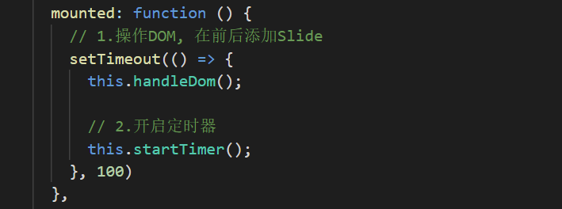
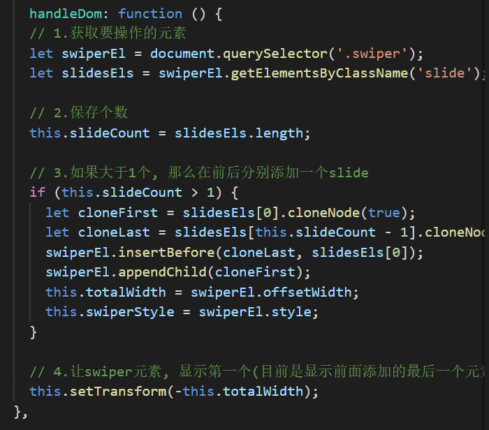
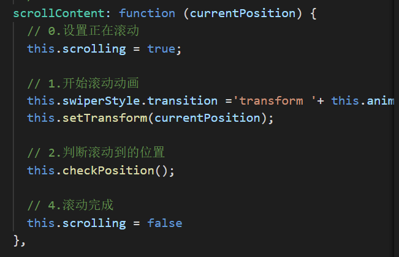
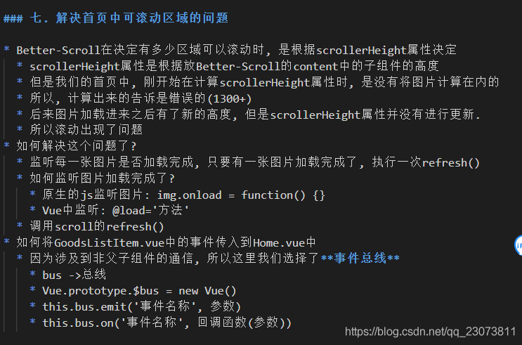

# 一、项目难点

## 1. 轮播图

### 1.1 复制图片

先获取轮播图主体和内容的元素节点，如果内容的个数大于一个，则将第一张图复制一份到最后，最后一张图复制放到头部。通过offsetwidth获取一个内容的宽度，再通过translate动画移动到-offsetwidth的地方，即第一张图片的位置。

### 1.2 设置自动轮播

**定时器方法**：设置一个无限循环的定时器，每隔interval时间，就调用一次scrollContent事件。

**滚动方法**：用currentIndex记录当前播放的图片，每次滚动时使currentIndex++，并利用translate动画移动到-offsetwidth*currentIndex的位置。

**处理滚动中的状态**：滚动时将this.scrolling设置为true，然后添加transition过渡，用translate：translate滚动。调用checkPosition检查滚动到的位置，完成滚动，将scrolling设置为false

**校验正确的位置**：在过渡的时间之后，开始校验正确的位置，将过渡效果取消，判断当前的currentIndex，如果是在末尾，则currentIndex置为1；如果在开头，则currentIndex置为末尾

### 1.3 拖动事件的处理

**touchStart**：判断轮播图目前是否在滚动，如果在滚动的话就直接返回。停止定时器，然后保存开始时触摸的位置。

**touchMove**：通过传入的event对象，在e.touched[0].pageX中获取当前移动到的位置，将当前位置减去初始位置，得到拖动的距离。将当前图片的坐标currentPosition + distance 得到实时拖动的动画效果。

**touchEnd**：先获取之前保存下来的移动的距离distance，判断最终的距离，如果移动的距离在0 - 0.25倍的totalwidth之间的话，移动到currentIndex * totalWidth的地方，实现回到移动前的位置。那么，如果超过了这个距离的话，对应的currentIndex就+1或者-1。移动完成后重新开启定时器。

## 2. 使用Better-Scroll后滚动区域异常的问题

做完这些后，为了防止重复监听同一次事件，在beforeDestroy中通过this.$bus.off 移除监听事件

封装防抖函数，利用防抖函数对图片监听进行优化。

## 3. 解决滚动区域中tabbar不能固定

​	